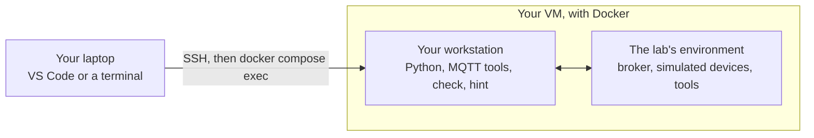

# IoT Labs

Hands-on labs on the Internet of Things: how connected objects talk, how their data travels, how a
system of thousands of them is designed, operated and secured. Each lab is a three-hour session you
complete **on your own**, on a virtual machine, with everything you need in this repository.

## The labs

| Lab | Topic | You will | Status |
|---|---|---|---|
| [Lab 1](lab1/) | IoT architecture and first MQTT messages | map an IoT architecture, watch every MQTT packet of a building, become a device, design a topic tree, use retained messages and the last will | available |
| Lab 2 | MQTT in depth | compare QoS 0, 1 and 2 on a failing link, persistent sessions, keepalive | coming |
| Lab 3 | The industrial field | read a Modbus controller and an OPC UA server, bridge them to MQTT, meet Sparkplug B | coming |
| Lab 4 | Low-power networks | LoRaWAN: spreading factor, airtime, gateways, binary payloads | coming |
| Lab 5 | Energy and fleet | the energy budget of a sensor, battery lifetime, remote management (LwM2M) | coming |
| Lab 6 | Data and interoperability | one data model for several vendors, SenML, information models | coming |
| Lab 7 | Edge computing | filter, aggregate and alert close to the devices, store and forward | coming |
| Lab 8 | IoT platform | time-series storage, dashboards, rules | coming |
| Lab 9 | Security | TLS, authentication, access control, attack surface | coming |
| Lab 10 | Architecture case study | design and defend the architecture of a new need | coming |

Each lab stands on its own: missing one does not prevent you from doing the next. They share one
setting, the **Adour site**, a small campus with two buildings whose devices come from different
vendors — as on every real site.

## How a lab works



- **Your VM.** You reach it with SSH. The comfortable way is **VS Code with the Remote – SSH
  extension**: an editor and terminals on the VM, and web pages of the VM forwarded to your laptop.
- **One folder per lab.** Each holds a `compose.yaml` that starts the lab's environment in Docker,
  and a `work/` folder for your files. You work inside a container called the **workstation**, which
  sees `work/` as `/work`.
- **The subject** is the lab's `README.md`. Each part starts with the background you need, then gives
  exercises and questions.
- **Exercises** are checked by a program: type `check` in the workstation, each exercise turns ✔ or
  ✘ with the reason.
- **Questions** ask you to observe, measure, explain, and sometimes to look something up. Write your
  answers in `work/answers.md` as you go. When a question says *research*, cite your sources.
- **Stuck?** `hint <exercise>` gives the next hint, one step at a time. The last one is close to the
  answer: try the others first.
- **Hand in** the file that `check report` writes: your answers, your files, and which exercises were
  confirmed, with the time.

## Getting a lab onto your VM

Your teacher may have done it already: look for the folder `~/iot-labs`. Otherwise:

```bash
git clone <this repository's URL> ~/iot-labs
cd ~/iot-labs/lab1
docker compose up -d
```

Later, to get a new lab: `cd ~/iot-labs && git pull`.

## Rules of the game

- Work on your own VM; do not share it.
- Answers are graded, not the ✔ of the checker: a working exercise with a vague answer is worth
  little. Short and precise beats long: a table, a figure with its unit, the source of what you
  looked up.
- You may use any documentation, search engine or assistant, as long as you understand and can
  defend every line you hand in. Cite what you used.
