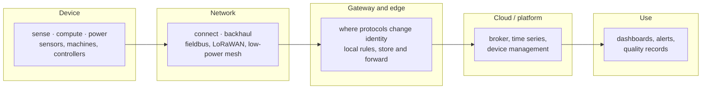
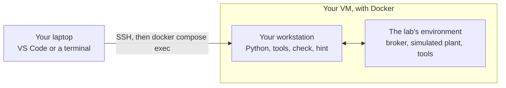

# IoT Labs — Adour Composites

Ten hands-on labs on the Internet of Things, built around one plant. You join **Adour Composites**, a
maker of carbon-fibre parts in Tarnos, as its IoT engineers. Lab after lab, you find out how its data
travel, fix what is fragile, connect what is not connected yet, and end up defending the architecture
of the whole site.

Each lab is a three-hour session you complete **on your own**, on a virtual machine, with everything in
this repository. The plant is simulated, but its data follow its real rhythm: two shifts, cure cycles
of almost five hours, a freezer door opened a dozen times a day, a compressor that never quite stops.

## The course map

Every lab works on one part of the same chain — the chain of the lectures, from the six blocks of a
device to the tiers where each function runs. Keep this map in mind: whatever the lab, you can always
say where you are.



| Lab | The plant's problem | Layers | Protocols and standards | Status |
|---|---|---|---|---|
| [1](lab1/) | *Map the plant* — how do the data travel today? | all, through their messages | MQTT, unified namespace, ISA-95 | available |
| 2 | *Never lose a cure record* — the autoclave's data must survive a failing link | edge ↔ platform | MQTT QoS 0/1/2, sessions, MQTT 5 | coming |
| 3 | *Talk to the machines* — read the meters and the autoclave's controller directly | field ↔ edge | Modbus TCP, OPC UA, Sparkplug B | coming |
| 4 | *Through the freezer wall* — long-range radio for the cold store | field ↔ networks | LoRaWAN: spreading factor, airtime, duty cycle | coming |
| 5 | *Sensors that sleep* — battery devices in the cleanroom, managed remotely | field ↔ networks ↔ platform | CoAP, CBOR, LwM2M, energy budget | coming |
| 6 | *One language for the plant* — units, time, identity, meaning | platform | SenML, Asset Administration Shell | coming |
| 7 | *Decide on the spot* — alarms and filtering close to the devices | edge | edge rules, hysteresis, store and forward | coming |
| 8 | *See the plant* — time series, dashboards, KPIs | platform ↔ applications | InfluxDB, Grafana, OEE | coming |
| 9 | *Lock the doors* — who may publish what, and who can listen | every layer | TLS, authentication, ACL, IEC 62443 | coming |
| 10 | *Defend your architecture* — a new need, your record, your choices | all | — | coming |

### The labs and the lectures

The labs apply the lectures of *IoT Systems Design*; each lab says which parts it uses.

| Lecture | Title | Used in labs |
|---|---|---|
| **L1** | What a connected system is made of — the six blocks, the five lines, who answers | 1, 5, 10 |
| **L2** | The radio link — link budget, range and rate, technologies | 4, 5 |
| **L3** | Communication protocols and system architectures — layers, sharing, addressing, transport, application, data, placement, edge, engineering models, method | every lab |

The labs keep the lectures' habits. Every choice is written the same way: **the constraint, the
option retained, the option rejected, and the reason.** Before a protocol, the interaction pattern:
request/response, publish/subscribe or observe. And bytes are counted before anything is chosen.

### Which protocol for what

The course meets several protocols. They do not compete: each answers a different question, at a
different place in the chain.

| Protocol | Model | Runs over | Made for | Lab |
|---|---|---|---|---|
| **MQTT** | publish / subscribe, through a broker | TCP | many devices and applications that must not know each other | 1, 2 |
| **Modbus TCP** | request / response, registers | TCP | reading and writing a controller's values, simply; the oldest fieldbus still everywhere | 3 |
| **OPC UA** | client / server, and publish / subscribe | TCP (and MQTT) | industrial machines that describe their own data | 3 |
| **LoRaWAN** | uplinks from devices, through gateways, to a network server | radio, sub-GHz | a few bytes, kilometres away, for years on a battery | 4 |
| **CoAP** | request / response, like HTTP, with observation | UDP | very constrained devices and networks | 5 |
| **LwM2M** | device management, a standard object model | CoAP | configuring, updating and monitoring a fleet | 5 |
| **HTTP / REST** | request / response | TCP | applications and platform APIs | 6, 8 |

## Going deep without getting lost

Every lab is built the same way, so that you always know what is expected.

- **Background first.** Each part opens with the notions you need, explained. You do not need to have
  memorised the lecture — but you will find its vocabulary.
- **Three levels for every protocol.** You **use** it (make it work), you **see** it (watch its packets,
  count its bytes, measure its delays), and you **decide** with it (choose a setting and defend it).
  Each question says which: `Use`, `See`, `Decide`, or `Research` when you must look something up.
- **Core and deeper.** Questions marked **◆ Deeper** are for those who have finished: skipping them
  never blocks you.
- **What to remember.** Each part ends with the two or three ideas to keep.
- **One record for the whole course.** The file `record/site-architecture.md` is your team's
  architecture of the plant. Each lab adds a section and logs its decisions; Lab 10 is its defence.
  It is what ties the labs together.

## How a lab works



- **Your VM.** You reach it with SSH. The comfortable way is **VS Code with the Remote – SSH
  extension**: an editor and terminals on the VM, and the VM's web pages forwarded to your laptop.
- **One folder per lab.** Each holds a `compose.yaml` that starts the lab's environment in Docker, and
  a `work/` folder for your files. You work inside a container called the **workstation**, which sees
  `work/` as `/work` and the record as `/record`.
- **The subject** is the lab's `README.md`.
- **Exercises** are checked by a program: type `check` in the workstation, each exercise turns ✔ or ✘
  with the reason.
- **Questions** are answered in `work/answers.md`, as you go.
- **Stuck?** `hint <exercise>` gives the next hint, one step at a time. The last one is close to the
  answer: try the others first.
- **Hand in** the file that `check report` writes: your answers, your files, your record, and which
  exercises were confirmed, with the time.

## Getting a lab onto your VM

Your teacher may have done it already: look for the folder `~/iot-labs`. Otherwise:

```bash
git clone <this repository's URL> ~/iot-labs
cd ~/iot-labs/lab1
docker compose up -d
```

To get a new lab later: `cd ~/iot-labs && git pull`.

## Rules of the game

- Work on your own VM; do not share it.
- Answers are graded, not the ✔ of the checker: a working exercise with a vague answer is worth little.
  Short and precise beats long: a table, a figure with its unit, the source of what you looked up.
- You may use any documentation, search engine or assistant, as long as you understand and can defend
  every line you hand in. Cite what you used.

*Adour Composites, its people and its data are fictional. The protocols, standards and orders of
magnitude are real.*
