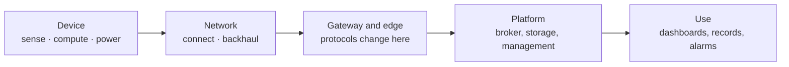

# The course map

The labs apply the lectures of *IoT Systems Design*. This page shows where each lab sits; you do not
need it to do a lab, but it helps to see the whole.

## One chain, from the sensor to its use

Every lab works on one part of the same chain. Whatever the lab, you can say where you are.

| Lab | Where in the chain | Lectures |
|---|---|---|
| 1 | the whole chain, through its messages | L1 (six blocks), L3 parts 1, 4, 5, 6 |
| 2 | gateway ↔ platform | L3 parts 4, 5 |
| 3 | device ↔ gateway | L3 parts 5, 6 |
| 4 | device ↔ network | L2, L3 parts 2, 3 |
| 5 | device ↔ network ↔ platform | L1, L2, L3 parts 5, 9 |
| 6 | platform | L3 part 6 |
| 7 | gateway and edge | L3 parts 7, 8 |
| 8 | platform ↔ use | L3 parts 7, 9 |
| 9 | every element | L3 part 4 |
| 10 | the whole chain | L1, L3 part 11 |

**L1** *What a connected system is made of* — the six blocks, the five lines, who answers.
**L2** *The radio link* — link budget, range and rate, technologies.
**L3** *Communication protocols and system architectures* — layers, sharing, addressing, transport,
application, data, placement, edge, engineering models, method.

## Which protocol for what

The protocols of the course do not compete: each answers a different question, at a different place
in the chain.

| Protocol | Model | Runs over | Made for | Lab |
|---|---|---|---|---|
| **MQTT** | publish / subscribe, through a broker | TCP | many devices and applications that must not know each other | 1, 2 |
| **LoRaWAN** | uplinks from devices, through gateways, to a network server | sub-GHz radio | a few bytes, kilometres away, for years on a battery | 1, 4 |
| **Modbus TCP** | request / response, registers | TCP | reading a controller's values; the oldest fieldbus still everywhere | 3 |
| **OPC UA** | client / server, and publish / subscribe | TCP | machines that describe their own data | 3 |
| **CoAP** | request / response, with observation | UDP | very constrained devices and networks | 5 |
| **LwM2M** | device management, a standard object model | CoAP | configuring, updating and monitoring a fleet | 5 |
| **HTTP / REST** | request / response | TCP | applications and platform APIs | 6, 8 |

## The habits of the course

- Before a protocol, the interaction pattern: request/response, publish/subscribe, or observe.
- Count the bytes before choosing.
- Every decision is written the same way: **the constraint, the option retained, the option
  rejected, and the reason.** That is the format of the decision log in your record.
