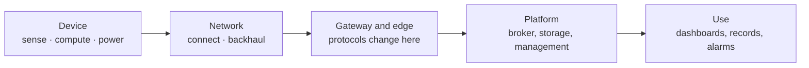

# The course map

The labs apply the material developed in *IoT Systems Design*. The map below positions each session within the end-to-end system and indicates the corresponding lecture material.

## One chain, from the sensor to its use

The sessions progressively cover different parts of the same end-to-end chain.

| Lab | Where in the chain | Lectures |
|---|---|---|
| 1 | the whole chain, through its messages | L1 (six blocks), L3 parts 1, 4, 5, 6 |
| 2 | gateway ↔ platform | L3 parts 4, 5 |
| 3 | device ↔ gateway | L3 parts 5, 6 |
| 4 | device ↔ network | L2, L3 parts 2, 3 |
| 5 | device ↔ network ↔ platform | L1, L2, L3 parts 5, 9 |
| 6 | platform | L3 part 6 |
| 7 | gateway and edge | L3 parts 7, 8 |
| 8 | platform ↔ use | L3 parts 7, 9 |
| 9 | every element | L3 part 4 |
| 10 | the whole chain | L1, L3 part 11 |

**L1** *What a connected system is made of* — the six blocks, the five lines, who answers.
**L2** *The radio link* — link budget, range and rate, technologies.
**L3** *Communication protocols and system architectures* — layers, sharing, addressing, transport,
application, data, placement, edge, engineering models, method.

## Protocol families you will meet

These technologies sit at different places in the chain and expose different interaction models. The
labs will make you compare their consequences rather than treat this table as a recipe.

| Technology | Interaction model | Typical transport here | Main role in this course | Lab |
|---|---|---|---|---|
| **MQTT** | publish / subscribe through a broker | TCP | decoupled exchange between producers and consumers | 1, 2 |
| **LoRaWAN** | device uplinks through gateways to a network server | LoRa radio, sub-GHz | low-rate, long-range IoT connectivity | 1, 4 |
| **Modbus TCP** | request / response over registers | TCP | simple access to controller values | 3 |
| **OPC UA** | client / server; also PubSub | UA TCP and other mappings | structured industrial interoperability | 3 |
| **CoAP** | request / response; observe | UDP | web-like interactions for constrained environments | 5 |
| **LwM2M** | device management with a standard object model | CoAP | configuring, updating and monitoring a fleet | 5 |
| **HTTP** | request / response | TCP in these labs | application and REST-style platform APIs | 6, 8 |

## Engineering principles used throughout the course

The labs repeatedly use three principles: distinguish the interaction model from the protocol that implements it; quantify communication costs rather than reasoning only from protocol names; and justify architectural decisions in terms of a constraint, a retained option, an alternative and the rationale for the choice.
