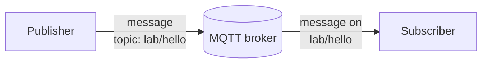
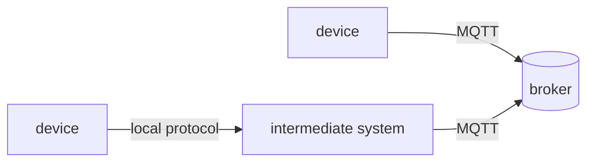
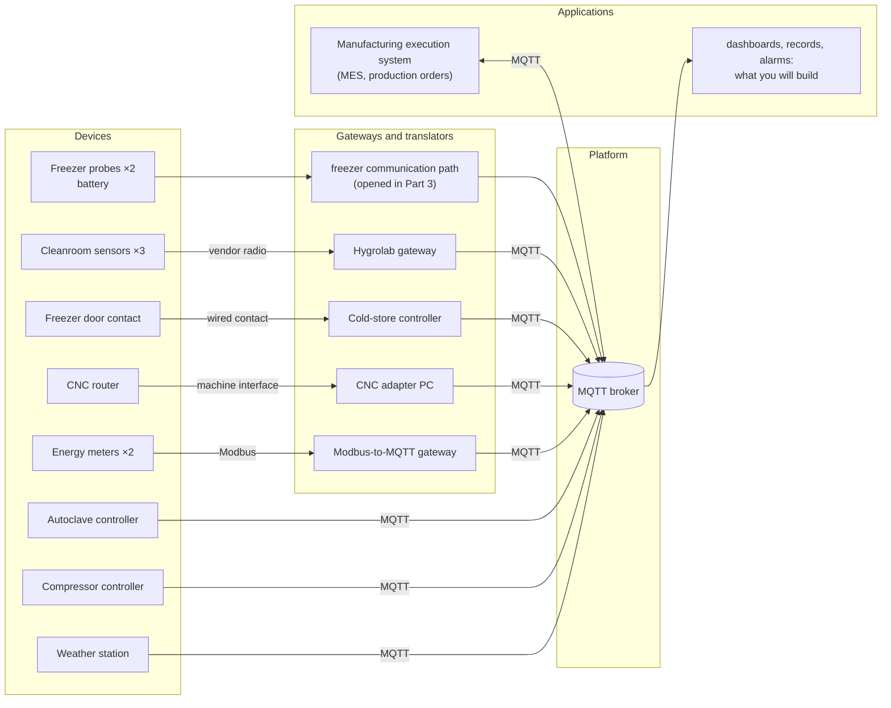
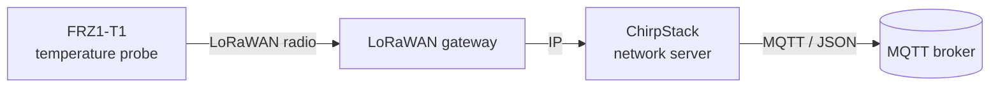
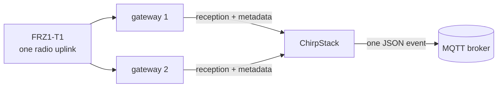

# Lab 1 — How do our data travel today, and can we trust them?


## The situation

> *"In three weeks an aerospace customer audits us, and I must be able to prove every cure cycle and
> every hour of the freezer. Our electricity bill went up by a third this year, and I want to know
> where it goes. And I want one system, not nine."*
> — Maialen Etxeberria, plant manager

Adour Composites makes carbon-fibre parts. Its prepreg (carbon fibre pre-impregnated with resin) waits
in a freezer at −18 °C; technicians lay it up in a cleanroom; an autoclave cures the parts at 180 °C
and 7 bar; a CNC router trims them; a compressor and the electricity network serve the whole site.
The equipment already sends data, but through different devices, protocols, gateways and formats.

The objective of this first lab is to reconstruct how those data travel today and to determine what
can — and cannot — be established from the data that finally reach applications.

---

## Preparation

Follow [Working on your VM](../docs/setup.md) to connect to the VM and start the lab. Keep the
**viewer** open at <http://localhost:8080>; MQTT traffic from the simulated plant should appear within
a few seconds.

Unless stated otherwise, commands run **inside the `workstation` container**, which already contains
Python and the Mosquitto clients. From `~/iot-labs/lab1` on the VM, open it with:

```bash
docker compose exec workstation bash
```

The shell opens in `/work`. This directory is the same `lab1/work` directory visible on the VM:
you may edit files with your usual VM editor, or inside the container with `nano` or `vim`. Open
additional workstation shells with the same command when programs must run in parallel.

The viewer displays MQTT traffic passing through the lab relay; simulated clients therefore connect to
`relay:1884` rather than directly to the broker.

---

## Part 1 — One MQTT message, from publisher to subscriber

Before looking at the plant, start with the smallest MQTT system that is useful: one program produces a
message, one broker receives it, and one program consumes it.



A **publisher** sends a message on a named **topic**. A **subscriber** asks the **broker** for
messages on that topic; the broker forwards matching publications. Publisher and subscriber therefore
do not need to know each other.

**MQTT** is the protocol; **Eclipse Mosquitto** is the implementation used here. It provides both
the broker and the `mosquitto_pub` / `mosquitto_sub` command-line clients.

### Publish one message and receive it

In the first `workstation` shell, subscribe to one exact topic:

```bash
mosquitto_sub -h relay -p 1884 -i lab-subscriber -t 'lab/hello' -v
```

`relay:1884` is the lab's MQTT endpoint; `-t` selects the topic and `-v` prints topic and payload.
`-i lab-subscriber` gives the client a readable **client identifier** in the viewer. Its role is examined
later. The terminal should initially remain quiet.

Open a second `workstation` shell with the same `docker compose exec workstation bash` command, then publish one message on that same topic:

```bash
mosquitto_pub -h relay -p 1884 -i lab-publisher -t 'lab/hello' -m 'hello from team X'
```

The subscriber should now display the message. At this point, the important chain is simply:

```text
publisher  ->  broker  ->  subscriber
             lab/hello
```

In the viewer's **Packets** tab, filter on `lab-` to isolate your two clients. You should find their
`CONNECT` packets, the subscriber's `SUBSCRIBE`, and the publisher's `PUBLISH`; a clean shutdown may
also produce `DISCONNECT`.

The lab inserts a relay so that this traffic can be observed. `↑` denotes a packet travelling toward
the broker and `↓` a packet travelling away from it.

### Q1 — Reconstruct the exchange you just generated

Follow your two terminals in the **Packets** tab. Starting with the subscriber connection and ending
with the message received by that subscriber, reconstruct the sequence you can actually observe.
Which client installed the subscription? Which topic did it request? Which client later published the
message? Where, in this chain, is the decision made to forward the publication to the subscriber?

Relate the trace to the three roles in the figure above. Then stop the subscriber with `Ctrl+C`.

### From one topic to several

Subscribing to one exact topic works for `lab/hello`, but a real application often needs a whole set of
related measurements. MQTT topics are hierarchical names made of levels separated by `/`. For example,
the cleanroom sensors use names of this form:

```text
hygrolab
├── CR-01
│   ├── temperature
│   └── humidity
└── CR-02
    ├── temperature
    └── humidity
```

A **topic filter** can select several topics. MQTT provides two **wildcards** for this purpose:

```text
hygrolab/CR-01/temperature    one exact topic
hygrolab/+/temperature        '+' lets one level vary
hygrolab/#                    '#' includes everything below hygrolab
```

`+` always replaces exactly one level. `#` replaces all remaining levels and can only appear at the
end of a filter. These wildcards belong to **subscription filters**; publishers still publish to a
concrete topic such as `hygrolab/CR-01/temperature`.

### Q2 — Read MQTT topic filters as the broker does

Consider the following three filters:

```text
hygrolab/#
hygrolab/+/temperature
+/CR-01/temperature
```

First predict which of the following topics each filter would match:

```text
hygrolab/CR-01/temperature
hygrolab/CR-02/humidity
hygrolab/CR-01/status
compressors/CMP1
```

Then test the filters with `mosquitto_sub` for a short period and compare what actually arrives with
your prediction. For example, start with:

```bash
mosquitto_sub -h relay -p 1884 -i filter-observer -t 'hygrolab/#' -v
```

The cleanroom simulator publishes six measurements (temperature and humidity for three sensors) every
10 seconds, so allow at least one complete 10-second cycle before deciding that nothing is arriving.
Stop the command with `Ctrl+C` before testing the next filter; reuse `filter-observer` sequentially,
not in several terminals at once.

Some listed topics may not currently be produced, so use the matching rule rather than absence of
traffic as evidence. Explain at least two non-obvious matches level by level.

<details>
<summary><strong>◆ Going deeper — D1: what the broker says about itself</strong></summary>

Mosquitto publishes operational information under the special `$SYS/` hierarchy. Subscribe for about
20 seconds (keep the quotes: `$` has a meaning to the shell):

```bash
mosquitto_sub -h relay -p 1884 -i sys-observer -t '$SYS/#' -v
```

Find the broker version, the number of connected clients and at least one counter related to messages
or bytes. For each value, state what an operator could actually diagnose from it. Then identify one
important property of the physical plant that these broker metrics cannot tell you.

Now stop that subscriber and subscribe briefly to `#`. You will not receive the `$SYS/...` messages.
This is an MQTT rule: a topic beginning with `$` is not matched by a subscription whose first level is
a wildcard (`#` or `+`). To receive system topics, the filter itself must begin with `$`. Verify the
rule with the two subscriptions and explain why separating broker-internal topics from ordinary
application traffic can be useful.
</details>

Stop any filter-testing subscriptions before moving on; broad subscriptions would duplicate later
traffic in the viewer.

---

## Part 2 — From physical devices to MQTT

In the plant, a device may publish to MQTT directly or reach MQTT through an intermediate system
that translates or forwards its data.



With an intermediate system, the broker sees that system—not the physical sensor—as its MQTT peer.
Use the following map to distinguish direct publishers from mediated paths. The freezer path remains
collapsed until Part 3.



Labels such as Modbus, vendor radio and machine interface simply indicate that MQTT appears later in
the path. Their protocol details are not needed here.

Observe the complete MQTT namespace for about one minute:

```bash
mosquitto_sub -h relay -p 1884 -i plant-observer -t '#' -v
```

Start in the viewer's **Topics** tab. Choose a topic clearly associated with one device, filter for it
in **Packets**, inspect a recent `PUBLISH`, and read the sending **client**. Then use the architecture
diagram to work back to the physical device. The **Clients** tab confirms whether a client is connected.

### Q3 — Trace five devices up to the broker

Apply that method to `CR-01`, `EM-MAIN`, `AC-1`, `CNC-1` and `CMP-1`. The freezer is deliberately
left aside here; its longer LoRaWAN path is introduced step by step in Part 3.

For each of the five devices, reconstruct:

1. the first communication link or interface leaving the physical device, using the architecture;
2. any intermediate component before MQTT appears;
3. the MQTT client id that actually publishes the data, using the viewer;
4. one concrete MQTT topic carrying data from that device.


### Q4 — What can the broker actually tell you about a failure?

Use the paths you reconstructed in Q3 for `AC-1`, `CR-01` and `EM-MAIN`. Open one recent `PUBLISH`
for each source and compare the physical device named in the architecture with the MQTT client visible
in the viewer. `AC-1` publishes directly, whereas the other two reach MQTT through an intermediate
component.

Now focus on `CR-01`. Suppose the physical sensor continues to operate normally but `hygrolab-gw`
stops publishing. What would an application connected only to the MQTT broker observe? Could it tell
whether the sensor itself failed, the local link failed, or the gateway failed? State what additional
observation would be needed to distinguish those cases.

Repeat the reasoning for `EM-MAIN` and its Modbus-to-MQTT translator. Is the observation boundary the
same?

<details>
<summary><strong>◆ Going deeper — D2: the lab is not the plant</strong></summary>

The relay is useful for teaching because it makes MQTT visible, but inserting it also changes what the
broker can observe. On the VM, outside the `workstation` container, inspect recent broker log lines:

```bash
cd ~/iot-labs/lab1
docker compose logs broker | tail -30
```

Look specifically for lines reporting a new MQTT client connection. Compare the **network address**
reported there with the logical client ids visible in the viewer (`hygrolab-gw`, `modbus2mqtt`,
`autoclave-ac1`, ...). Draw one complete path:

```text
MQTT client -> relay -> broker
```

and mark which identity or address is visible at each point. Explain why the broker-side network
address alone cannot identify the original physical device in this lab.

Finally, compare two alternatives for observing a real deployment without inserting this relay:
**broker-side logs/metrics** and a **network capture on the broker host**. What would each reveal that
the other might not? The objective is to separate what an observation point can see from what exists
elsewhere in the path.
</details>

Stop `plant-observer` before continuing. It has served its purpose, and leaving a `#` subscription open
would make every later publication appear once more on its way back to that subscriber.

---

## Part 3 — Follow one freezer reading end to end

Part 2 reconstructed **where** data travel. Part 3 follows one `FRZ1-T1` measurement through that path
to distinguish what the probe sends from what later components add.

### First locate the measurement path

`FRZ1-T1` is the battery-powered temperature **probe** placed near the freezer door. The probe does
not speak MQTT. Its measurements reach the broker through this chain:



Three roles are enough for now:

- **LoRaWAN** is the low-power radio technology used by the probe;
- a **LoRaWAN gateway** hears the radio transmission and forwards it over IP;
- **ChirpStack** is the LoRaWAN network server used in the lab. It receives the forwarded radio data
  and exposes an application event through MQTT.

A transmission from the probe toward the network is an **uplink**. From the VM, open another
workstation shell with `docker compose exec workstation bash`, then run:

```bash
python watch_uplinks.py
```

Leave it running and verify that both probes appear periodically. Ignore `fCnt` and `gateways` for now.

In ChirpStack, `FRZ1-T1` is named `frz1-probe-door` and `FRZ1-T2` is named `frz1-probe-back`. These
are two names for the same physical devices at different layers of the system.

### Decode what the probe actually sent

The probe sends only **6 application bytes**, not JSON. ChirpStack carries those bytes in the JSON
`data` field using **base64**, a text representation of binary data.

In the viewer, filter on:

```text
application/adour-coldchain/device/
```

Open one recent event whose `deviceInfo.deviceName` is `frz1-probe-door` and locate its `data` field.
That field is base64 text; after decoding the base64, the probe payload contains exactly six bytes:

| Byte | 0 | 1–2 | 3 | 4 | 5 |
|---|---|---|---|---|---|
| Content | frame type `0x11` | temperature, hundredths of °C, **signed**, big-endian | humidity % | battery % | status |

`work/decode.py` (mounted as `/work/decode.py` in the container) already converts base64 into six
bytes. Complete only their interpretation. `raw[n]` reads one byte; use
`int.from_bytes(..., byteorder="big", signed=True)` for the two-byte signed temperature.

Run the provided example first:

```bash
python decode.py --test
```

The test prints the known frame as `11 f8 98 1c 57 00`, so you can map the code directly to the table.
Once it passes, decode the `data` field from a real `FRZ1-T1` event and check the resulting values.

### Q5 — What information did the probe itself produce?

Use the single `FRZ1-T1` event you have just decoded. Keep the six decoded bytes and the resulting
physical values side by side.

Identify exactly which information is encoded by the probe in those six bytes. In particular, decide
whether the payload itself contains the device name, a measurement timestamp or any information about
which gateway received it. For the temperature field, explain how the two bytes become a signed value
in degrees Celsius; you may use one concrete decoded example rather than describing the conversion
only in general terms.


### Now look at what the infrastructure adds

Return to the same ChirpStack JSON event and compare the six probe bytes with the surrounding fields.

A single LoRaWAN transmission can also be heard by more than one gateway. Each gateway forwards its
reception to ChirpStack; the network server recognises that they concern the same uplink and exposes
one application event containing reception metadata.



The number printed in the `gateways` column of `watch_uplinks.py` is the number of gateway receptions
reported for that event.

### Q6 — What was added after the radio transmission?

Stay with the same `FRZ1-T1` event. Compare the six decoded application bytes with the surrounding
ChirpStack JSON.

Find at least three useful pieces of information that are present in the JSON but were **not** present
in the six bytes sent by the probe. For each one:

1. point to the corresponding JSON field;
2. identify which part of the path can know or create that information;
3. give one reason why an application might care about it.

Then return to the binary temperature format used in Q5. Somewhere in the system, software must know
that bytes 1–2 mean a signed big-endian temperature in hundredths of a degree. Identify where that
knowledge is used in this lab. What would happen if a future probe firmware changed the encoding but
the decoder was not updated?


### Detect a missing uplink

One field in the ChirpStack event deserves separate attention: `fCnt`, the LoRaWAN **frame counter**.
It increases when the device creates successive uplinks. If an application receives counters 41 and
43 for the same probe, it knows that the sequence it observed is incomplete even though it never saw
counter 42.

The simulator deliberately suppresses one in four probe uplinks so that a counter gap appears quickly;
this **25% loss rate is intentionally exaggerated** for the lab. The missing uplink still consumes its
counter value.

### Q7 — Use `fCnt` to identify incomplete evidence

Return to `watch_uplinks.py` and find two successive **received** events from the same probe whose
`fCnt` values are not consecutive. Record the two counters and their reception times.

From this one concrete gap, determine which counter value is missing and what you can conclude about
the sequence that reached ChirpStack. Then state two things that the counter does **not** tell you:
where along the path the missing uplink disappeared, and what temperature value it contained.

Reason only from the received events, not from your knowledge of how the simulator injects the loss.

### Finally, ask what time the measurement represents

The ChirpStack event also contains a `time` field. This is a network-server reception time. The probe
itself has no clock, so it does not put a measurement timestamp in its six-byte payload.

### Q8 — Which timestamp does the freezer evidence actually contain?

Open one freezer event and compare its JSON `time` with the arrival time displayed by the relay.
Consider four instants in order:

1. the physical temperature measurement;
2. the radio transmission;
3. reception by ChirpStack;
4. arrival of the MQTT packet at the relay.

For each one, state whether this system knows it directly, only approximates it, or does not know it at
all. Then explain the remaining uncertainty if an auditor asks whether the freezer was below −15 °C
**throughout** a particular hour.

<details>
<summary><strong>◆ Going deeper — D3: from message representation to traffic at scale</strong></summary>

The freezer probe uses six compact application bytes because radio airtime matters. Once data reaches
an IP network, other sources in the plant use much more verbose MQTT representations. Quantify that
trade-off rather than assuming that either representation is inherently better.

First choose one `hygrolab/CR-01/temperature` publication in the viewer. Record its MQTT `packet B`,
the topic length and the textual temperature payload. Estimate what fraction of that MQTT packet is
the temperature text itself. The viewer's `packet B` is the MQTT packet only; TCP/IP and link-layer
headers are not included.

Then use the **Topics (last 5 min)** tab to compare three reporting behaviours: `CR-01`, the compressor
`compressors/CMP1`, and the main energy meter `modbus2mqtt/meter_main/...`. For each one, estimate
messages per hour and MQTT PUBLISH bytes per hour. Extrapolate each behaviour independently to 5,000
similar devices.

Explain why a larger, readable representation on the IP side can still be sensible even though the
radio payload is compact. Finally, give at least three reasons why your linear extrapolation would be
insufficient for real broker capacity planning (bursts, reconnects, TLS/TCP overhead, changing payload
sizes, correlated reporting, ...).
</details>

<details>
<summary><strong>◆ Going deeper — D4: automate the audit gap check</strong></summary>

Q7 detects one counter gap manually. Automate exactly that reasoning. `watch_uplinks.py` already shows
how to subscribe to the freezer probes and extract `deviceName`, `fCnt` and reception time; copy it to
a new file and extend it rather than rebuilding an MQTT client from scratch.

Keep the previous counter **separately for each probe**. When a new value is not `previous + 1`, print
an alert containing the probe, previous counter, current counter, number of missing counters and the
reception-time interval over which the evidence became incomplete. Normal consecutive uplinks should
remain quiet. The simulator's regular injected loss gives you a reproducible test case.

Once the detector works, state what additional observation would be needed to distinguish four
different locations for a loss: before any gateway hears the radio frame, between a gateway and
ChirpStack, between ChirpStack and the MQTT broker, or after publication at a subscriber. The script
does not need to locate the loss; explain why its current observation point cannot do so.
</details>

<details>
<summary><strong>◆ Going deeper — D5: how much timing uncertainty?</strong></summary>

The viewer displays packet times in **UTC**, as does ChirpStack's JSON `time` field. Select five
freezer `PUBLISH` packets. For each one, record the ChirpStack `time` value inside the JSON, the arrival
time of that same packet in the viewer, and the difference in milliseconds.

Report the minimum, maximum and rough spread of the five differences. Do not call this number
"sensor latency": identify exactly which part of the path lies **before** the ChirpStack timestamp and
which part lies **between** that timestamp and the relay observation.

The probe has no clock, so this still gives no precise timestamp for the physical measurement itself.
If a future audit required measurement time to be known within one second, what capability would need
to move closer to the physical sensor, and what new clock-synchronisation or trust question would that
introduce?
</details>

Stop `watch_uplinks.py` and any other temporary subscriptions from this part before continuing.

---

## Part 4 — What must an MQTT client get right?

Part 3 dealt with the identity and context of a **measurement**. We now consider the MQTT connection
itself. In particular, ChirpStack's `deviceName` names a probe at application level; it is not the
identifier of the MQTT client carrying the event.

An MQTT client opens a connection and presents a **client identifier**. The identifier lets the broker
distinguish clients that connect to it; **it is not, by itself, proof of the physical device's identity**.

The lab includes **Paho**, a Python MQTT client library. A minimal publisher is:

```python
c = mqtt.Client(mqtt.CallbackAPIVersion.VERSION2, client_id="sensor-student")
c.connect("relay", 1884)
c.loop_start()
c.publish("some/topic", "some payload")
```

One MQTT rule matters here: if a new connection presents a client identifier already in use, the
broker disconnects the existing connection with that identifier.

### Add a virtual sensor

Run `python publish_example.py` once and identify its `CONNECT`, `PUBLISH` and `DISCONNECT` packets.
Then open `work/sensor.py`: it already publishes a JSON measurement every 5 s on
`lab/sensors/student/env` as client `sensor-student`. Two status/last-will lines remain for Part 6.

Run it from a `workstation` shell:

```bash
python sensor.py
```

Let several messages appear and inspect one of them in the viewer.

### Q9 — Observe what happens when two connections reuse one client id

Keep your first `sensor.py` running. From a second `workstation` shell, start a second copy without
changing `NAME`. Filter the viewer on `sensor-student`, then watch the **Clients** tab and both terminals
for roughly 30 seconds.

Describe the sequence you observe when the two processes repeatedly try to use the same client id,
and relate it to the MQTT rule given above. Then distinguish two statements:

1. what `sensor-student` allows the broker to distinguish;
2. what seeing that client id does **not** establish about the identity of the physical sender.

<details>
<summary><strong>◆ Going deeper — D6: diagnose duplicate identities from observations only</strong></summary>

Reuse the trace produced by Q9, but now pretend that the two programs are remote devices and that their
terminal output is unavailable. In the viewer, filter on `sensor-student` and use only **Packets** and
**Clients** as evidence. If your Q9 trace is too short to show the reconnect pattern clearly, rerun the
experiment once, starting the second copy about ten seconds after the first.

Build a diagnosis from observations only. Identify at least two concrete symptoms of the collision
(for example repeated connections with the same client id, interruptions in the publication stream,
or a reconnect pattern). For each symptom, name another failure that could look similar, such as an
unstable network or a crashing client.

Then state one extra observation that would help distinguish a duplicate client id from that
alternative explanation. The objective is not to guess the fault from one symptom, but to reason about
what this monitoring point can and cannot diagnose.
</details>

<details>
<summary><strong>◆ Going deeper — D7: one device, several identities</strong></summary>

MQTT does not enforce a relationship between a client id and the device name encoded in a topic. Test
that statement. Keep one normal `sensor.py` running, then publish one extra message to **the same
environmental topic** from another MQTT client:

```bash
NOW=$(date -u +%Y-%m-%dT%H:%M:%SZ)
mosquitto_pub -h relay -p 1884 -i another-client \
  -t 'lab/sensors/student/env' \
  -m "{\"temperature_c\":21.5,\"humidity_pct\":45,\"measured_at\":\"$NOW\"}"
```

The injected values are deliberately plausible so that the payload does not trivially reveal the substitution. In the viewer, compare the two `PUBLISH`
packets: the topic claims the same application-level sensor while the MQTT client ids are different.

Now distinguish three identities: the physical or virtual asset, the MQTT client connection, and the
application-level device name encoded in topic or payload. Where does the mapping between these three
come from in this lab? Could a subscriber detect from MQTT alone that the `another-client` message did
not come from the expected sensor? What extra source of evidence, outside these MQTT names, would be
needed to bind the message to a particular physical asset with stronger confidence?
</details>

Stop **both** copies of `sensor.py` before continuing; otherwise their reconnect loop will keep
interfering with later observations.

---

## Part 5 — Make heterogeneous data usable together

A correct MQTT client identity does not make heterogeneous data interoperable. The plant mixes
conventions: device ids may appear in topics or JSON, units differ, and timestamps may originate at
different points in the path. Applications combining these sources must understand those differences.

Topic hierarchy is part of that interface: it determines which groups of data can be selected easily.
For example, `plant/<area>/<cell>/<device>/...` makes `plant/curing/#` natural but may make cross-area
queries harder. The useful hierarchy therefore depends on the queries that matter.

### Q10 — Make the current interoperability problems explicit

Start with two sources that both contain temperature information: one recent freezer event and
`hygrolab/CR-01/temperature`. Compare only these two first. Look at their topic names and payloads and
identify at least two differences an application would have to understand before it could treat the
measurements uniformly.

Then add one recent message from the main energy meter (`modbus2mqtt/meter_main/...`) and from the
compressor (`compressors/CMP1`). Across the four sources, identify at least **four concrete
incompatibilities** in total. Look specifically at naming, units, timestamps, whether several
quantities are grouped in one payload, and where device identifiers appear. For every incompatibility,
point to the concrete pair of messages or conventions that exhibits it.


### Design a topic hierarchy for the plant

`work/inventory.json` describes 13 devices, their location and their class. Read it before choosing a
hierarchy. Five applications already exist or are planned:

| Need | The application wants |
|---|---|
| N1 | everything in the curing area |
| N2 | every energy meter, whatever the area |
| N3 | everything in the cold store |
| N4 | every production machine, for the production-performance dashboard |
| N5 | everything in the autoclave-1 cell, for its quality record |

Propose a consistent MQTT topic hierarchy for the plant. You do not need to enumerate every possible
measurement field; the important choice here is the order and meaning of the levels used to locate a
device and its data. Check the design on a few deliberately different cases, including `FRZ1-T1`,
`AC-1`, `EM-AC1`, `CMP-1` and `WS-ROOF`.

### Q11 — Which queries does your hierarchy make easy?

Use your proposed hierarchy to write subscription filters for N1–N5. Try to retrieve exactly the
required devices and avoid a list of one filter per device; if a need genuinely requires two filters,
that is already useful information about the structure you chose.

Then consider a new request that was not in the original requirements: an engineer wants **every
source that reports temperature on the site** — including the freezer probes, cleanroom sensors,
autoclave and roof weather station — regardless of area. First decide whether your topic convention actually
encodes the measurement type in a position that MQTT filters can use. If it does, write the required
filter or filters. If it does not, say explicitly why this request cannot be expressed from the topic
name alone and what an application would have to inspect instead. Compare this with N1–N5 and explain
which kinds of query your hierarchy naturally favours and which become awkward.

### Normalize two sources

A common topic hierarchy solves only **addressing**. Payloads may still disagree on units, field names
and timestamps. Here a **bridge** subscribes to existing messages, converts them and republishes a
common form. Those conversions become part of the resulting data's meaning and lineage.

`work/bridge.py` already contains the MQTT callbacks, JSON parsing, timestamp conversion and freezer
decoding. Complete only the topic choices and conversions, in two passes.

**First, normalize only the compressor.** Choose its output topic from your Q11 hierarchy and replace
the single `pressure_bar = None` line with the psi-to-bar conversion. The compressor input topic and
Unix-to-ISO timestamp conversion are already provided. Use `1 psi = 0.0689476 bar` and keep at least
two decimals. Run the bridge and confirm in the viewer that you can place one original compressor
message beside its normalized output.

**Then add the freezer probes.** Choose their two output topics and set `FREEZER_INPUT` to one MQTT
wildcard filter matching the two ChirpStack uplink topics. The mapping between plant identifiers
(`FRZ1-T1`, `FRZ1-T2`) and ChirpStack `deviceName` values is provided, and the starter code already
calls your decoder from Part 3 and uses the ChirpStack reception time as `measured_at`.

| Device | Existing message | Message produced by your bridge |
|---|---|---|
| `CMP-1` | `compressors/CMP1`: pressure in **psi**, Unix timestamp | `pressure_bar`, `measured_at` |
| `FRZ1-T1`, `FRZ1-T2` | ChirpStack event, 6-byte payload in `data` | `temperature_c`, `measured_at` |

Run the bridge from a `workstation` shell:

```bash
python bridge.py
```

Verify the compressor input/output pair first, then add and verify the freezer path.

### Q12 — Compare an original message with the value produced by your bridge

Choose one compressor message and one `FRZ1-T1` message for which you can also find the corresponding
output from your bridge. Use the source timestamp to pair them: the compressor's Unix `timestamp`
becomes your ISO `measured_at`, while the freezer event's ChirpStack `time` becomes its output
`measured_at`. Filtering the viewer on `bridge-student` helps isolate the republished messages. Keep the
input/output pairs together so that you are comparing the same observation.

For each output field produced by the bridge, determine whether it is:

- directly measured by the physical device;
- supplied later by another component in the path;
- computed by your bridge.

Use the actual input and output values to justify the classification. Then answer two concrete
questions: what information can the bridge normalize reliably, and what missing information can it not
recover from the source message?

Finally, suppose an auditor challenges a value such as `pressure_bar = 6.89`. State which original
value and which conversion information would have to be retained to reproduce and justify that
normalized value.

<details>
<summary><strong>◆ Going deeper — D8: can one tree make every query easy?</strong></summary>

Use Q11 to compare two deliberately different topic designs. Keep your first hierarchy as **Design A**.
For **Design B**, make measurement type a high-level routing dimension so that all temperature data
can be selected easily. For example, you might explore a shape such as
`plant/by-measure/<measurement>/...`; you still have to decide which device and location levels follow
it.

Write concrete Design A and Design B topics for `FRZ1-T1`, `CR-01`, `AC-1`, `EM-AC1`, `CMP-1` and
`WS-ROOF`. Then make a small comparison table for N1–N5 plus **all temperature sources**: how many MQTT
filters are required by each design? Mark any request that cannot be expressed from topics alone.

Finally, explain the trade-off. Which dimensions are worth encoding in a topic because subscribers
route on them frequently, and which belong more naturally in payload metadata? If making every query
easy requires duplicating the same measurement under several topic trees, identify the consistency
problem that duplication would create.
</details>

Stop `bridge.py` before continuing so that Part 6 contains only the traffic needed for the liveness
experiments.

---

## Part 6 — When data stop, what can we conclude?

Part 5 dealt with messages **when they arrive**. Silence is more ambiguous: nothing changed, a sensor
stopped, a gateway failed, or an MQTT connection disappeared. MQTT offers several mechanisms, but they
answer different questions.

A **retained message** answers one question: what should a subscriber learn if it arrives after the
last publication? The broker stores the latest retained value and sends it immediately to new
subscribers.

This is useful for state such as a current mode or configuration, but it creates an obvious question:
the value is the **last value remembered by the broker**, not necessarily a fresh measurement.

For the experiments in this part, enable **show protocol details** in the viewer. Retained `PUBLISH`
packets are then marked `retain`, and the Clients tab exposes the connection information used below.

### Q13 — Determine what a new subscriber learns immediately

Stop any broad `#` subscription you currently have. Start a fresh one:

```bash
mosquitto_sub -h relay -p 1884 -i retained-observer -t '#' -v
```

Let the subscriber run only briefly, then stop it so that the first burst is easy to inspect. In the
viewer, distinguish messages marked as retained from periodic publications that happened to arrive at
the same time.

Choose a few retained messages and interpret what a new application would learn from them without
waiting for the original producer. Then pick one retained measurement or state that could be stale:
what timestamp, age or independent signal would you need before treating that stored value as current
evidence rather than simply the last value the broker remembers?

### Add an online status and a last will

Retained state does not explain why a client disappeared. For unexpected disconnections, MQTT provides
a **Last Will and Testament** (last will).

When a client connects, it can give the broker a message to publish on its behalf if the connection
later disappears without a clean `DISCONNECT`. A common pattern is therefore to register a retained
`offline` will before connecting, then publish a retained `online` status once the connection is
established:

```python
c.will_set(STATUS, "offline", retain=True)
c.connect(HOST, PORT, keepalive=KEEPALIVE_S)
c.publish(STATUS, "online", retain=True)
```

Complete the only two remaining `TODO` lines in `sensor.py`:

- before connecting, register `offline` as a retained last will on `lab/sensors/student/status`;
- after connecting, publish `online` on the same topic and retain that status.

Observe the status from another terminal:

```bash
mosquitto_sub -h relay -p 1884 -i status-observer -t 'lab/sensors/+/status' -v
```

Start the sensor, verify that `online` is visible, then stop the Python process with **Ctrl+C** and
observe the status change. The starter script does not catch Ctrl+C to send an MQTT `DISCONNECT`; the
process exits and its TCP connection closes abruptly, so this is an unexpected disconnect from the
broker's point of view.

### Observe a connection that dies silently

A last will is published only after the broker detects that the connection is gone. MQTT therefore uses
a **keepalive** interval: an idle client exchanges `PINGREQ`/`PINGRESP`, and prolonged silence lets the
broker declare the connection lost.

For MQTT 3.1.1, the broker must treat the connection as lost if it receives no MQTT control packet
from the client for **1.5 times the keepalive interval**. A client that is otherwise idle sends
`PINGREQ` before its keepalive interval expires; ordinary MQTT traffic also counts as activity.

The next experiment makes that delay visible rather than simply terminating the process.

Set `KEEPALIVE_S = 15`, restart the sensor and keep the status subscription open. In the viewer's
**Clients** tab, use **Freeze** on that connection. The relay then stops forwarding traffic without
closing the underlying connection.

Record the moment at which you freeze the connection and the moment at which `offline` appears.

### Q14 — Compare abrupt failure with keepalive-based detection

Use the two observations above. Explain why Ctrl+C can trigger the last will quickly,
whereas the frozen connection remains apparently present until the broker's keepalive timeout.

For keepalive values of **15 s** and **60 s**, calculate:

- the approximate worst-case time before the broker considers an otherwise silent connection lost;
- the number of keepalive cycles per hour for an idle client.

For the mains-powered cleanroom gateway, choose between these two values if the application is
expected to detect a communication failure within one minute, and justify the choice. Finally,
explain why even a perfectly chosen MQTT keepalive for the gateway does not prove that a battery
freezer probe behind that gateway is still alive.

<details>
<summary><strong>◆ Going deeper — D9: when `online` and fresh data disagree</strong></summary>

A status topic and a measurement stream are two different observations. Create two situations in which
they disagree instead of assuming that `online` automatically means "fresh measurements are arriving".

**Case A — status still says `online`, but measurements have stopped.** Run the sensor with
`KEEPALIVE_S = 60` and wait until it has published `online` plus several environmental measurements.
Then use **Freeze** on that connection in the viewer. For the first 20–30 seconds, no new measurement
reaches the broker, but the broker has not yet reached its keepalive timeout, so the retained status is
still `online`. Compare the age of the latest measurement with the status value. Afterwards, restart
the sensor normally to restore the connection and its retained status.

**Case B — measurements arrive while status says `offline`.** Run the sensor normally. From another
`workstation` shell, deliberately overwrite only its retained status:

```bash
mosquitto_pub -h relay -p 1884 -i status-test -r \
  -t 'lab/sensors/student/status' -m 'offline'
```

Verify that environmental messages continue while a new status subscriber immediately receives
`offline`. Restart the sensor afterwards so that it republishes its normal retained `online` state.

For each case, identify which observation is stale or misleading. Then propose a liveness rule that
combines the status value, the age of the latest measurement and the expected 5 s measurement period.
Finally, give one realistic failure mode that could still fool that combined rule.
</details>

---

## Final decision

The final question combines the evidence built throughout the lab; it introduces no new mechanism.

### Q15 — What can you actually tell the plant manager?

Return to the audit question from the beginning of the session: **can the current system prove that
the freezer stayed compliant for every hour?** Give the plant manager an answer that is as strong as
the evidence allows, but no stronger. Use the decoded measurements, timestamps, `fCnt` continuity and
the data path you reconstructed to support the claim.

Then identify the main gaps that still weaken that evidence and three changes you would prioritise if
traceability and auditability became production requirements. Keep the changes tied to problems you
actually observed rather than proposing a generic redesign.

There is one related question we have not resolved yet: if a critical record such as an autoclave cure
message is published while the network is failing, what guarantee do we have that it reaches its
destination exactly as intended? That is the question taken up in Lab 2.

*Next: Lab 2 — can we lose a cure record if the network fails?*
