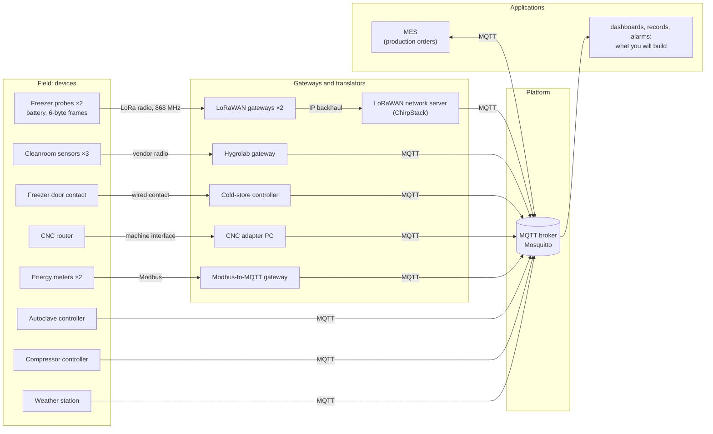
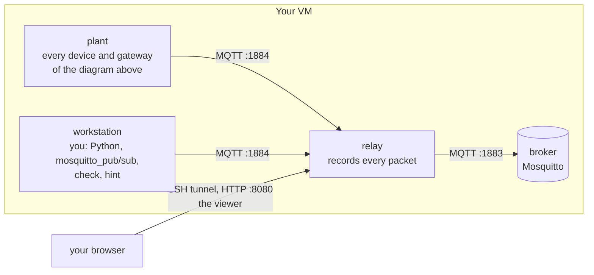
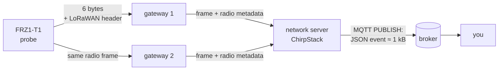

# Lab 1 — Map the plant: IoT architecture and first MQTT messages

**Duration:** 3 hours, on your own. **You hand in:** `work/report-lab1.txt`, written by `check report`.
**Where this lab sits:** the whole chain, from device to use, seen through its messages
(see the [course map](../README.md#the-course-map)). **Protocol:** MQTT, and a first look at LoRaWAN.
**From the lectures:** L1 (the six blocks), L3 parts 1 (reference models), 5 (publish/subscribe, MQTT)
and 6 (payloads).

> **Before the session (15 min).** Connect to your VM, start the lab and run `check 1`
> ([section B](#b-getting-started)), then read [section A](#a-the-plant-and-its-architecture).
> If `check 1` does not pass, tell your teacher before the session.

You join Adour Composites as IoT engineers. Today the plant's data reach one MQTT broker through
nine different paths, and nobody has the full picture. In this lab you take the architecture as it is,
follow one measurement from a freezer probe to your screen, byte by byte, become a device yourself,
put the plant's topics in order and translate two devices into them, and make sure the plant always
knows which devices are alive.

**By the end of this lab you can:**

- read an IoT architecture and say what each element does to the data that cross it;
- publish and subscribe with MQTT, from the command line and from Python;
- take an MQTT packet and a LoRaWAN uplink apart, byte by byte;
- design a topic namespace from the needs of its subscribers, and bridge devices into it;
- tell whether a device is alive, and how long it takes to find out.

## Contents

- [A. The plant and its architecture](#a-the-plant-and-its-architecture)
- [B. Getting started](#b-getting-started)
- [C. Part 1 — Read the architecture](#c-part-1--read-the-architecture-30-min)
- [D. Part 2 — Follow one measurement](#d-part-2--follow-one-measurement-40-min)
- [E. Part 3 — Become a device](#e-part-3--become-a-device-25-min)
- [F. Part 4 — Put the plant in order](#f-part-4--put-the-plant-in-order-45-min)
- [G. Part 5 — Alive or dead](#g-part-5--alive-or-dead-30-min)
- [H. Your site architecture record](#h-your-site-architecture-record-10-min)
- [I. Hand in](#i-hand-in)
- [J. When something goes wrong](#j-when-something-goes-wrong)
- [K. Python, JSON and the terminal in ten lines](#k-python-json-and-the-terminal-in-ten-lines)

| Part | Time | Exercises | Questions | ◆ Deeper |
|---|---|---|---|---|
| 1 — Read the architecture | 30 min | 2 | 1, 2 | D1 |
| 2 — Follow one measurement | 40 min | 3 | 3, 4 | D2, D3 |
| 3 — Become a device | 25 min | 4 | 5 | — |
| 4 — Put the plant in order | 45 min | 5, 6 | 6, 7 | D4, D5 |
| 5 — Alive or dead | 30 min | 7, 8 | 8, 9, 10 | — |
| Record, hand in | 10 min | — | — | — |

The **core** is questions 1 to 10, exercises 1 to 8, and sections 3 and 4 of the record. Items marked
**◆ Deeper** are for those who are done; skipping them costs nothing.

> **Pace yourself.** At the break (1 h 30) you should be starting Part 3. If at 2 h you have not
> started Part 4, do exercises 5 to 8 first, then come back to the questions. Ten minutes before the
> end, whatever happens: record sections 3 and 4, then `check report`.

**The questions.** Everything you need to answer the core questions is in this subject or on your
screen: each part opens with the background it needs. Answer in **`work/answers.txt`**, which has a
place for each question, often a table to fill. You never write a program from an empty file either:
`work/` holds a starter for each one, where the plumbing is written and `TODO` marks the part that
needs thinking. Each question says what it asks:

| Tag | You are asked to |
|---|---|
| `See` | observe or measure, and explain what you saw |
| `Decide` | choose, and justify the choice against its alternatives |
| `Research` | look it up, and cite your source (◆ items mostly) |

---

## A. The plant and its architecture

### Adour Composites, Tarnos

Adour Composites makes carbon-fibre parts for aircraft and racing yachts. Around eighty people work
there in two shifts, 06:00–14:00 and 14:00–22:00, on weekdays. A part goes through five areas:

| Area | What happens there | What is measured | Why it matters |
|---|---|---|---|
| **Cold store** | rolls of *prepreg* (carbon fibre pre-impregnated with resin) wait in a freezer at −18 °C | temperature (two wireless probes), the door | a roll costs thousands of euros; every hour spent warm counts against its shelf life |
| **Cleanroom** | technicians lay the prepreg plies up on moulds | temperature and humidity (three sensors) | outside the specification's limits, parts are scrapped |
| **Curing** | the moulds cure in an **autoclave**, a pressure vessel: 180 °C at 7 bar for two hours | air and part temperatures, pressure, vacuum, energy | each cure cycle is a quality record the customer audits |
| **Machining** | a CNC router trims the cured parts | its state, spindle load, parts made | how much of the time the machine actually produces |
| **Utilities** | compressed air and electricity for the site | the compressor, the main meter, the autoclave's sub-meter | energy is the plant's second-largest cost |

The plant manager, Maialen Etxeberria:

> *"In three weeks an aerospace customer audits us, and I must be able to prove every cure cycle and
> every hour of the freezer. Our electricity bill went up by a third this year, and I want to know
> where it goes. And I want one system, not nine."*

### The architecture today

Each supplier connected its devices in its own way. This is what the plant looks like, from the
sensors to the broker:



Three things to notice before you start:

- **Most devices do not speak MQTT.** A gateway or a translator does it for them, and each one changes
  something on the way: the protocol, the format, the identity of the device.
- **The broker is the only point every piece of data crosses.** It stores nothing for long and
  understands nothing of the data: it routes messages by topic.
- **Nothing on the right side exists yet.** The plant has data, but no application uses them
  together. That is the job.

### MQTT in a nutshell

MQTT is a lightweight publish/subscribe protocol over TCP, born in 1999 to monitor pipelines over
satellite links; it is now an OASIS and ISO standard, and the most common way for connected devices to
deliver their data. Clients never talk to each other: they connect to the **broker**, **publish**
messages on a **topic** (a string such as `adour/tarnos/curing/autoclave-1/air-temperature`), and
**subscribe** to topic filters; the broker forwards each message to every subscriber whose filter
matches. Publishers do not know who listens, subscribers do not know who publishes.

Every exchange is made of **packets**: `CONNECT`/`CONNACK` to open a session, `PUBLISH` to send a
message, `SUBSCRIBE`/`SUBACK`, `PINGREQ`/`PINGRESP` to show the connection is alive, `DISCONNECT` to
leave.

### The lab environment

The lab runs four containers on your VM. Compared with the plant, everything in the field and
gateway columns is played by one container:



**Rule of the lab:** every client connects to **`relay`, port `1884`** — never to the broker
directly, or the viewer and the checker cannot see you. In the workstation, `MQTT_HOST` and
`MQTT_PORT` already say so.

The data are simulated but follow the plant's rhythm: shifts, cure cycles of almost five hours, door
openings, a quiet night. Note the day and time of your observations.

---

## B. Getting started

*Before the session, and again at its start if your VM was restarted.*

**Connect.** The comfortable way is **VS Code with the Remote – SSH extension**: *Connect to Host*,
then open the folder `~/iot-labs`. Otherwise, from your laptop: `ssh -L 8080:localhost:8080
<login>@<your-vm>` (the `-L` part carries the viewer's page to your laptop; VS Code does it in its
*Ports* tab).

**Start the lab**, on the VM:

```bash
cd ~/iot-labs/lab1
docker compose up -d
docker compose ps --services --status running     # broker, plant, relay, workstation
```

The first start builds the lab's image and takes a few minutes. A service missing?
`docker compose logs <service>`.

**Open the workstation**, where you work (open two terminals this way):

```bash
docker compose exec workstation bash
```

Your prompt becomes `root@workstation:/work#`. Your files live in `~/iot-labs/lab1/work` on the VM,
seen as `/work` in the workstation: edit them with VS Code, run them in the workstation.

**Open the viewer**, http://localhost:8080 in your laptop's browser:

- **Packets** — every packet, live: time, direction (↑ to the broker, ↓ from it), client, type, QoS,
  flags, topic, payload, sizes. Click a payload to see it whole. The line at the top counts the
  messages of the last minute.
- **Topics** — per topic, over the last 5 minutes: messages, period, average sizes, publishers.
- **Clients** — every connection: its settings, its traffic, how it ended.

### Exercise 1 — The lab is running

In the workstation, `check 1`. **You should see:**

```
Exercise 1 — The lab is running
  ✔ the relay answers at http://relay:8080
  ✔ the plant is talking: autoclave-ac1, chirpstack, cmp1, cnc1-adapter, coldstore-ctrl, hygrolab-gw, mes, modbus2mqtt, weather-roof
  ✔ MQTT answers at relay:1884

1/1 passed
```

Stuck? `hint 1`.

---

## C. Part 1 — Read the architecture (30 min)

### Background: topic filters

A subscription names a **topic filter**. Topics are made of levels separated by `/`; a filter can
contain two wildcards:

| Filter | Matches | Does not match |
|---|---|---|
| `hygrolab/CR-01/temperature` | exactly that topic | anything else |
| `hygrolab/+/temperature` | the temperature of every cleanroom sensor — `+` is exactly one level | `hygrolab/CR-01/humidity` |
| `hygrolab/#` | everything under `hygrolab/`, at any depth — `#` is the rest, and comes last | `cnc/router1/state` |
| `#` | every topic (almost: see ◆ D3) | |

`mosquitto_sub` and `mosquitto_pub` options: `-h` host, `-p` port, `-t` topic, `-m` message, `-v`
print the topic, `-q` QoS, `-r` retain, `-C` stop after that many messages. `mosquitto_sub --help`
lists the rest.

### Exercise 2 — A message by hand, a subscription by hand

In a first terminal, subscribe to the cleanroom (quote any filter with `#` or `+`):

```bash
mosquitto_sub -h relay -p 1884 -t 'hygrolab/#' -v
```

Six values arrive every ten seconds, such as `hygrolab/CR-01/temperature 20.65`. In a second
terminal, publish:

```bash
mosquitto_pub -h relay -p 1884 -t lab/hello -m 'hello from team X'
```

In the viewer, find your `SUBSCRIBE` and its `SUBACK`, then your `CONNECT`, `PUBLISH`, `DISCONNECT`.
Then `check 2`. Stuck? `hint 2`.

> **Question 1 — Put names on the architecture** · `See` · *the six blocks (L1, part 2)*
>
> Subscribe to `#` for a minute and use the *Topics* and *Clients* tabs. For five devices of the
> diagram — a freezer probe, a cleanroom sensor, the main energy meter, the autoclave, the CNC router —
> fill the table in `answers.txt`: the link between the device and the next element, the element
> that publishes on MQTT on its behalf (if any), the **client id** that element uses, and the topic.
>
> Then: (a) four of these five devices reach MQTT only through a translator. For each, give the reason
> it does not publish MQTT itself — think of energy, range, age, and who controls the machine. (b) Each translator is now part of
> the data path: name one thing that goes wrong for the plant's data if one of them fails, that would
> not go wrong if the device published directly. (c) Fill the six blocks of L1 — sense, compute,
> power, connect, backhaul, use — for the freezer probe, reading them off the diagram.

Now look at the lab from the **VM** (not the workstation):

```bash
docker network inspect lab1_default | grep -E '"Name"|IPv4Address'
docker compose logs broker | tail -20
```

> **Question 2 — The lab is not the plant** · `See` · *tiers and placement (L3, part 7)*
>
> The broker's log shows the address each client connects from. Which address is it, which container
> owns it, and why is it the same for every client? Name one thing a real broker could no longer do
> properly behind such a relay. What would play the relay's role — seeing every packet — in the real
> plant?

> **◆ Deeper D1 — Why not HTTPS for the cleanroom?** · `Decide` · *cost of a short exchange (L3,
> part 4), interaction patterns (L3, part 5)*
>
> The cleanroom's gateway could POST each reading to a web server over HTTPS. Estimate, for one
> reading, the bytes and round trips of HTTPS with a new connection each time, with a connection kept
> open, and of MQTT on an open session. Which interaction pattern does each impose on the applications
> that want the data? If the sensors slept between readings, which protocol would L3 propose, and why?

**What to remember.** An architecture is read element by element, asking what each one does to the
data: the gateways translate protocols, formats and identities, and each of them becomes a part of
the system that can fail.

---

## D. Part 2 — Follow one measurement (40 min)

You will follow one temperature of the freezer probe near the door, `FRZ1-T1`, from the probe to
your screen.

### Background: the way from the probe to the broker



- The probe wakes up once a minute, measures, sends **6 bytes** by radio, and goes back to sleep. It
  sends **unconfirmed** uplinks: no acknowledgement, no retransmission. A frame lost on the radio is
  lost.
- Any gateway within range receives the frame and forwards it to the network server, adding what it
  measured of the radio signal (strength, quality, channel). Two gateways may hear the same frame.
- The network server removes the duplicates, checks the frame, and publishes one **event** per uplink
  on MQTT, a JSON document in which the probe's bytes are base64-encoded in the field `data`.
- Each uplink carries a **frame counter**, `fCnt`, which the probe increments at every transmission.
  The network server uses it to reject replayed frames; a gap in it means frames were lost.

The probe's frame, from its datasheet:

| Byte | 0 | 1–2 | 3 | 4 | 5 |
|---|---|---|---|---|---|
| Content | frame type, `0x11` | temperature, hundredths of °C, **signed**, big-endian | humidity, % | battery, % | status |

### Background: the anatomy of an MQTT `PUBLISH`

| Part | Bytes | Content |
|---|---|---|
| fixed header | 1 | packet type (`PUBLISH` = 3) and flags: DUP, QoS (2 bits), RETAIN |
| | 1 to 4 | *remaining length*: the size of everything after it (1 byte up to 127) |
| variable header | 2 | length of the topic |
| | n | the topic, UTF-8 |
| | 0 or 2 | packet identifier — only with QoS 1 or 2 |
| payload | the rest | the message, any bytes |

(MQTT 3.1.1, section 3.3.) These bytes ride on TCP and IP, which add 40 bytes or more per segment.

### Exercise 3 — Take a message apart

Open `work/measurements.json` and replace each `null`:

| Key | What |
|---|---|
| `cleanroom_topic_bytes` | the length of the topic `hygrolab/CR-01/temperature` |
| `cleanroom_packet_bytes` | the whole `PUBLISH` packet carrying a CR-01 temperature (viewer, *packet B*) |
| `chirpstack_payload_bytes` | the payload of one ChirpStack event (any, roughly) |
| `probe_frame_bytes` | the bytes the probe sent: the event's `data` field, base64-decoded |
| `probe_temperature_c` | the temperature in one uplink of `FRZ1-T1` from the last 15 minutes, **decoded by you** from `data` |

Which event is `FRZ1-T1`? The event names the probe in words.

To decode, complete the two `TODO` of **`work/decode.py`**: turn the base64 text into bytes, and
choose the `struct` format that matches the datasheet ([section K](#k-python-json-and-the-terminal-in-ten-lines)
shows both). `python decode.py --test` checks your decoder against a frame whose content is known;
then `python decode.py <data>` decodes any frame. Exercise 6 reuses it. Then `check 3`: each key
turns ✔ or says what is wrong. Stuck? `hint 3`.

> **Question 3 — Where do the bytes go?** · `See` · *count the bytes (L3, parts 5 and 6)*
>
> (a) Complete the account of the CR-01 packet: fixed header ___ + topic length ___ + topic ___ +
> packet identifier ___ + payload ___ = ___ bytes. What share is the measured value? (b) In the
> ChirpStack event, what share of the payload is the probe's own data? List three other pieces of
> information it carries, and who in the plant could use each — or nobody. (c) The probe sent about
> 20 bytes over the radio; about 1,000 reach the broker. Where along the chain is the difference added,
> and why is that acceptable there when it would not be on the radio? (d) Propose two ways to deliver
> the same information to the applications in fewer bytes, and say where in the chain each one acts.

> **Question 4 — Lost frames** · `See` · *transport: what a lost message costs (L3, part 4)*
>
> Subscribe to `FRZ1-T1`'s events for three minutes, or find three successive ones in the viewer's
> history. (a) Note `fCnt`, `time` and the gateways that heard it (`rxInfo`) for each. What does
> `fCnt` let the receiver detect that the timestamps alone would not? (b) Suppose two successive
> events show `fCnt` 4120 then 4123: what happened, and can the plant get those measurements back?
> Why not? (c) The auditor asks for proof that the freezer stayed below −15 °C *every* hour. Propose
> the rule an application should apply to these events so that missing data never pass for good data,
> and say what it should do when the rule fires. (d) Why does the plant pay for two gateways?

> **◆ Deeper D2 — From one plant to the group** · `Decide` · *orders of magnitude (L1, part 2)*
>
> Stop your own clients and read the viewer's counter: how many messages and bytes does the plant
> publish per minute, per day? The group plans 5,000 devices of the same mix over four plants:
> estimate the messages per second and per year, and the yearly bill of a cloud platform charging 1 €
> per million messages. Which flow dominates, and what does that mean for a device on a cellular link?

> **◆ Deeper D3 — What the broker says about itself** · `Research` · *operating a broker*
>
> Subscribe to `$SYS/#` for 20 seconds: which Mosquitto version runs here, how many clients are
> connected, how many messages has it received? Why do these topics not appear under `#`? Quote the
> section of the MQTT specification.

**What to remember.** A measurement is a few bytes; everything around it is added on the way, by the
elements of the architecture. What the radio did not carry can never be recovered by the platform:
gaps must be detected, and named as gaps.

---

## E. Part 3 — Become a device (25 min)

### Background: a client in Python

The cleanroom gets a fourth layup bay, and its sensor is late: you will write a stand-in. **Paho** is
the reference MQTT client library:

```python
import paho.mqtt.client as mqtt

c = mqtt.Client(mqtt.CallbackAPIVersion.VERSION2, client_id="sensor-alice")
c.connect("relay", 1884, keepalive=60)   # host, port, keepalive in seconds
c.loop_start()                           # the network runs in a background thread
c.publish("some/topic", "some payload", qos=1)
```

The **client id** tells the broker who you are. The **keepalive** is the longest the client promises
to stay silent; with nothing to say, it sends a `PINGREQ`.

**One rule of MQTT matters here** (MQTT 3.1.1, section 3.1.4): *if a client connects with a client id
already in use, the broker must disconnect the existing client.* It exists so that a device whose link
broke can reconnect at once, even before the broker has noticed that its old connection is dead.

### Exercise 4 — Your virtual sensor

Run the example, and find its packets in the viewer (`CONNECT`, `CONNACK`, `PUBLISH` QoS 1, `PUBACK`,
`DISCONNECT`):

```bash
python publish_example.py
```

Then open **`work/sensor.py`**: connection, loop and publication are written; complete the `TODO`
marked *exercise 4*, so that the sensor:

- connects with the client id `sensor-<name>`, for example `sensor-alice`;
- publishes every 2 to 10 seconds on `lab/sensors/<name>/env`;
- sends JSON with `temperature_c` and `humidity_pct` (numbers) and `measured_at` (ISO 8601, UTC), for
  example `{"temperature_c": 20.4, "humidity_pct": 46, "measured_at": "2026-09-30T13:28:21+00:00"}`.

The `TODO` marked *exercise 7* wait for Part 5.

Run it (`python sensor.py`), wait a minute, `check 4`. **You should see:**

```
Exercise 4 — Your virtual sensor
  ✔ sensor-alice publishes on lab/sensors/alice/env
  ✔ payload: JSON with temperature_c, humidity_pct and measured_at
  ✔ one message every 5.0 s
```

Stuck? `hint 4`.

> **Question 5 — Two clients, one identifier** · `See` · *MQTT sessions (L3, part 5)*
>
> Start a second copy of your sensor with the same client id and watch the *Clients* tab for 30
> seconds. (a) Describe what happens, with a figure (how many connections in 30 s?), and explain it
> with the rule above. (b) In the plant, two devices are installed with the same id: what do the
> applications see, and why is it hard to diagnose? How do manufacturers make ids unique? (c) In the
> viewer, which client id did `mosquitto_pub` send in exercise 2? Compare with what
> `mosquitto_pub --help` says about option `-i`, and with the broker's log: who chose the id in the
> end?

**What to remember.** A client is an identifier, a connection and a keepalive. The broker trusts the
identifier to know who is who: it must be unique by construction.

---

## F. Part 4 — Put the plant in order (45 min)

### Background: the namespace is an interface

All the topics together form a **tree**. Its order of levels decides which questions one subscription
can answer: with `plant/<area>/<cell>/...`, `plant/curing/#` delivers the whole curing area. Every
subscriber depends on that order; changing it later means changing them all. The namespace is the
first interface of an IoT system, and deserves the care of an API.

Industry converges on the **unified namespace** (UNS): one broker, one tree, in which every device,
machine and application of a site publishes its current state, organised like the plant. The
structure usually comes from **ISA-95**, the standard that describes a manufacturing enterprise as a
hierarchy: *enterprise, site, area, work centre, work unit*. Since devices rarely speak the
namespace, **bridges** subscribe to their vendor topics, clean the messages, and republish them in the
tree: units converted, time attached, identity made explicit.

> **Question 6 — What is wrong with the plant's topics?** · `See` · *identity, unit and time travel
> with the value (L3, part 6)*
>
> From the *Topics* tab, fill the table in `answers.txt` with at least five distinct problems: the
> problem, a topic or payload where you saw it, and what it breaks for an application that subscribes.
> Look at the freezer door's topic, the energy meters, the compressor, and the cleanroom. Then: why
> can nobody subscribe to "everything in the curing area" today?

### Exercise 5 — A unified namespace for the plant

`work/inventory.json` lists the plant's 13 devices — area, cell (the work unit), class — and five
needs of future applications:

| Need | The application wants |
|---|---|
| N1 | everything in the curing area |
| N2 | every energy meter, whatever the area |
| N3 | everything in the cold store |
| N4 | every production machine, for the OEE dashboard |
| N5 | everything in the autoclave-1 cell, for its quality record |

Write in `work/`:

- `tree.json`: one topic per device, `{"<device id>": "<topic>", ...}`, all 13;
- `subscriptions.json`: for each need, the filters that deliver exactly its devices,
  `{"N1": ["<filter>"], ...}` — **two at most**, one if your namespace is good.

The checker applies your filters to your topics as a broker would, and says what each need misses or
catches too much — for example `N2 (every energy meter, whatever the area): misses EM-MAIN`. Topics
take no wildcards, spaces, empty levels, leading or trailing `/`, and do not start with `$`. Then
`check 5`. Stuck? `hint 5`.

### Exercise 6 — Bridge two devices into your namespace

Complete **`work/bridge.py`**: a client with the id `bridge-<name>` that subscribes to two vendor
flows and republishes them, cleaned, on the devices' topics from your `tree.json`. The plumbing is
written — connection, dispatch of each message, publication on the right topic; the `TODO` are what
makes a bridge: the subscriptions, the identity of the probes, and the two conversions.

| Device | The plant publishes | Your bridge publishes |
|---|---|---|
| CMP-1 | `compressors/CMP1`: JSON, pressure in **psi**, time in seconds since 1970 | `{"pressure_bar": 7.12, "measured_at": "..."}` |
| FRZ1-T1 and FRZ1-T2 | ChirpStack events: the 6 bytes in `data` | `{"temperature_c": -17.62, "measured_at": "..."}` |

Rules of the clean namespace: values in the site's units, °C and bar (1 psi = 0.0689476 bar), with at
least two decimals; `measured_at` in ISO 8601 **with its time zone**, from the device's own time; any
extra field welcome (`humidity_pct`, `battery_pct`, `state`…).

Run it, leave it two minutes so that both probes speak, then `check 6`. The checker compares the last
value you published for each device with what the plant published just before, and recognises a
pressure left in psi, a forgotten division, a lost sign, or a time without its zone. **You should see:**

```
Exercise 6 — Bridge two devices into your namespace
  ✔ CMP-1 -> adour/.../CMP-1: pressure_bar 7.12 (the plant: 7.12 bar), by bridge-alice
  ✔ FRZ1-T1 -> adour/.../FRZ1-T1: temperature_c -17.62 (the plant: -17.62 °C), by bridge-alice
```

Stuck? `hint 6`.

> **Question 7 — Your namespace under stress** · `Decide` · *unified namespace, ISA-95*
>
> (a) Explain the order of your levels in two or three sentences, and what ISA-95 gave you. (b) A new
> application wants *every temperature measured on the site*. Write the filters your namespace needs
> for it; if one is not enough, say what you would change, and what it would cost. (c) Next year the
> CNC router moves to a new cell, `trimming-2`. Which of N1–N5 keep working unchanged? Which
> subscribers lose it, and what do you propose? (d) Your bridge stops for ten minutes. What does each
> subscriber of the compressor's clean topic see, and how could it know the bridge is down rather than
> the compressor quiet? (Part 5 gives the tools.)

> **◆ Deeper D4 — Sparkplug B** · `Research` · *what OPC UA and others add (L3, part 5)*
>
> Sparkplug B (Eclipse Foundation) is a standard on top of MQTT. Describe its topic structure and its
> message types. What does it impose that your namespace does not, which problems of question 6 does
> it solve, and how does it fit with a unified namespace? Cite the specification.

> **◆ Deeper D5 — The whole plant** · `Decide`
>
> Extend your bridge to the other eleven devices. Drive it from a table (source topic → device →
> conversion) rather than a chain of `if`, and say in `answers.txt` which conversions needed
> information that is not in the messages themselves (the meters' register numbers, for instance).

**What to remember.** Design the namespace from the needs of those who subscribe, most general level
first. Devices rarely speak it: a bridge translates, and the bridge is part of the architecture — with
its own failures.

---

## G. Part 5 — Alive or dead (30 min)

### Background: state and liveness

Every application asks *what is the state right now*, even if it just arrived, and *is this device
still alive?* The auditor adds: *how do you know?*

- A **retained message** is published with the *retain* flag: the broker keeps the last one of each
  topic, and hands it at once to every new subscriber.
- The **last will** is a message a client registers in its `CONNECT` packet — topic, payload, QoS,
  retain flag. If the client disappears without a `DISCONNECT`, the broker publishes it on its behalf.
  A clean `DISCONNECT` deletes the will.
- The **keepalive** sets how a silent death is noticed (MQTT 3.1.1, section 3.1.2.10): *if the broker
  receives nothing from a client for one and a half times its keepalive, it closes the connection as
  if the network had failed* — and publishes the will. A client sends `PINGREQ` only when it has sent
  nothing else for a whole keepalive.

The classic status pattern: publish `online` (retained) when connected, register `offline` (retained)
as the last will.

> **Question 8 — What a newcomer receives** · `See` · *publish/subscribe (L3, part 5)*
>
> Stop your subscriptions, start a new one on `#`, and look only at the first second. (a) Which
> messages arrive at once, and why these and not the cleanroom's? (b) Give one message of the plant
> that must never be retained, and why. (c) How is a retained message deleted? Find it (MQTT 3.1.1,
> section 3.3.1.3) and give the `mosquitto_pub` command.

### Exercise 7 — A retained status and a last will

Complete the two `TODO` of `sensor.py` marked *exercise 7*: right after connecting, the sensor
publishes `online` on `lab/sensors/<name>/status`, **retained**; and it registers a **last will**,
`offline` on the same topic, retained too. Mind where the will goes. Watch the status in a second
terminal:

```bash
mosquitto_sub -h relay -p 1884 -t 'lab/sensors/+/status' -v
```

Start the sensor, stop it with **Ctrl+C**, look at the *Clients* tab, then `check 7`. **You should
see:**

```
Exercise 7 — A retained status and a last will
  ✔ retained on lab/sensors/alice/status: offline
  ✔ sensor-alice has a last will: lab/sensors/alice/status <- offline, retained
  ✔ sensor-alice died abruptly at 13:29:03
```

One device of the plant uses this pattern, and does not always stay alive: find it in the *Clients*
tab. Stuck? `hint 7`.

### Exercise 8 — A link that dies in silence

Ctrl+C is a gentle death: the operating system still closes the connection. A device whose radio
fades or whose power is cut closes nothing. The viewer's **Freeze** button imitates it: the relay stops
forwarding anything on a connection, without closing it.

Start your sensor with a keepalive of 15 s (`KEEPALIVE_S`), keep the status subscription running, note the time, and press
**Freeze** on your sensor's connection in the *Clients* tab. Note the time when `offline` appears.
Then `check 8`:

```
Exercise 8 — A link that dies in silence
  ✔ sensor-alice (keepalive 15 s): frozen: broker gave up after 20 s
```

Your sensor then reconnects through a new connection: look at its status afterwards. Stuck? `hint 8`.

> **Question 9 — How long before the broker notices?** · `See` · `Decide` · *session cost (L3,
> part 5)*
>
> (a) Your measured delay, and the delay the rule predicts: why can the measure be a little shorter?
> (b) For a `DISCONNECT`, a Ctrl+C and a frozen link: is the will published, and when? (c) An idle
> client sends one `PINGREQ` per keepalive, and each one wakes its radio (to send it, then to listen
> for the `PINGRESP`). Count the wake-ups per hour for a keepalive of 15 s and of 60 s, and give the
> worst-case detection delay of each. (d) Choose a keepalive for the cleanroom gateway (mains-powered, an
> alarm expected within a minute) and say why MQTT's keepalive is the wrong tool for the battery
> freezer probes — what tells the plant that a probe is dead? (Part 2 has the answer.)

> **Question 10 — Birth, death and goodbye of a gateway** · `Decide` · *who answers when a device
> dies (L1, part 3)*
>
> (a) After exercise 8, your sensor publishes again, yet its status says `offline`: explain, and fix
> `sensor.py`. (b) Design the status messages of the cleanroom's gateway: what it publishes when it
> starts (and exactly when), its last will, and what it does when it is shut down on purpose. Give
> topic, payload, QoS and retain flag for each, and explain the order of the last step.

**What to remember.** Retained messages give the current state to whoever arrives; the will reports a
death the device could not announce. A silent death is noticed after 1.5 × keepalive, and every second
of detection is paid in energy.

---

## H. Your site architecture record (10 min)

`~/iot-labs/record/site-architecture.md`, seen as `/record` in the workstation, is your team's **site
architecture record**. Each lab writes or revises a section and logs its decisions; in Lab 10, you
defend it.

**During this lab**, write sections 3 and 4: your **unified namespace** (structure, examples, rules)
and **device status and liveness** (the pattern of question 10, your keepalive). Log each decision the
way L3 writes every choice: constraint, option retained, option rejected, reason.

**Before Lab 2**, at home, write sections 1 and 2: the three uses of the plant's data (freezer
compliance, cure record, energy bill) through the five lines of L1, and the plant's architecture as it
should be — start from the diagram of section A.

## I. Hand in

With your answers in `work/answers.txt` and your record up to date, in the workstation:

```bash
check report
```

It writes `work/report-lab1.txt`, a plain text file: which exercises pass and since when, the hints
you opened, your answers, your files (`measurements.json`, `decode.py`, `tree.json`,
`subscriptions.json`, `bridge.py`, `sensor.py`) and your record. Download it (VS Code: right-click,
*Download*; or `scp <login>@<your-vm>:iot-labs/lab1/work/report-lab1.txt .`) and hand it in where
your teacher asks. Run `check report` again after any change: it rewrites the file.

## J. When something goes wrong

| You see | It usually means | Try |
|---|---|---|
| `check: command not found` | you are on the VM, not in the workstation | `docker compose exec workstation bash` |
| `no configuration file provided` | you are not in the lab's folder | `cd ~/iot-labs/lab1` |
| a service missing from `docker compose ps` | it stopped or failed | `docker compose logs <service>`, then `docker compose up -d` |
| the viewer does not open | no SSH tunnel | `ssh -L 8080:localhost:8080 ...`, or VS Code's *Ports* tab |
| your client works but the viewer does not show it | you connected to the broker directly | host `relay`, port `1884` |
| `mosquitto_sub` prints nothing | wrong topic, or a `#` the shell swallowed | quote it: `-t 'hygrolab/#'` |
| exercise 3: `probe_temperature_c` does not match | wrong probe, wrong byte order, or unsigned | `FRZ1-T1` is the probe near the door; `>BhBBB` |
| exercise 5: `is not valid JSON` | a missing comma or quote | the message gives line and column |
| exercise 6: nothing of yours on a topic | the bridge publishes elsewhere, or subscribed before connecting | the topics of `tree.json`; subscribe in `on_connect` |
| exercise 7: no abrupt death | you stopped the sensor with `disconnect()` | Ctrl+C |
| exercise 8: the broker has not given up yet | it waits longer than the keepalive | wait: question 9 |
| the autoclave says `IDLE`, the CNC `OFF` | night or weekend at the plant | normal; the freezer, cleanroom and utilities never sleep |
| everything is broken | — | `docker compose down`, then `docker compose up -d`: `work/` is kept |

## K. Python, JSON and the terminal in ten lines

```text
Terminal  cd ~/iot-labs/lab1 · ls · cat file      move, list, print a file;  ↑ recalls a command
          Ctrl+C stops the running program;  nano file edits (Ctrl+O save, Ctrl+X quit) — or VS Code
JSON      {"temperature_c": 20.4, "tags": ["a", "b"]}   double quotes only, no comma after the last item
          python -m json.tool tree.json                  checks a JSON file, says where it is broken
Python    import json;  d = json.loads(text);  text = json.dumps(d)       text <-> dictionary
          d["pressure_psi"] · float("20.65") · round(x, 2) · f"lab/sensors/{name}/env"
          from datetime import datetime, timezone
          datetime.now(timezone.utc).isoformat(timespec="seconds")      now, ISO 8601, in UTC
          datetime.fromtimestamp(1790000000, timezone.utc).isoformat()  seconds since 1970 -> ISO
          import base64, struct;  raw = base64.b64decode(s);  struct.unpack(">BhBBB", raw)  bytes -> numbers
```

In `struct`: `>` big-endian, `B` one unsigned byte, `h` two bytes read as a signed number.

---

*Finished early? The ◆ items first; then watch the energy: the main meter
(`modbus2mqtt/meter_main/reg/3059`, kW), the autoclave's sub-meter, the compressor's state. What does
the compressor do at night, when nobody uses compressed air? Labs 7 and 8 come back to it.*

*Next: [Lab 2 — Never lose a cure record](../README.md#the-course-map). QoS 0, 1 and 2 on a link that
fails, persistent sessions, and what "delivered" really means.*
