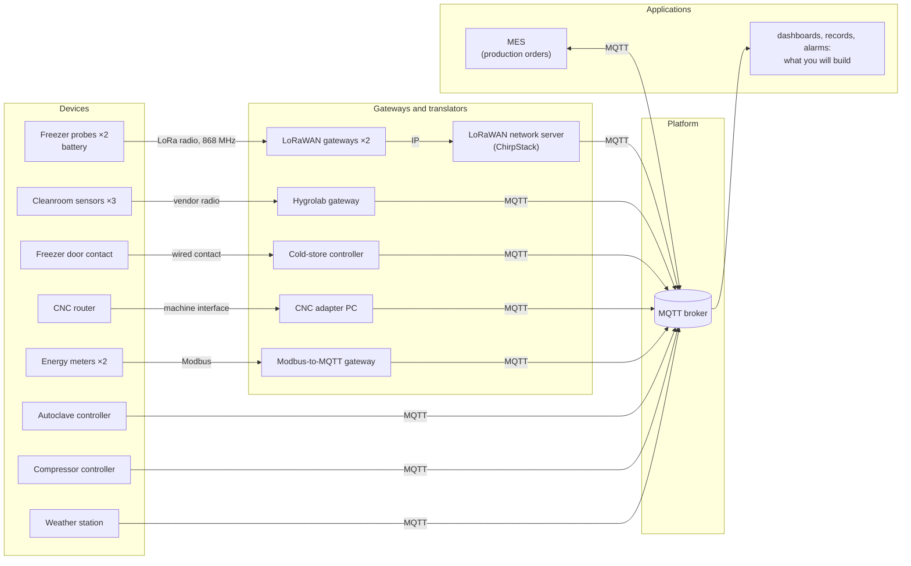
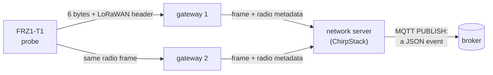

# Lab 1 — How do our data travel today, and can we trust them?

**3 hours, on your own.** You hand in `work/report-lab1.txt`, written by `check report`.
**Lectures:** L1 (the six blocks), L3 parts 1, 4, 5 and 6. Practical help: [Working on your VM](../docs/setup.md).

## The situation

> *"In three weeks an aerospace customer audits us, and I must be able to prove every cure cycle and
> every hour of the freezer. Our electricity bill went up by a third this year, and I want to know
> where it goes. And I want one system, not nine."*
> — Maialen Etxeberria, plant manager

Adour Composites makes carbon-fibre parts. Its prepreg (carbon fibre pre-impregnated with resin) waits
in a freezer at −18 °C; technicians lay it up in a cleanroom; an autoclave cures the parts at 180 °C and
7 bar; a CNC router trims them; a compressor and the electricity network serve the whole site. Every
one of these sends data to the plant's MQTT broker — each supplier in its own way.

Before building anything for Maialen, you must answer one question: **how do the plant's data travel
today, and can they be trusted for the audit?** At the end of the lab, you give her your verdict.

## The thread of the lab

Each part answers one question, and its answer raises the next one.

| Part | The question | Time |
|---|---|---|
| [1](#part-1--what-is-there) | What is there? | 25 min |
| [2](#part-2--what-exactly-reaches-the-broker) | What exactly reaches the broker? | 45 min |
| [3](#part-3--what-does-it-take-to-be-a-device) | What does it take to be a device? | 20 min |
| [4](#part-4--how-do-we-make-the-data-usable-together) | How do we make the data usable together? | 50 min |
| [5](#part-5--when-the-data-stop-how-do-we-know-why) | When the data stop, how do we know why? | 30 min |
| [Verdict](#your-verdict) | Can the plant be trusted for the audit? | 10 min |

> **Pace yourself.** At the break (1 h 30), you should be finishing Part 2. If at 2 h 15 you have not
> started Part 5, do its exercises before the remaining questions. Ten minutes before the end: the
> verdict, then `check report`. The [◆ deeper](#-going-deeper) items are for those who are done.

**How it works.** In each part you first **predict**, then **learn** what you need, **do** the
exercises (each says its goal; `check` confirms it works), and **think**: the questions, answered in
`work/answers.txt`, are what is graded. The programs you write all start from a base in `work/` where
`TODO` marks what is yours to write.

## Step 0 — Before the session: get your lab ready

**Why:** three hours go fast. This step makes sure that the four programs of the lab run on your VM,
so that the session goes to the plant, not to the installation. Nothing to understand yet.

Follow [Working on your VM](../docs/setup.md) to connect, start the lab and open a terminal in the
workstation. Then type `check 1`:

```
Exercise 1 — The lab is running
  ✔ the relay answers at http://relay:8080
  ✔ the plant is talking: autoclave-ac1, chirpstack, cmp1, cnc1-adapter, coldstore-ctrl, hygrolab-gw, mes, modbus2mqtt, weather-roof
  ✔ MQTT answers at relay:1884
```

The list of devices varies: some publish only every few minutes. If a line is red, run `hint 1`; if it
stays red, tell your teacher before the session. Then open the **viewer** in your laptop's browser,
http://localhost:8080, and keep it open for the whole lab. (Inside the lab its address is
`relay:8080`, which is what `check` shows; your SSH tunnel or VS Code carries it to `localhost:8080`.)

---

## Part 1 — What is there?

**Why.** You cannot trust data whose path you do not know. Every element between a sensor and an
application can change the data, lose them, or fail — so the first job is to read the architecture,
element by element.

### Learn: the plant's architecture

This is how the plant's data reach the broker today:



**MQTT** is the protocol every path ends with. Clients never talk to each other: they connect to the
**broker**, **publish** messages on a **topic** (an address such as `hygrolab/CR-01/temperature`), and
**subscribe** to topic **filters**; the broker forwards each message to every subscriber whose filter
matches. Publishers do not know who listens. Two wildcards make filters: `+` replaces exactly one level
(`hygrolab/+/temperature`: every cleanroom sensor's temperature), `#` replaces all the rest and comes
last (`hygrolab/#`: everything under `hygrolab/`). Each exchange is a series of **packets**:
`CONNECT`/`CONNACK` to open a session, `PUBLISH` to send a message (and `PUBACK`, the broker's
acknowledgement, when the message asks for one: that is its *QoS*, the subject of Lab 2),
`SUBSCRIBE`/`SUBACK`, `PINGREQ`/`PINGRESP` to show a silent client is still there, `DISCONNECT`.

**Your lab** reproduces this. The `plant` container plays every device and gateway above; `broker` is
the broker; your `workstation` is where you work; and the `relay` sits in front of the broker and
records every packet for the viewer. **Rule of the lab:** every client connects to the relay, host
`relay`, port `1884`, never to the broker directly — otherwise the viewer cannot see you.

### Do

**Exercise 2 — A subscription and a message by hand.**
*Goal: see publish/subscribe work with your own eyes, and learn to find packets in the viewer — the
instrument of the whole lab.*

In a first workstation terminal, subscribe to the cleanroom (always quote a filter with `#` or `+`):

```bash
mosquitto_sub -h relay -p 1884 -t 'hygrolab/#' -v
```

Six values arrive every ten seconds, such as `hygrolab/CR-01/temperature 20.65`. The subscription
stays open and receives. In a second terminal, publish a message:

```bash
mosquitto_pub -h relay -p 1884 -t lab/hello -m 'hello from team X'
```

The publisher connects, publishes and leaves: it never knows who received it. Now find both in the
viewer's *Packets* tab: your `SUBSCRIBE` and its `SUBACK`, then the `CONNECT`, `PUBLISH`, `DISCONNECT`
of `mosquitto_pub`. The plant talks a lot, so type `lab/hello` or `SUBSCRIBE` in the **filter** box at
the top; ↑ is a packet going to the broker, ↓ one coming from it; `PINGREQ`/`PINGRESP` are hidden
unless you untick the box. The two command-line tools appear with an empty client id: they let the
broker choose one. Then `check 2`.

### Think

> **Question 1 — Put names on the architecture** · *the six blocks (L1, part 2)*
>
> Subscribe to `#` for a minute and use the viewer's *Topics* and *Clients* tabs. For five devices — a
> freezer probe, a cleanroom sensor, the main energy meter, the autoclave, the CNC router — fill the
> table in `answers.txt`: the link between the device and the next element in the diagram, the
> **client id** that publishes its data on MQTT, and the topic.
>
> (a) Four of these five reach MQTT only through a translator. For each, why does the device not
> publish MQTT itself? Think of energy, range, age, and who controls the machine.
> (b) Each translator is now in the data path. Name one thing that can go wrong for the plant's data
> when a translator fails, that could not go wrong if the device published directly. The *Clients* tab
> shows a real case.

**What you now know.** The data change hands several times before the broker, and each translator
changes the protocol, the format, sometimes the identity of the device. *So what exactly arrives at
the end?*

---

## Part 2 — What exactly reaches the broker?

**Why.** The audit needs every hour of the freezer. So follow one freezer temperature, from the probe
near the door (`FRZ1-T1`) to your screen, and see what is added on the way, what is lost, and what is
missing.

**Predict** (in `answers.txt`, before you look; a wrong guess costs nothing): how many bytes reach the
broker for one freezer reading? If the radio loses a reading, does the plant get it back?

**Start now**, in a spare terminal, `python watch_uplinks.py`, and leave it running: it prints one
line per uplink of the freezer probes. Question 3 needs at least twenty minutes of it.

### Learn: from the probe to the broker



- The probe wakes once a minute, measures, sends **6 bytes** by radio, and sleeps again. Its uplinks
  are **unconfirmed**: no acknowledgement, no retransmission.
- Every gateway in range receives the frame and forwards it, adding what it measured of the signal.
- The network server removes duplicates and publishes one **event** per uplink: a JSON document in
  which the probe's bytes are base64-encoded in the field `data`. Each uplink carries a **frame
  counter**, `fCnt`, that the probe increments at every transmission.

The probe's frame, from its datasheet:

| Byte | 0 | 1–2 | 3 | 4 | 5 |
|---|---|---|---|---|---|
| Content | frame type, `0x11` | temperature, hundredths of °C, **signed**, big-endian | humidity, % | battery, % | status |

And an MQTT `PUBLISH` packet (MQTT 3.1.1, section 3.3):

| Part | Bytes | Content |
|---|---|---|
| fixed header | 1 | packet type and flags: DUP, QoS, RETAIN |
| | 1 to 4 | *remaining length*: the size of what follows (1 byte up to 127) |
| variable header | 2 | the topic's length |
| | n | the topic |
| | 0 or 2 | packet identifier, only with QoS 1 or 2 |
| payload | the rest | the message |

### Do

**Exercise 3 — Take a message apart.**
*Goal: measure, yourself, what one reading costs and contains — your answers to questions 2 and 3 rest
on these numbers.*

Fill `work/measurements.json`:

| Key | What |
|---|---|
| `cleanroom_topic_bytes` | the length of the topic `hygrolab/CR-01/temperature` |
| `cleanroom_packet_bytes` | the whole `PUBLISH` packet of a CR-01 temperature (viewer, *packet B*) |
| `chirpstack_payload_bytes` | the payload of one ChirpStack event, roughly |
| `probe_frame_bytes` | the bytes the probe sent: the event's `data`, base64-decoded |
| `probe_temperature_c` | a temperature of `FRZ1-T1` from the last 15 minutes, **decoded by you** |

To decode, complete the two `TODO` of `work/decode.py`: base64 to bytes, then the `struct` format that
matches the datasheet. `python decode.py --test` checks your decoder on a known frame;
`python decode.py <data>` decodes any frame. Which event is `FRZ1-T1`? The event names the probe in
words. Then `check 3`.

### Think

> **Question 2 — Where do the bytes go?** · *count the bytes (L3, parts 5 and 6)*
>
> (a) Complete the account of the CR-01 packet: fixed header (type and flags, then remaining length)
> ___ + topic length ___ + topic ___ + packet identifier ___ + payload ___ = ___ bytes. What share is
> the measured value?
> (b) The probe's 6 bytes are what share of the ChirpStack event's payload? Name three other pieces of
> information the event carries, and who in the plant could use each — or nobody.
> (c) The probe sent about 20 bytes over the radio; about 1,000 reach the broker. Where along the chain
> is the difference added, and why is that acceptable there when it would not be on the radio?

> **Question 3 — Lost frames** · *what a lost message costs (L3, part 4)*
>
> (a) In the output of `watch_uplinks.py`, find a gap in one probe's `fCnt`: which counters are
> missing, around what time? What does `fCnt` let you detect that the times alone would not?
> (b) Can the plant get those readings back? Why not?
> (c) The auditor wants proof that the freezer stayed below −15 °C *every* hour. Propose the rule an
> application must apply to these events so that missing data never pass for good data, and what it
> does when the rule fires.

**What you now know.** A measurement is a few bytes; everything around it is added by the
architecture. What the radio did not carry is lost for good, and the time in the event is when it was
*received*. *So what must a device do to deliver its data properly?*

---

## Part 3 — What does it take to be a device?

**Why.** The cleanroom gets a fourth layup bay and its sensor is late: you write a stand-in. Being on
the device's side shows what every device must get right — and what happens when it does not.

### Learn: a client, an identity, a session

A client has an **identifier**, opens a **connection**, and promises a **keepalive**: the longest it
will stay silent (when it has nothing to say, it sends `PINGREQ`). In Python, with the Paho library:

```python
c = mqtt.Client(mqtt.CallbackAPIVersion.VERSION2, client_id="sensor-alice")
c.connect("relay", 1884, keepalive=60)
c.loop_start()                                   # the network runs in a background thread
c.publish("some/topic", "some payload", qos=1)
```

One rule of MQTT matters here (MQTT 3.1.1, section 3.1.4): *if a client connects with a client id
already in use, the broker disconnects the existing client.* It lets a device whose link broke
reconnect at once, before the broker has noticed that the old connection is dead.

### Do

**Exercise 4 — Your virtual sensor.**
*Goal: publish a measurement the way a good device should: a unique identity, a clean format, the time
of measurement.*

Run `python publish_example.py` and find its packets in the viewer. Then complete the `TODO` marked
*exercise 4* in `work/sensor.py`: your name, and a reading in JSON with `temperature_c`,
`humidity_pct` and `measured_at` (ISO 8601, UTC), for example
`{"temperature_c": 20.4, "humidity_pct": 46, "measured_at": "2026-10-01T13:28:21+00:00"}`. The sensor
publishes every 5 s on `lab/sensors/<name>/env`. Run it (`python sensor.py`), wait a minute, `check 4`.
Keep it running: question 4 needs it.

### Think

> **Question 4 — Two clients, one identifier** · *sessions (L3, part 5)*
>
> Start a second copy of your sensor with the same client id and watch the *Clients* tab for 30 s.
> (a) What happens? Give a figure (connections in 30 s) and explain it with the rule above.
> (b) In the plant, two devices are installed with the same id: what do the applications see, and why
> is it hard to diagnose? How do manufacturers make ids unique?

**What you now know.** A device is trusted on its identity, and its data are only as good as the
format and the time it gives them. The plant's devices each do it their own way. *So how do we make
their data usable together?*

---

## Part 4 — How do we make the data usable together?

**Why.** Maialen wants one system. Today an application that wants "everything about the autoclave"
must know three vendors' conventions. The fix has two halves: an address for every device, organised
for those who will read it — a **namespace** — and programs that translate each vendor's messages
into it — **bridges**.

**Predict**: the autoclave's quality record needs everything about the autoclave — its controller and
its energy meter, and nothing else. How many subscriptions does that take today? How many should it?

### Learn: the namespace is an interface

All topics together form a **tree**, and the order of its levels decides what one subscription can
ask: with `plant/<area>/<cell>/...`, the filter `plant/curing/#` delivers the whole curing area. Every
subscriber depends on that order: the namespace is the first interface of an IoT system, and changing
it later means changing every subscriber.

Industry converges on the **unified namespace**: one broker, one tree, organised like the plant. Its
structure usually comes from **ISA-95**, the standard that describes a manufacturing company as a
hierarchy: *enterprise, site, area, work centre, work unit*. Since devices rarely speak it, **bridges**
subscribe to the vendors' topics, clean the messages — units converted, time attached, identity made
explicit — and republish them in the tree.

### Think first

> **Question 5 — What is wrong with the plant's topics?** · *identity, unit and time travel with the
> value (L3, part 6)*
>
> From the *Topics* tab, fill the table in `answers.txt` with at least four distinct problems: the
> problem, where you saw it, and what it breaks for an application that subscribes. Look at the
> freezer door, the energy meters, the compressor, the cleanroom. Then: why can nobody subscribe to
> "everything in the curing area" today?

### Do

**Exercise 5 — A namespace for the plant.**
*Goal: give every device one address, organised so that each future application needs one
subscription.*

`work/inventory.json` lists the 13 devices — area, cell, class — and five needs:

| Need | The application wants |
|---|---|
| N1 | everything in the curing area |
| N2 | every energy meter, whatever the area |
| N3 | everything in the cold store |
| N4 | every production machine, for the OEE dashboard |
| N5 | everything in the autoclave-1 cell, for its quality record |

Fill `work/tree.json` (it lists the 13 devices: give each one its topic) and
`work/subscriptions.json` (for each need, the filters that deliver exactly its devices — two at most,
one if your namespace is good). The checker applies your filters as a broker would, and says what each
need misses or catches too much. `check 5`.

**Exercise 6 — Bridge two devices into your namespace.**
*Goal: make the namespace real, the way plants do it: a program that translates vendor messages.*

Complete the `TODO` of `work/bridge.py`: its subscriptions, which probe is which, and two conversions.

| Device | The plant publishes | Your bridge publishes, on the device's topic in `tree.json` |
|---|---|---|
| CMP-1 | `compressors/CMP1`: JSON, pressure in **psi**, time in seconds since 1970 | `{"pressure_bar": 7.12, "measured_at": "..."}` |
| FRZ1-T1, FRZ1-T2 | ChirpStack events, the 6 bytes in `data` | `{"temperature_c": -17.62, "measured_at": "..."}` |

Values in °C and bar (1 psi = 0.0689476 bar), two decimals at least. `measured_at` in ISO 8601 with its
time zone, and the best time you have: the compressor's own clock (its `timestamp`); for the probes,
which have no clock, the network server's reception time (the event's `time`). Run it two minutes,
then `check 6`: it compares what you published with what the plant sent.

### Think

> **Question 6 — Your namespace under stress** · *unified namespace, ISA-95*
>
> (a) Justify the order of your levels in two or three sentences. What did ISA-95 give you?
> (b) A new application wants *every temperature measured on the site*. Write the filters it needs. If
> one is not enough, what would you change, and at what cost?
> (c) Next year the CNC router moves to a new cell, `trimming-2`, and its topic changes. Which
> subscribers lose it, and what do you propose?
> (d) Your bridge stops for ten minutes. What do the subscribers of the compressor's clean topic see?
> Can they tell a stopped bridge from a quiet compressor?

**What you now know.** A namespace designed for its readers, and a bridge that cleans the data, make
the plant readable as one. But question 6 (d) left a hole: when data stop, silence says nothing. *So
how do we know whether a device is alive?*

---

## Part 5 — When the data stop, how do we know why?

**Why.** For the audit, "no data" must never look like "all fine". An application must know at any
moment whether each device is alive, and how quickly it learns of a death decides how long the plant
stays blind.

**Predict**: if the cleanroom's gateway lost power right now, how long before an application would
know, and how?

### Learn: retained messages, last will, keepalive

- A **retained message** is kept by the broker — the last one per topic — and handed at once to every
  new subscriber.
- The **last will** is a message a client registers in its `CONNECT` packet. If the client disappears
  without a `DISCONNECT`, the broker publishes it on its behalf. A clean `DISCONNECT` deletes it.
- The **keepalive** decides how a *silent* death is noticed (MQTT 3.1.1, section 3.1.2.10): *if the
  broker receives nothing from a client for one and a half times its keepalive, it closes the
  connection as if the network had failed* — and publishes the will.

Together they give the status pattern: publish `online`, retained, when connected; register `offline`,
retained, as the last will. With Paho:

```python
c.will_set(STATUS, "offline", qos=1, retain=True)   # the will travels in CONNECT: set it before connect()
c.publish(STATUS, "online", qos=1, retain=True)     # a retained message
```

> **Question 7 — What a newcomer receives** · *publish/subscribe (L3, part 5)*
>
> Stop your subscriptions, start a new one on `#`, and look only at the first second.
> (a) Which messages arrive at once, and why these and not the cleanroom's?
> (b) One device of the plant uses the status pattern and crashes from time to time (*Clients* tab).
> While it is down, which of its retained messages still claim something that may be false? What
> should an application check before trusting a retained value?

### Do

**Exercise 7 — A status and a last will.**
*Goal: let any application know at any moment whether your sensor is alive — even one that subscribes
later.*

Complete the `TODO` of `sensor.py` marked *exercise 7*: `online` on `lab/sensors/<name>/status`,
retained, after connecting; and a last will, `offline` on the same topic, retained. Mind where the
will goes. Watch the status in a second terminal
(`mosquitto_sub -h relay -p 1884 -t 'lab/sensors/+/status' -v`), start the sensor, stop it with
**Ctrl+C**, then `check 7`.

**Exercise 8 — A link that dies in silence.**
*Goal: measure how long the plant stays blind when a device dies without a word — the case that
matters, since a cut cable or a flat battery closes nothing.*

Set `KEEPALIVE_S = 15` in `sensor.py`, start it, keep the status subscription running, and press
**Freeze** on its connection in the *Clients* tab: the relay stops forwarding anything, without
closing the connection. Note the time of the freeze, and the time `offline` appears. `check 8`. Then
watch the status for a minute.

### Think

> **Question 8 — How long before the broker notices?** · *the cost of a session (L3, part 5)*
>
> (a) Your measured delay, and the one the rule predicts. Why can they differ by a few seconds, in
> either direction?
> (b) For a `DISCONNECT`, a Ctrl+C and a frozen link: is the will published, and when?
> (c) An idle client sends one `PINGREQ` per keepalive, each waking its radio. Count the wake-ups per
> hour, and the worst-case detection delay, for a keepalive of 15 s and of 60 s.
> (d) Choose a keepalive for the cleanroom gateway (mains-powered; an alarm is expected within a
> minute). Why is MQTT's keepalive the wrong tool for the battery freezer probes, and what tells the
> plant that a probe is dead?

> **Question 9 — Birth, death and goodbye of a gateway** · *who answers when a device dies (L1)*
>
> (a) After exercise 8, your sensor publishes again, yet its status says `offline`. Explain, and fix
> `sensor.py`.
> (b) Design the status messages of the cleanroom's gateway: when it starts (exactly when?), its last
> will, and when it is shut down on purpose. Topic, payload and retain flag for each — and why the
> order of the last step matters.

**What you now know.** Retained messages give the state to whoever arrives; the will reports a death
the device could not announce; the keepalive sets how long a silent death goes unnoticed, and every
second of detection is paid in energy.

---

## Your verdict

> **Question 10 — What you tell Maialen** · *the whole lab*
>
> In ten lines at most, answer the plant manager: **can the plant, today, prove every hour of the
> freezer?** Give what prevents it, then the three changes you recommend first, in order. Every claim
> must rest on something you measured or observed in this lab — name it. End with one line: what this
> lab does *not* yet tell you about the cure records (Lab 2 starts there).

## Hand in, and your record

**Record, at home before Lab 2** (`~/iot-labs/record/site-architecture.md`): write sections 1 to 4 —
the three uses of the plant's data, the architecture as it should be (start from Part 1), your
namespace, and device liveness — and log your decisions: constraint, option retained, option rejected,
reason. It is handed in with Lab 2's report.

**Hand in:** `check report`, then download `~/iot-labs/lab1/work/report-lab1.txt` and hand it in. It
holds your answers, your files, and the time each exercise first passed — your programs need not be
running. Run it again after any change to your answers.

---

## ◆ Going deeper

For those who are done, in any order. Answer in `answers.txt`.

> **D1 — The lab is not the plant** *(extends Part 1)* In a terminal on the VM (not the workstation),
> `cd ~/iot-labs/lab1 && docker compose logs broker | tail -20` shows the address each client connects from.
> Which address, which container's, and why is it the same for every client? Name one thing a real
> broker could no longer do properly behind such a relay. In the real plant, what would let you see
> every packet without sitting in the data path?

> **D2 — Why not HTTPS for the cleanroom?** *(extends Part 1)* The cleanroom's gateway could POST each
> reading over HTTPS. Estimate, for one reading, the bytes and round trips of HTTPS with a new
> connection, with a connection kept open, and of MQTT on an open session. Which interaction pattern
> does each impose on the applications? If the sensors slept between readings, which protocol would L3
> propose, and why?

> **D3 — From one plant to the group** *(extends Part 2)* Stop your clients and read the viewer's
> counter: messages and bytes per minute, then per day. The group plans 5,000 devices of the same mix:
> messages per second and per year, and the yearly bill of a platform charging 1 € per million
> messages. Which flow dominates, and what does it mean for a device on a cellular link?

> **D4 — What the broker says about itself** *(extends Part 2)* Subscribe to `$SYS/#` for 20 s: the
> Mosquitto version, the clients connected, the messages received. Why do these topics not appear
> under `#`? Quote the section of the MQTT specification.

> **D5 — Sparkplug B** *(extends Part 4)* Describe the topic structure and message types of this
> standard on top of MQTT (Eclipse Foundation). What does it impose that your namespace does not,
> which problems of question 5 does it solve, and how does it fit with a unified namespace? Cite the
> specification.

> **D6 — The whole plant** *(extends Part 4)* Extend your bridge to the eleven other devices, driven by
> a table (source topic → device → conversion) rather than a chain of `if`. Which conversions needed
> information that is in no message?

*Next: Lab 2 — can we lose a cure record if the network fails?*
