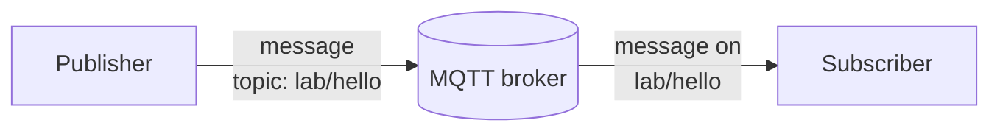
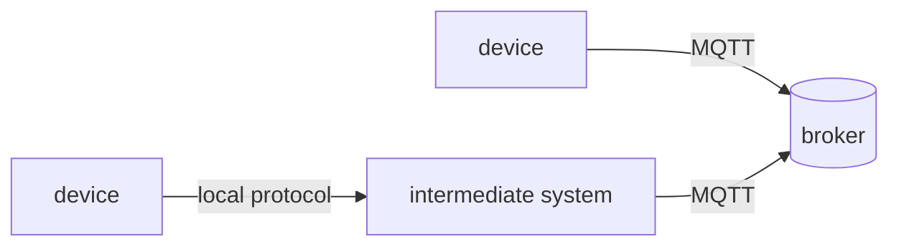
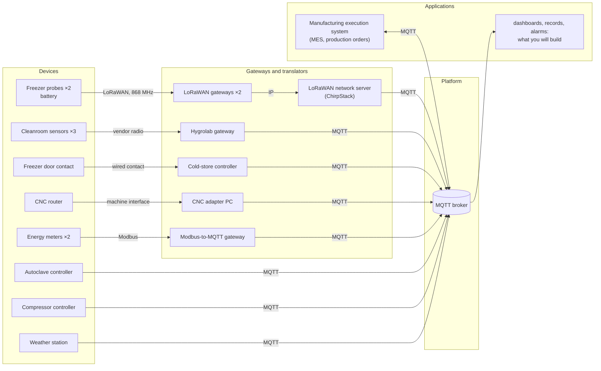
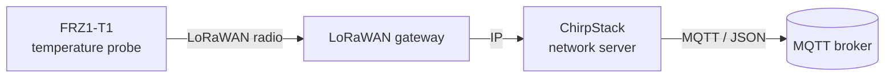
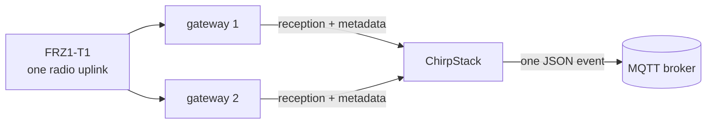

# Lab 1 — How do our data travel today, and can we trust them?


## The situation

> *"In three weeks an aerospace customer audits us, and I must be able to prove every cure cycle and
> every hour of the freezer. Our electricity bill went up by a third this year, and I want to know
> where it goes. And I want one system, not nine."*
> — Maialen Etxeberria, plant manager

Adour Composites makes carbon-fibre parts. Its prepreg (carbon fibre pre-impregnated with resin) waits
in a freezer at −18 °C; technicians lay it up in a cleanroom; an autoclave cures the parts at 180 °C
and 7 bar; a CNC router trims them; a compressor and the electricity network serve the whole site.
The equipment already sends data, but through different devices, protocols, gateways and formats.

The objective of this first lab is to reconstruct how those data travel today and to determine what
can — and cannot — be established from the data that finally reach applications.

---

## Preparation

Follow [Working on your VM](../docs/setup.md) to connect to the VM and start the lab. Open the
**viewer** in your laptop's browser at <http://localhost:8080> and keep it available throughout the
lab. Within a few seconds, MQTT traffic from the simulated plant should appear.

All commands in this lab are run **inside the `workstation` container** unless stated otherwise. The
container already includes Python and the Mosquitto command-line clients, so nothing needs to be
installed on your own machine. From `~/iot-labs/lab1` on the VM, open a shell in that container with:

```bash
docker compose exec workstation bash
```

The shell opens in `/work`, which is the lab's working directory. Open additional shells with the same
command whenever two programs must run at the same time.

The viewer is an observation instrument built for the course. It displays the MQTT traffic that
passes through the lab relay. To make this observation possible, the simulated MQTT clients connect
through `relay:1884` rather than directly to the broker.

---

## Part 1 — One MQTT message, from publisher to subscriber

Before looking at the plant, start with the smallest MQTT system that is useful: one program produces a
message, one broker receives it, and one program consumes it.



The **publisher** sends a message to a named **topic**. The **subscriber** asks the broker for messages
on that topic. The **broker** sits between them: it receives publications and forwards them to the
subscribers that asked for the corresponding topics. The publisher therefore does not need to know
which application will consume its data.

**MQTT** is the protocol. **Eclipse Mosquitto** is one implementation of it. The broker used in this
lab runs Mosquitto, and Mosquitto also provides the two command-line programs used below:
`mosquitto_pub` to publish a message and `mosquitto_sub` to receive one.

### Publish one message and receive it

In the first `workstation` shell, subscribe to one exact topic:

```bash
mosquitto_sub -h relay -p 1884 -i lab-subscriber -t 'lab/hello' -v
```

Here `relay:1884` is the MQTT endpoint exposed by the lab, `-t` gives the topic of interest, and `-v`
prints both the topic and the payload. The option `-i lab-subscriber` gives this command-line client a
readable name in the viewer; MQTT calls it a **client identifier**. We will examine the role of that
identifier later. The terminal should initially remain quiet.

Open a second `workstation` shell with the same `docker compose exec workstation bash` command, then publish one message on that same topic:

```bash
mosquitto_pub -h relay -p 1884 -i lab-publisher -t 'lab/hello' -m 'hello from team X'
```

The subscriber should now display the message. At this point, the important chain is simply:

```text
publisher  ->  broker  ->  subscriber
             lab/hello
```

Now look at the same exchange in the viewer's **Packets** tab. Enter `lab-` in the filter box so that
the plant's background traffic does not obscure your two clients. The terminal commands only show the
application-level result; the viewer exposes the MQTT exchange underneath it. You should find a
connection from each client, a subscription from the receiving client and the publication you just
generated. In MQTT, these appear as packets such as `CONNECT`, `SUBSCRIBE` and `PUBLISH`. A cleanly
closed client may also send `DISCONNECT`.

The lab inserts a relay so that this traffic can be observed. `↑` denotes a packet travelling toward
the broker and `↓` a packet travelling away from it.

### Q1 — Reconstruct the exchange you just generated

Follow your two terminals in the **Packets** tab. Starting with the subscriber connection and ending
with the message received by that subscriber, reconstruct the sequence you can actually observe.
Which client installed the subscription? Which topic did it request? Which client later published the
message? Where, in this chain, is the decision made to forward the publication to the subscriber?

Relate what you observe to the three roles in the figure above: **publisher**, **broker** and
**subscriber**.

When you have finished Q1, stop the first subscriber with `Ctrl+C`. Keeping it running is not useful
for the next step, and we will study later what happens when two MQTT connections reuse the same
client identifier.

### From one topic to several

Subscribing to one exact topic works for `lab/hello`, but a real application often needs a whole set of
related measurements. MQTT topics are hierarchical names made of levels separated by `/`. For example,
the cleanroom sensors use names of this form:

```text
hygrolab
├── CR-01
│   ├── temperature
│   └── humidity
└── CR-02
    ├── temperature
    └── humidity
```

A **topic filter** can describe more than one topic. A **wildcard** is a placeholder used in a
subscription filter instead of spelling out an exact level or suffix. MQTT provides two wildcard
symbols:

```text
hygrolab/CR-01/temperature    one exact topic
hygrolab/+/temperature        '+' lets one level vary
hygrolab/#                    '#' includes everything below hygrolab
```

`+` always replaces exactly one level. `#` replaces all remaining levels and can only appear at the
end of a filter. These wildcards belong to **subscription filters**; publishers still publish to a
concrete topic such as `hygrolab/CR-01/temperature`.

### Q2 — Read MQTT topic filters as the broker does

Consider the following three filters:

```text
hygrolab/#
hygrolab/+/temperature
+/CR-01/temperature
```

First predict which of the following topics each filter would match:

```text
hygrolab/CR-01/temperature
hygrolab/CR-02/humidity
hygrolab/CR-01/status
compressors/CMP1
```

Then test the filters with `mosquitto_sub` for a short period and compare what actually arrives with
your prediction. For example, start with:

```bash
mosquitto_sub -h relay -p 1884 -i filter-observer -t 'hygrolab/#' -v
```

The cleanroom simulator publishes six measurements (temperature and humidity for three sensors) every
10 seconds, so allow at least one complete 10-second cycle before deciding that nothing is arriving.
Stop the command with `Ctrl+C` before testing the next filter; reuse `filter-observer` sequentially,
not in several terminals at once.

Some listed topics may not currently be produced; in that case, decide from the matching rule rather
than from the absence of a live message. For at least two non-obvious cases, explain the match level
by level.

<details>
<summary><strong>◆ Going deeper — D1: what the broker says about itself</strong></summary>

Mosquitto publishes operational information under the special `$SYS/` hierarchy. Subscribe for about
20 seconds (keep the quotes: `$` has a meaning to the shell):

```bash
mosquitto_sub -h relay -p 1884 -i sys-observer -t '$SYS/#' -v
```

Find the broker version, the number of connected clients and at least one counter related to messages
or bytes. For each value, state what an operator could actually diagnose from it. Then identify one
important property of the physical plant that these broker metrics cannot tell you.

Now stop that subscriber and subscribe briefly to `#`. You will not receive the `$SYS/...` messages.
This is an MQTT rule: a topic beginning with `$` is not matched by a subscription whose first level is
a wildcard (`#` or `+`). To receive system topics, the filter itself must begin with `$`. Verify the
rule with the two subscriptions and explain why separating broker-internal topics from ordinary
application traffic can be useful.
</details>

Stop the temporary `lab-subscriber` and any filter-testing subscriptions with **Ctrl+C** before moving
on. Keeping broad subscriptions open would only duplicate background traffic in the viewer.

---

## Part 2 — From physical devices to MQTT

The exchange above had only three actors. In the plant, there are two basic ways for a measurement to
reach MQTT. Some devices can act as MQTT clients themselves. Others speak a different protocol and
need an intermediate component that translates or forwards their data before MQTT appears.



In the first case, the physical device and the MQTT client may be the same component. In the second,
the physical device is not an MQTT client: a gateway, adapter, network server or other intermediate
component eventually publishes on its behalf. The broker therefore sees that intermediate component,
not the original sensor, as its MQTT peer. That distinction matters later when we ask where a value
came from or what exactly has failed.

The plant is simply a larger combination of these two patterns. Use the following diagram first as a
map: identify which sources publish MQTT directly and which ones reach MQTT through an intermediate
component.

This is the current architecture:



The labels on the first links—LoRa radio, Modbus, vendor radio, machine interface—mainly tell you that
those devices do **not** start by speaking MQTT. Their internal protocol details are not needed to trace
the path here; the important question is where MQTT first appears.

A **gateway** or **translator** belongs to the data path. Depending on the source, it may change the
communication protocol, the representation of a value, the timestamp, or the identifier eventually
visible to applications.

Observe the complete MQTT namespace for about one minute:

```bash
mosquitto_sub -h relay -p 1884 -i plant-observer -t '#' -v
```

Do not try to decode the whole plant from the packet list at once. Start in the viewer's **Topics**
tab and choose a topic whose name clearly points to one of the devices below. Copy a distinctive part
of that topic into the **Packets** filter, inspect a recent `PUBLISH`, and read the **client** that sent
it. Then use the architecture diagram to work backwards from that MQTT client to the physical device.
The **Clients** tab is useful when you want to confirm that a client is currently connected.

### Q3 — Trace five devices up to the broker

Apply that method to `CR-01`, `EM-MAIN`, `AC-1`, `CNC-1` and `CMP-1`. The freezer is deliberately
left aside here; its longer LoRaWAN path is introduced step by step in Part 3.

For each of the five devices, reconstruct:

1. the first communication link or interface leaving the physical device, using the architecture;
2. any intermediate component before MQTT appears;
3. the MQTT client id that actually publishes the data, using the viewer;
4. one concrete MQTT topic carrying data from that device.

The objective is to distinguish what the **physical device** is from what the **broker sees as an
MQTT client**.

### Q4 — What changes when a gateway publishes on behalf of a device?

Open one recent `PUBLISH` for each of these three sources: `AC-1`, `CR-01` and `EM-MAIN`. For each
one, put side by side the physical source named in the architecture and the MQTT client shown in the
viewer.

`AC-1` reaches MQTT directly. `CR-01` and `EM-MAIN` do not. For each of those two translated paths,
identify the intermediate component and explain why it is needed. Then consider this concrete
situation: the physical sensor is still operating, but the intermediate component stops publishing.
What would the application see at the broker? From MQTT traffic alone, could it distinguish a failed
sensor from a failed gateway or translator? Explain what information is missing.

<details>
<summary><strong>◆ Going deeper — D2: the lab is not the plant</strong></summary>

The relay is useful for teaching because it makes MQTT visible, but inserting it also changes what the
broker can observe. On the VM, outside the `workstation` container, inspect recent broker log lines:

```bash
cd ~/iot-labs/lab1
docker compose logs broker | tail -30
```

Look specifically for lines reporting a new MQTT client connection. Compare the **network address**
reported there with the logical client ids visible in the viewer (`hygrolab-gw`, `modbus2mqtt`,
`autoclave-ac1`, ...). Draw one complete path:

```text
MQTT client -> relay -> broker
```

and mark which identity or address is visible at each point. Explain why the broker-side network
address alone cannot identify the original physical device in this lab.

Finally, compare two alternatives for observing a real deployment without inserting this relay:
**broker-side logs/metrics** and a **network capture on the broker host**. What would each reveal that
the other might not? The objective is to separate what an observation point can see from what exists
elsewhere in the path.
</details>

Stop `plant-observer` before continuing. It has served its purpose, and leaving a `#` subscription open
would make every later publication appear once more on its way back to that subscriber.

---

## Part 3 — Follow one freezer reading end to end

The freezer is the first device in the lab whose data takes a longer path before reaching MQTT. Rather
than introducing every detail at once, follow one measurement from `FRZ1-T1` and add one piece of the
path at a time.

### First locate the measurement path

`FRZ1-T1` is the battery-powered temperature **probe** placed near the freezer door. The probe does
not speak MQTT. Its measurements reach the broker through this chain:



Only three new roles are needed for now:

- **LoRaWAN** is the low-power radio technology used by the probe;
- a **LoRaWAN gateway** hears the radio transmission and forwards it over IP;
- **ChirpStack** is the LoRaWAN network server used in the lab. It receives the forwarded radio data
  and exposes an application event through MQTT.

A transmission from the probe toward the network is called an **uplink**. Open a spare
`workstation` shell and run:

```bash
docker compose exec workstation bash
python watch_uplinks.py
```

Leave it running. Each line corresponds to one freezer uplink that ChirpStack has accepted. At this
point, just make sure that you can see the two probes appear periodically. The columns `fCnt` and
`gateways` will be used later; there is no need to interpret them yet.

In ChirpStack, `FRZ1-T1` is named `frz1-probe-door` and `FRZ1-T2` is named `frz1-probe-back`. These
are two names for the same physical devices at different layers of the system.

### Decode what the probe actually sent

The physical probe does not send JSON. To save radio airtime and energy, it packs its application data
into only **6 bytes**. ChirpStack later places those bytes inside a JSON MQTT event. Because arbitrary
binary bytes cannot be written directly as ordinary JSON text, the event carries them in the `data`
field using **base64**, a text representation of binary data.

In the viewer, filter on:

```text
application/adour-coldchain/device/
```

Open one recent event whose `deviceInfo.deviceName` is `frz1-probe-door`. Locate its `data` field.
That base64 string represents these six bytes:

| Byte | 0 | 1–2 | 3 | 4 | 5 |
|---|---|---|---|---|---|
| Content | frame type `0x11` | temperature, hundredths of °C, **signed**, big-endian | humidity % | battery % | status |

Complete the two `TODO` in `work/decode.py`: decode the base64 text into bytes, then unpack the
6-byte structure above. The script already contains a small local test:

```bash
python decode.py --test
```

Then give it the `data` value from the real `FRZ1-T1` event and check that the resulting temperature,
humidity and battery values are plausible.

### Q5 — What information did the probe itself produce?

Use the single `FRZ1-T1` event you have just decoded. Keep the six decoded bytes and the resulting
physical values side by side.

Identify exactly which information is encoded by the probe in those six bytes. In particular, decide
whether the payload itself contains the device name, a measurement timestamp or any information about
which gateway received it. For the temperature field, explain how the two bytes become a signed value
in degrees Celsius; you may use one concrete decoded example rather than describing the conversion
only in general terms.

The objective here is simply to establish the boundary of the **sensor payload**: what the physical
probe knows and sends before the rest of the infrastructure adds anything around it.

### Now look at what the infrastructure adds

Return to the complete ChirpStack JSON event containing those same six bytes. The JSON is much richer
than the probe payload because other components know things that the probe does not.

A single LoRaWAN transmission can also be heard by more than one gateway. Each gateway forwards its
reception to ChirpStack; the network server recognises that they concern the same uplink and exposes
one application event containing reception metadata.



The number printed in the `gateways` column of `watch_uplinks.py` is the number of gateway receptions
reported for that event.

### Q6 — What was added after the radio transmission?

Stay with the same `FRZ1-T1` event. Compare the six decoded application bytes with the surrounding
ChirpStack JSON.

Find at least three useful pieces of information that are present in the JSON but were **not** present
in the six bytes sent by the probe. For each one:

1. point to the corresponding JSON field;
2. identify which part of the path can know or create that information;
3. give one reason why an application might care about it.

Then return to the binary temperature format used in Q5. Somewhere in the system, software must know
that bytes 1–2 mean a signed big-endian temperature in hundredths of a degree. Identify where that
knowledge is used in this lab. What would happen if a future probe firmware changed the encoding but
the decoder was not updated?

At this point you should be able to separate two things clearly: **the measurement produced by the
probe** and **the context added by the communication infrastructure**.

### Detect a missing uplink

One field in the ChirpStack event deserves separate attention: `fCnt`, the LoRaWAN **frame counter**.
It increases when the device creates successive uplinks. If an application receives counters 41 and
43 for the same probe, it knows that the sequence it observed is incomplete even though it never saw
counter 42.

To make this visible during the lab, the simulator deliberately suppresses one out of every four probe
uplinks before it reaches ChirpStack. The **25% loss rate is intentionally exaggerated for teaching**.
The missing uplink still consumes its counter value, so a gap appears in the next received event.

### Q7 — Use `fCnt` to identify incomplete evidence

Return to `watch_uplinks.py` and find two successive **received** events from the same probe whose
`fCnt` values are not consecutive. Record the two counters and their reception times.

From this one concrete gap, determine which counter value is missing and what you can conclude about
the sequence that reached ChirpStack. Then state two things that the counter does **not** tell you:
where along the path the missing uplink disappeared, and what temperature value it contained.

For this reasoning, ignore the fact that you know how the teaching simulator injects the loss. Reason
only from the events that a real application would receive.

### Finally, ask what time the measurement represents

The ChirpStack event also contains a `time` field. This is a network-server reception time. The probe
itself has no clock, so it does not put a measurement timestamp in its six-byte payload.

### Q8 — Which timestamp does the freezer evidence actually contain?

Open one freezer event and compare its JSON `time` with the arrival time displayed by the relay.
Consider four instants in order:

1. the physical temperature measurement;
2. the radio transmission;
3. reception by ChirpStack;
4. arrival of the MQTT packet at the relay.

For each one, state whether this system knows it directly, only approximates it, or does not know it at
all. Then explain the remaining uncertainty if an auditor asks whether the freezer was below −15 °C
**throughout** a particular hour.

<details>
<summary><strong>◆ Going deeper — D3: from message representation to traffic at scale</strong></summary>

The freezer probe uses six compact application bytes because radio airtime matters. Once data reaches
an IP network, other sources in the plant use much more verbose MQTT representations. Quantify that
trade-off rather than assuming that either representation is inherently better.

First choose one `hygrolab/CR-01/temperature` publication in the viewer. Record its MQTT `packet B`,
the topic length and the textual temperature payload. Estimate what fraction of that MQTT packet is
the temperature text itself. The viewer's `packet B` is the MQTT packet only; TCP/IP and link-layer
headers are not included.

Then use the **Topics (last 5 min)** tab to compare three reporting behaviours: `CR-01`, the compressor
`compressors/CMP1`, and the main energy meter `modbus2mqtt/meter_main/...`. For each one, estimate
messages per hour and MQTT PUBLISH bytes per hour. Extrapolate each behaviour independently to 5,000
similar devices.

Explain why a larger, readable representation on the IP side can still be sensible even though the
radio payload is compact. Finally, give at least three reasons why your linear extrapolation would be
insufficient for real broker capacity planning (bursts, reconnects, TLS/TCP overhead, changing payload
sizes, correlated reporting, ...).
</details>

<details>
<summary><strong>◆ Going deeper — D4: automate the audit gap check</strong></summary>

Q7 detects one counter gap manually. Automate exactly that reasoning. `watch_uplinks.py` already shows
how to subscribe to the freezer probes and extract `deviceName`, `fCnt` and reception time; copy it to
a new file and extend it rather than rebuilding an MQTT client from scratch.

Keep the previous counter **separately for each probe**. When a new value is not `previous + 1`, print
an alert containing the probe, previous counter, current counter, number of missing counters and the
reception-time interval over which the evidence became incomplete. Normal consecutive uplinks should
remain quiet. The simulator's regular injected loss gives you a reproducible test case.

Once the detector works, state what additional observation would be needed to distinguish four
different locations for a loss: before any gateway hears the radio frame, between a gateway and
ChirpStack, between ChirpStack and the MQTT broker, or after publication at a subscriber. The script
does not need to locate the loss; explain why its current observation point cannot do so.
</details>

<details>
<summary><strong>◆ Going deeper — D5: how much timing uncertainty?</strong></summary>

The viewer displays packet times in **UTC**, as does ChirpStack's JSON `time` field. Select five
freezer `PUBLISH` packets. For each one, record the ChirpStack `time` value inside the JSON, the arrival
time of that same packet in the viewer, and the difference in milliseconds.

Report the minimum, maximum and rough spread of the five differences. Do not call this number
"sensor latency": identify exactly which part of the path lies **before** the ChirpStack timestamp and
which part lies **between** that timestamp and the relay observation.

The probe has no clock, so this still gives no precise timestamp for the physical measurement itself.
If a future audit required measurement time to be known within one second, what capability would need
to move closer to the physical sensor, and what new clock-synchronisation or trust question would that
introduce?
</details>

Stop `watch_uplinks.py` and any other temporary subscriptions from this part before continuing.

---

## Part 4 — What must an MQTT client get right?

So far, every producer was part of the simulated plant. Creating one ourselves gives more control over
its connection lifecycle and makes an MQTT detail visible that is easy to overlook when everything is
working normally: the broker needs a stable way to distinguish one MQTT client from another.

An MQTT client opens a connection and presents a **client identifier**. The identifier lets the broker
distinguish clients that connect to it; **it is not, by itself, proof of the physical device's identity**.

The lab already includes **Paho**, a Python MQTT client library. A minimal publisher using it looks like this:

```python
c = mqtt.Client(mqtt.CallbackAPIVersion.VERSION2, client_id="sensor-alice")
c.connect("relay", 1884)
c.loop_start()
c.publish("some/topic", "some payload")
```

For the next experiment, one MQTT rule is sufficient: when a new connection presents a client
identifier that is already in use, the broker disconnects the existing connection associated with
that identifier.

### Add a virtual sensor

From a `workstation` shell, run `python publish_example.py` once and identify its `CONNECT`, `PUBLISH` and `DISCONNECT` packets in
the viewer. Then open `work/sensor.py`. For now, complete only the `NAME` and `reading()` TODOs; the two
status/last-will TODOs are intentionally left for Part 6. The simulated sensor should:

- use your name in its client id and topic;
- publish `temperature_c`, `humidity_pct` and `measured_at` as JSON;
- represent `measured_at` as an ISO 8601 timestamp in UTC;
- publish every 5 s on `lab/sensors/<name>/env`.

Run it from a `workstation` shell:

```bash
python sensor.py
```

Let several messages appear and inspect one of them in the viewer.

### Q9 — Observe what happens when two connections reuse one client id

Keep your first `sensor.py` running. From a second `workstation` shell, start a second copy without
changing `NAME`. Filter the viewer on `sensor-<name>`, then watch the **Clients** tab and both terminals
for roughly 30 seconds.

Describe the sequence you observe when the two processes repeatedly try to use the same client id,
and relate it to the MQTT rule given above. Then distinguish two statements:

1. what `sensor-<name>` allows the broker to distinguish;
2. what seeing that client id does **not** establish about the identity of the physical sender.

<details>
<summary><strong>◆ Going deeper — D6: diagnose duplicate identities from observations only</strong></summary>

Repeat the duplicate-client experiment from Q9, but this time pretend that the two programs are remote
devices and do **not** use their terminal output as evidence. Start the first copy, wait until it has
published normally, then start the second copy about ten seconds later. In the viewer, filter on
`sensor-<name>` and use both **Packets** and **Clients**.

Build a diagnosis from observations only. Identify at least two concrete symptoms of the collision
(for example repeated connections with the same client id, interruptions in the publication stream,
or a reconnect pattern). For each symptom, name another failure that could look similar, such as an
unstable network or a crashing client.

Then state one extra observation that would help distinguish a duplicate client id from that
alternative explanation. The objective is not to guess the fault from one symptom, but to reason about
what this monitoring point can and cannot diagnose.
</details>

<details>
<summary><strong>◆ Going deeper — D7: one device, several identities</strong></summary>

MQTT does not enforce a relationship between a client id and the device name encoded in a topic. Test
that statement. Keep one normal `sensor.py` running, then publish one extra message to **the same
environmental topic** from another MQTT client:

```bash
NOW=$(date -u +%Y-%m-%dT%H:%M:%SZ)
mosquitto_pub -h relay -p 1884 -i another-client \
  -t 'lab/sensors/<name>/env' \
  -m "{\"temperature_c\":21.5,\"humidity_pct\":45,\"measured_at\":\"$NOW\"}"
```

Replace `<name>` with the name used by your sensor. The injected values are deliberately plausible so
that the payload does not trivially reveal the substitution. In the viewer, compare the two `PUBLISH`
packets: the topic claims the same application-level sensor while the MQTT client ids are different.

Now distinguish three identities: the physical or virtual asset, the MQTT client connection, and the
application-level device name encoded in topic or payload. Where does the mapping between these three
come from in this lab? Could a subscriber detect from MQTT alone that the `another-client` message did
not come from the expected sensor? What extra source of evidence, outside these MQTT names, would be
needed to bind the message to a particular physical asset with stronger confidence?
</details>

Stop **both** copies of `sensor.py` before continuing; otherwise their reconnect loop will keep
interfering with later observations.

---

## Part 5 — Make heterogeneous data usable together

Looking at the Topics tab should now reveal another problem: the plant has not merely chosen several
protocols, it has also accumulated several conventions. One vendor puts the device id in the topic,
another hides it in JSON; one source reports psi, another degrees Celsius; timestamps may refer to the
device, a gateway or a server. None of these choices is necessarily wrong in isolation, but an
application that combines the sources must understand all of them.

MQTT topics are part of that interface. Their hierarchy determines which groups of data are easy to
select with one subscription. With `plant/<area>/<cell>/<device>/...`, for example,
`plant/curing/#` naturally selects the curing area, while a query that cuts across areas may be less
convenient. There is therefore a design trade-off: the tree should reflect the queries that matter,
not simply reproduce the organisation chart.

### Q10 — Make the current interoperability problems explicit

Start with two sources that both contain temperature information: one recent freezer event and
`hygrolab/CR-01/temperature`. Compare only these two first. Look at their topic names and payloads and
identify at least two differences an application would have to understand before it could treat the
measurements uniformly.

Then add one recent message from the main energy meter (`modbus2mqtt/meter_main/...`) and from the
compressor (`compressors/CMP1`). Across the four sources, identify at least **four concrete
incompatibilities** in total. Look specifically at naming, units, timestamps, whether several
quantities are grouped in one payload, and where device identifiers appear. For every incompatibility,
point to the concrete pair of messages or conventions that exhibits it.

The point is not to invent a universal data model yet. First make the heterogeneity already present in
the plant explicit.

### Design a topic hierarchy for the plant

`work/inventory.json` describes 13 devices, their location and their class. Read it before choosing a
hierarchy. Five applications already exist or are planned:

| Need | The application wants |
|---|---|
| N1 | everything in the curing area |
| N2 | every energy meter, whatever the area |
| N3 | everything in the cold store |
| N4 | every production machine, for the production-performance dashboard |
| N5 | everything in the autoclave-1 cell, for its quality record |

Propose a consistent MQTT topic hierarchy for the plant. You do not need to enumerate every possible
measurement field; the important choice here is the order and meaning of the levels used to locate a
device and its data. Check the design on a few deliberately different cases, including `FRZ1-T1`,
`AC-1`, `EM-AC1`, `CMP-1` and `WS-ROOF`.

### Q11 — Which queries does your hierarchy make easy?

Use your proposed hierarchy to write subscription filters for N1–N5. Try to retrieve exactly the
required devices and avoid a list of one filter per device; if a need genuinely requires two filters,
that is already useful information about the structure you chose.

Then consider a new request that was not in the original requirements: an engineer wants **every
source that reports temperature on the site** — including the freezer probes, cleanroom sensors,
autoclave and roof weather station — regardless of area. First decide whether your topic convention actually
encodes the measurement type in a position that MQTT filters can use. If it does, write the required
filter or filters. If it does not, say explicitly why this request cannot be expressed from the topic
name alone and what an application would have to inspect instead. Compare this with N1–N5 and explain
which kinds of query your hierarchy naturally favours and which become awkward.

### Normalize two sources

A common topic hierarchy solves only the **addressing** problem. The payloads can still disagree on
units, field names and timestamps. One way to hide those vendor-specific differences from downstream
applications is to place a **bridge** in the data path. Here, the bridge subscribes to an existing
message, interprets it, converts what is needed and republishes a new message in the common form.

That translation is useful, but it is not neutral: once the bridge converts psi to bar, chooses a
timestamp or renames a field, those choices become part of the meaning and lineage of the resulting
data.

Complete `work/bridge.py` in two passes rather than implementing every source at once.

**First, normalize only the compressor.** Choose an output topic consistent with the hierarchy from
Q11, subscribe to `compressors/CMP1`, convert `pressure_psi` to `pressure_bar`, and convert the
compressor's Unix `timestamp` (seconds since 1970) to an ISO 8601 `measured_at` with a time zone. Use
`1 psi = 0.0689476 bar` and keep at least two decimals. Run the bridge and confirm in the viewer that
you can place one original compressor message beside its normalized output.

**Then add the freezer probes.** The mapping between plant identifiers (`FRZ1-T1`, `FRZ1-T2`) and
ChirpStack `deviceName` values is already provided in both `inventory.json` and the starter code. Use
your decoder from Part 3 to extract `temperature_c`, and use the ChirpStack network-server reception
time as `measured_at` because the probes themselves have no clock. Choose output topics consistent
with the same hierarchy as the compressor.

| Device | Existing message | Message produced by your bridge |
|---|---|---|
| `CMP-1` | `compressors/CMP1`: pressure in **psi**, Unix timestamp | `pressure_bar`, `measured_at` |
| `FRZ1-T1`, `FRZ1-T2` | ChirpStack event, 6-byte payload in `data` | `temperature_c`, `measured_at` |

Run the bridge from a `workstation` shell:

```bash
python bridge.py
```

Do not move on until you can observe both an original message and the corresponding normalized message
for the compressor. Once that path works, add the freezer path and check it in the same way.

### Q12 — Compare an original message with the value produced by your bridge

Choose one compressor message and one `FRZ1-T1` message for which you can also find the corresponding
output from your bridge. Use the source timestamp to pair them: the compressor's Unix `timestamp`
becomes your ISO `measured_at`, while the freezer event's ChirpStack `time` becomes its output
`measured_at`. Filtering the viewer on `bridge-<name>` helps isolate the republished messages. Keep the
input/output pairs together so that you are comparing the same observation.

For each output field produced by the bridge, determine whether it is:

- directly measured by the physical device;
- supplied later by another component in the path;
- computed by your bridge.

Use the actual input and output values to justify the classification. Then answer three concrete
questions: what information can the bridge normalize reliably, what missing information can it not
recover, and what would subscribers observe if the bridge stopped publishing for ten minutes?

Finally, suppose an auditor challenges a value such as `pressure_bar = 6.89`. State which original
value and which conversion information would have to be retained to reproduce and justify that
normalized value.

<details>
<summary><strong>◆ Going deeper — D8: can one tree make every query easy?</strong></summary>

Use Q11 to compare two deliberately different topic designs. Keep your first hierarchy as **Design A**.
For **Design B**, make measurement type a high-level routing dimension so that all temperature data
can be selected easily. For example, you might explore a shape such as
`plant/by-measure/<measurement>/...`; you still have to decide which device and location levels follow
it.

Write concrete Design A and Design B topics for `FRZ1-T1`, `CR-01`, `AC-1`, `EM-AC1`, `CMP-1` and
`WS-ROOF`. Then make a small comparison table for N1–N5 plus **all temperature sources**: how many MQTT
filters are required by each design? Mark any request that cannot be expressed from topics alone.

Finally, explain the trade-off. Which dimensions are worth encoding in a topic because subscribers
route on them frequently, and which belong more naturally in payload metadata? If making every query
easy requires duplicating the same measurement under several topic trees, identify the consistency
problem that duplication would create.
</details>

Stop `bridge.py` before continuing so that Part 6 contains only the traffic needed for the liveness
experiments.

---

## Part 6 — When data stop, what can we conclude?

Up to this point, receiving a message has been easy to interpret: some component was alive long enough
to publish it. Silence is harder. A quiet topic might mean that nothing changed, that a sensor stopped
measuring, that a gateway failed, or simply that an MQTT connection disappeared. MQTT provides mechanisms for these different situations, but they answer different questions.

A **retained message** addresses one of them: what should a subscriber learn when it arrives after the
last publication? When a publication is marked as retained, the broker stores the latest retained value
for that topic. A subscriber that arrives later can therefore receive
that value immediately, without waiting for the original producer to publish again.

This is useful for state such as a current mode or configuration, but it creates an obvious question:
the value is the **last value remembered by the broker**, not necessarily a fresh measurement.

For the experiments in this part, enable **show protocol details** in the viewer. Retained `PUBLISH`
packets are then marked `retain`, and the Clients tab exposes the connection information used below.

### Q13 — Determine what a new subscriber learns immediately

Stop any broad `#` subscription you currently have. Start a fresh one:

```bash
mosquitto_sub -h relay -p 1884 -i retained-observer -t '#' -v
```

Let the subscriber run only briefly, then stop it so that the first burst is easy to inspect. In the
viewer, distinguish messages marked as retained from periodic publications that happened to arrive at
the same time.

Choose a few retained messages and interpret what a new application would learn from them without
waiting for the original producer. Then pick one retained measurement or state that could be stale:
what timestamp, age or independent signal would you need before treating that stored value as current
evidence rather than simply the last value the broker remembers?

### Add an online status and a last will

A retained value tells a late subscriber what the broker remembers, but it does not tell us why a
client disappeared. MQTT provides a separate mechanism for unexpected disconnections: the **Last Will
and Testament** (usually shortened to **last will**).

When a client connects, it can give the broker a message to publish on its behalf if the connection
later disappears without a clean `DISCONNECT`. A common pattern is therefore to register a retained
`offline` will before connecting, then publish a retained `online` status once the connection is
established:

```python
c.will_set(STATUS, "offline", retain=True)
c.connect(HOST, PORT, keepalive=KEEPALIVE_S)
c.publish(STATUS, "online", retain=True)
```

Complete the two status-related `TODO` in `sensor.py`:

- before connecting, register `offline` as a retained last will on `lab/sensors/<name>/status`;
- after connecting, publish `online` on the same topic and retain that status.

Observe the status from another terminal:

```bash
mosquitto_sub -h relay -p 1884 -i status-observer -t 'lab/sensors/+/status' -v
```

Start the sensor, verify that `online` is visible, then stop the Python process with **Ctrl+C** and
observe the status change. The starter script does not catch Ctrl+C to send an MQTT `DISCONNECT`; the
process exits and its TCP connection closes abruptly, so this is an unexpected disconnect from the
broker's point of view.

### Observe a connection that dies silently

The last will still depends on the broker noticing that the connection is gone. If a TCP connection
vanishes without closing cleanly, that may not be immediate. MQTT therefore associates each
connection with a **keepalive** interval. An otherwise idle client periodically proves that the
connection is still responsive, using `PINGREQ`/`PINGRESP`; if the broker hears nothing for long
enough, it treats the connection as lost and can publish the client's last will.

For MQTT 3.1.1, the broker must treat the connection as lost if it receives no MQTT control packet
from the client for **1.5 times the keepalive interval**. A client that is otherwise idle sends
`PINGREQ` before its keepalive interval expires; ordinary MQTT traffic also counts as activity.

The next experiment makes that delay visible rather than simply terminating the process.

Set `KEEPALIVE_S = 15`, restart the sensor and keep the status subscription open. In the viewer's
**Clients** tab, use **Freeze** on that connection. The relay then stops forwarding traffic without
closing the underlying connection.

Record the moment at which you freeze the connection and the moment at which `offline` appears.

### Q14 — Compare abrupt failure with keepalive-based detection

Use the two observations above. Explain why Ctrl+C can trigger the last will quickly,
whereas the frozen connection remains apparently present until the broker's keepalive timeout.

For keepalive values of **15 s** and **60 s**, calculate:

- the approximate worst-case time before the broker considers an otherwise silent connection lost;
- the number of keepalive cycles per hour for an idle client.

For the mains-powered cleanroom gateway, choose between these two values if the application is
expected to detect a communication failure within one minute, and justify the choice. Finally,
explain why even a perfectly chosen MQTT keepalive for the gateway does not prove that a battery
freezer probe behind that gateway is still alive.

<details>
<summary><strong>◆ Going deeper — D9: when `online` and fresh data disagree</strong></summary>

A status topic and a measurement stream are two different observations. Create two situations in which
they disagree instead of assuming that `online` automatically means "fresh measurements are arriving".

**Case A — status still says `online`, but measurements have stopped.** Run the sensor with
`KEEPALIVE_S = 60` and wait until it has published `online` plus several environmental measurements.
Then use **Freeze** on that connection in the viewer. For the first 20–30 seconds, no new measurement
reaches the broker, but the broker has not yet reached its keepalive timeout, so the retained status is
still `online`. Compare the age of the latest measurement with the status value. Afterwards, restart
the sensor normally to restore the connection and its retained status.

**Case B — measurements arrive while status says `offline`.** Run the sensor normally. From another
`workstation` shell, deliberately overwrite only its retained status:

```bash
mosquitto_pub -h relay -p 1884 -i status-test -r \
  -t 'lab/sensors/<name>/status' -m 'offline'
```

Verify that environmental messages continue while a new status subscriber immediately receives
`offline`. Restart the sensor afterwards so that it republishes its normal retained `online` state.

For each case, identify which observation is stale or misleading. Then propose a liveness rule that
combines the status value, the age of the latest measurement and the expected 5 s measurement period.
Finally, give one realistic failure mode that could still fool that combined rule.
</details>

---

## Final decision

### Q15 — What can you actually tell the plant manager?

Return to the audit question from the beginning of the session: **can the current system prove that
the freezer stayed compliant for every hour?** Give the plant manager an answer that is as strong as
the evidence allows, but no stronger. Use the decoded measurements, timestamps, `fCnt` continuity and
the data path you reconstructed to support the claim.

Then identify the main gaps that still weaken that evidence and three changes you would prioritise if
traceability and auditability became production requirements. Keep the changes tied to problems you
actually observed rather than proposing a generic redesign.

There is one related question we have not resolved yet: if a critical record such as an autoclave cure
message is published while the network is failing, what guarantee do we have that it reaches its
destination exactly as intended? That is the question taken up in Lab 2.

*Next: Lab 2 — can we lose a cure record if the network fails?*
