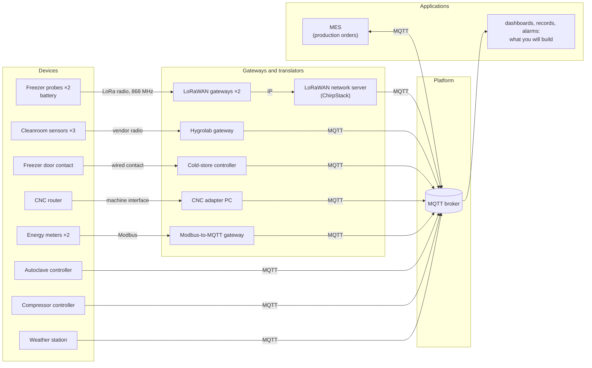
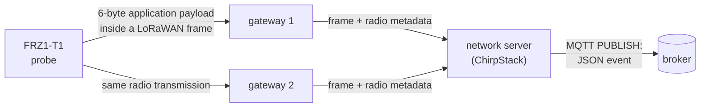

# Lab 1 — How do our data travel today, and can we trust them?

This lab is designed for a session of a little over three hours. The **15 numbered questions** form the core work; ◆ questions are optional extensions.

**Lectures:** L1 (the six blocks), L3 parts 1, 4, 5 and 6. Practical setup is described in [Working on your VM](../docs/setup.md).

## The situation

> *"In three weeks an aerospace customer audits us, and I must be able to prove every cure cycle and
> every hour of the freezer. Our electricity bill went up by a third this year, and I want to know
> where it goes. And I want one system, not nine."*
> — Maialen Etxeberria, plant manager

Adour Composites makes carbon-fibre parts. Its prepreg (carbon fibre pre-impregnated with resin) waits
in a freezer at −18 °C; technicians lay it up in a cleanroom; an autoclave cures the parts at 180 °C
and 7 bar; a CNC router trims them; a compressor and the electricity network serve the whole site.
The equipment already sends data, but through different devices, protocols, gateways and formats.

The objective of this first lab is to reconstruct how those data travel today and to determine what
can — and cannot — be established from the data that finally reach applications.

---

## Preparation

Follow [Working on your VM](../docs/setup.md) to connect, start the lab and open a terminal in the
workstation. Open the **viewer** in your laptop's browser at <http://localhost:8080> and keep it available throughout the lab. Within a few seconds, MQTT traffic from the simulated plant should appear.

The viewer is an observation instrument built for the course. It displays the MQTT traffic that
passes through the lab relay. To make this observation possible, the simulated MQTT clients connect
through `relay:1884` rather than directly to the broker.

---

## Part 1 — One MQTT message, from publisher to subscriber

Before examining the complete plant, isolate one MQTT exchange.

**MQTT** is a publish/subscribe protocol. A client can **publish** a message on a **topic**; another
client can **subscribe** to a topic filter. A **broker** receives publications and forwards each one
to matching subscribers. Publishers therefore do not need to know which applications consume their
data.

**MQTT is the protocol; Eclipse Mosquitto is an implementation.** The broker used here runs
Mosquitto, and Mosquitto also provides the two command-line clients used below:

- `mosquitto_sub`: subscribe and print received messages;
- `mosquitto_pub`: publish one message.

Two wildcards can appear in subscription filters:

- `+` replaces **one** topic level: `hygrolab/+/temperature`;
- `#` replaces **the rest** of a topic and must be the final level: `hygrolab/#`.

The viewer exposes MQTT packet types such as `CONNECT`, `SUBSCRIBE`, `PUBLISH` and `DISCONNECT`.
Delivery guarantees and session semantics are studied in Lab 2; here the packet names are sufficient
to reconstruct the exchange.

### Publish and subscribe by hand

Open a first workstation terminal and subscribe to all topics below `hygrolab`:

```bash
mosquitto_sub -h relay -p 1884 -t 'hygrolab/#' -v
```

Here `relay:1884` is the MQTT endpoint exposed by the lab, `-t` specifies the subscription filter, and
`-v` prints both topic and payload. Cleanroom measurements should appear every few seconds.

From a second terminal, publish a message of your own:

```bash
mosquitto_pub -h relay -p 1884 -t lab/hello -m 'hello from team X'
```

In the viewer, use the **Packets** tab to locate the subscription and your publication. The filter box
is useful because the plant generates continuous background traffic. `↑` denotes a packet travelling
toward the broker and `↓` a packet travelling away from it.


### Q1 — Reconstruct the exchange you just generated

Use the packets visible in the viewer, not only the commands you typed. Identify:

- the client that subscribes and the filter it sends to the broker;
- the client that publishes and the topic it uses;
- the packet types exchanged for the subscription and publication;
- which component decides whether the publication is forwarded to a subscriber.

Your answer should make clear the roles of **publisher**, **subscriber** and **broker** in this concrete
exchange.

### Q2 — Check that you can read MQTT topic filters

Consider these three filters:

```text
hygrolab/#
hygrolab/+/temperature
+/CR-01/temperature
```

For each filter, determine which of the following topics would match:

```text
hygrolab/CR-01/temperature
hygrolab/CR-02/humidity
hygrolab/CR-01/status
compressors/CMP1
```

For at least two non-obvious cases, explain your reasoning level by level rather than giving only the
final result.

<details>
<summary><strong>◆ Going deeper — D1: what the broker says about itself</strong></summary>

Subscribe for about 20 seconds to `$SYS/#`. Find the Mosquitto version, the number of connected
clients and a message counter. Then subscribe to `#`: why did `$SYS/...` not appear there? Verify the
rule in the MQTT specification or Mosquitto documentation and cite the section you used.

</details>

---

## Part 2 — From physical devices to MQTT

The plant is not simply a collection of MQTT sensors. Several field devices use another protocol or
interface locally and rely on a gateway or translator before their data reach MQTT. The component
that physically measures a value is therefore not always the MQTT client visible to the broker.

This is the current architecture:



A **gateway** or **translator** belongs to the data path. Depending on the source, it may change the
communication protocol, the representation of a value, the timestamp, or the identifier eventually
visible to applications.

Observe the complete MQTT namespace for about one minute:

```bash
mosquitto_sub -h relay -p 1884 -t '#' -v
```

At the same time, use the viewer's **Topics** and **Clients** tabs. You should be able to relate a
physical device in the diagram to a client id and to one or more MQTT topics.

### Q3 — Trace five devices up to the broker

For each of the following devices — `FRZ1-T1`, `CR-01`, `EM-MAIN`, `AC-1` and `CNC-1` — reconstruct
the path from the physical device to MQTT.

For each device, provide:

1. the first communication link or interface leaving the physical device;
2. any gateway or translator on the path;
3. the MQTT client id visible in the viewer;
4. one MQTT topic carrying data from that device.

The architecture diagram tells you the expected path; the viewer provides the client ids and actual
topics. Use both sources and make any mismatch explicit.

### Q4 — Compare a direct publisher with translated data

Compare `AC-1`, which publishes MQTT directly, with **two** translated sources: `FRZ1-T1` and
`EM-MAIN`.

For each translated source, identify why an intermediate component is necessary given the first link
shown in the architecture. Then identify one additional failure or ambiguity that this intermediate
component can introduce. Base the answer on the concrete path you reconstructed in Q3; for example,
consider what an application would observe if the physical device were still working but its
translator stopped publishing.

<details>
<summary><strong>◆ Going deeper — D2: the lab is not the plant</strong></summary>

On the VM, not inside the workstation:

```bash
cd ~/iot-labs/lab1
docker compose logs broker | tail -20
```

Which network address does the broker see for the clients, and why? What information about the true
client path is hidden by the relay? Propose one way to observe MQTT traffic in a real deployment
without inserting such a relay in the application data path.

</details>

---

## Part 3 — Follow one freezer reading end to end

The freezer is a useful end-to-end case because the audit requires evidence about its temperature
history. We will follow one reading from probe `FRZ1-T1` to MQTT and distinguish the physical
measurement from metadata and representations added later.

In a spare terminal, start the uplink monitor and leave it running during this part:

```bash
python watch_uplinks.py
```

It prints the network-server reception time, probe name, LoRaWAN frame counter (`fCnt`) and number of
gateways that received each uplink.



The probe wakes once a minute, measures, transmits and sleeps. Its **application payload is 6 bytes**.
LoRaWAN headers make the transmitted LoRaWAN frame larger, and the complete physical radio
transmission is larger again. The 6-byte quantity therefore refers only to application data produced
by the probe.

Every gateway in range may receive the same radio transmission. The network server deduplicates
those copies and publishes one JSON event on MQTT. The original 6 bytes appear base64-encoded in the
field `data`. The event also contains metadata added later, including a reception time, gateway
information and the frame counter `fCnt`.

The probe's 6-byte application payload is defined as follows:

| Byte | 0 | 1–2 | 3 | 4 | 5 |
|---|---|---|---|---|---|
| Content | frame type `0x11` | temperature, hundredths of °C, **signed**, big-endian | humidity % | battery % | status |

A MQTT 3.1.1 `PUBLISH` packet contains, in simplified form:

| Part | Bytes | Content |
|---|---:|---|
| fixed header | 1 | packet type and flags |
| remaining length | 1–4 | size of what follows |
| topic length | 2 | length of the topic |
| topic | n | UTF-8 topic |
| packet identifier | 0 or 2 | present when required by the selected delivery mode |
| payload | rest | application message |

### Decode one freezer payload

In the viewer, filter on:

```text
application/adour-coldchain/device/
```

Open one recent uplink from `FRZ1-T1` and locate its JSON `data` field. Complete the two `TODO` in
`work/decode.py`: first convert the base64 text into bytes, then unpack the 6-byte structure described
above.

Test the decoder with:

```bash
python decode.py --test
```

Then pass the `data` value from a real `FRZ1-T1` event to the script and verify that the decoded values are plausible.

### Q5 — Compare a compact sensor payload with an MQTT representation

Take **one actual** `hygrolab/CR-01/temperature` `PUBLISH` packet from the viewer. Record the size of
the complete MQTT packet, the topic and its length, and the textual payload. Using the simplified
packet structure above, account for the bytes that make up the packet. If the viewer shows a packet
identifier, include it; otherwise explain why it is absent.

Then compare the resulting MQTT packet with the freezer probe's 6-byte application payload. Calculate
what fraction of the cleanroom MQTT packet is the temperature text itself. Explain why a larger,
self-describing representation on an IP network is not necessarily a poor design even though the
battery-powered radio device uses a compact binary representation.

### Q6 — Determine where meaning and metadata are introduced

Use the **same real `FRZ1-T1` event** you decoded above. Put the decoded six fields next to the
corresponding ChirpStack JSON event and compare them.

Identify at least three useful pieces of information present in the JSON but absent from the six
bytes produced by the probe. For each one, state which component in the path can know or add it and
give one reason an application might use it.

Finally, identify where the knowledge *"bytes 1–2 are a signed big-endian temperature in hundredths
of a degree"* must reside. Explain what value applications would obtain if the probe firmware changed
that binary format while the decoder continued to use the old one.

### Q7 — Use `fCnt` to identify incomplete evidence

Leave `watch_uplinks.py` running until you observe a jump in `fCnt` for one of the freezer probes.
Record the two counters on either side of the gap and the associated reception times.

From this observation, state precisely:

- which transmission counter(s) are missing;
- what you can conclude about the sequence received by the network server;
- what you cannot determine about **where** in the path the loss occurred;
- whether the missing temperature value itself can be reconstructed from the remaining events.

Avoid replacing the last two points by guesses: distinguish evidence from plausible explanations.

### Q8 — Identify which timestamp the freezer evidence actually contains

Open one freezer event in the viewer and compare its JSON `time` field with the arrival time shown by
the relay. The probe itself has no clock.

Distinguish the following four instants in the end-to-end path: physical measurement, radio
transmission, network-server reception and MQTT arrival. For each one, state whether it is directly
known, approximated or absent in this system.

Conclude by explaining what uncertainty remains if an auditor asks whether the freezer was below
−15 °C **throughout** a particular hour.

<details>
<summary><strong>◆ Going deeper — D3: from one plant to a larger fleet</strong></summary>

With your own clients stopped, use the viewer to estimate messages and bytes per minute produced by
the simulated plant. Extrapolate to one day and to 5,000 devices with the same traffic mix. Which
source dominates the message count? Which dominates the bytes? State the assumptions that make your
extrapolation fragile.

</details>

<details>
<summary><strong>◆ Going deeper — D4: automate the audit gap check</strong></summary>

Write a short script of your choice that subscribes to the two freezer probes and reports every jump
in `fCnt`, with the time interval during which evidence is incomplete. It must not try to invent the
missing temperature. Explain what additional evidence would be required to distinguish a radio loss
from a loss later in the path.

</details>

<details>
<summary><strong>◆ Going deeper — D5: how much timing uncertainty?</strong></summary>

Observe several freezer events and compare their relay arrival time with the event's reception time.
Measure the difference. Is it stable? Give one reason why this experiment still does **not** measure
the delay between physical measurement and radio transmission.

</details>

---

## Part 4 — What must an MQTT client get right?

The previous parts observed existing producers. We now add a temporary cleanroom sensor and examine
what the broker actually uses to distinguish MQTT clients.

A MQTT client opens a connection and presents a **client identifier**. The identifier distinguishes
client sessions at the broker; **it is not, by itself, proof of the physical device's identity**.

With Paho in Python, a minimal publisher looks like this:

```python
c = mqtt.Client(mqtt.CallbackAPIVersion.VERSION2, client_id="sensor-alice")
c.connect("relay", 1884, keepalive=60)
c.loop_start()
c.publish("some/topic", "some payload", qos=1)
```

For the next experiment, one MQTT rule is sufficient: when a new connection presents a client
identifier that is already in use, the broker disconnects the existing connection associated with
that identifier.

### Add a virtual sensor

Run `python publish_example.py` once and identify its `CONNECT`, `PUBLISH` and `DISCONNECT` packets in
the viewer. Then complete the relevant `TODO` in `work/sensor.py` so that the simulated
sensor:

- uses your name in its client id and topic;
- publishes `temperature_c`, `humidity_pct` and `measured_at` as JSON;
- represents `measured_at` as an ISO 8601 timestamp in UTC;
- publishes every 5 s on `lab/sensors/<name>/env`.

Run it with:

```bash
python sensor.py
```

Let several messages appear and inspect one of them in the viewer.

### Q9 — Observe what happens when two connections reuse one client id

Keep your first `sensor.py` running. From a second workstation terminal, start a second copy without
changing `NAME`. Watch the **Clients** tab and both terminals for roughly 30 seconds.

Describe the sequence you observe when the two processes repeatedly try to use the same client id,
and relate it to the MQTT rule given above. Then distinguish two statements:

1. what `sensor-<name>` allows the broker to distinguish;
2. what seeing that client id does **not** establish about the identity of the physical sender.

<details>
<summary><strong>◆ Going deeper — D6: diagnose duplicate identities from observations only</strong></summary>

Suppose you are not allowed to inspect the devices themselves. From the viewer alone, define two
observable indicators that would make you suspect two clients are fighting over the same id. For
each indicator, give one alternative explanation that would produce a similar symptom.

</details>

<details>
<summary><strong>◆ Going deeper — D7: one device, several identities</strong></summary>

The plant contains a physical sensor, the broker sees an MQTT client id, and applications consume
data under a topic such as `lab/sensors/alice/env`. Are these necessarily the same identity? For each
of the three levels, state what it identifies and where the association with the other levels is
defined. Then give one failure mode in which two of these identities remain consistent while the
third becomes wrong.

</details>

---

## Part 5 — Make heterogeneous data usable together

The Topics tab now shows a consequence of integrating equipment from several suppliers: topic names,
units, timestamps and payload structures were chosen independently. An application that wants to use
all of the plant's data must therefore know source-specific conventions.

A topic hierarchy is an interface. Its level order determines what a subscriber can select with one
filter. For example, with:

```text
plant/<area>/<cell>/<device>/...
```

`plant/curing/#` can select the curing area. Another ordering may make a different cross-cutting query
easier. No single tree automatically makes every possible query convenient.

Manufacturing standards such as **ISA-95** provide useful vocabulary for levels such as site, area,
work centre and work unit. Here, that terminology is used only to describe the plant hierarchy; data
modelling is treated in Lab 6.

A **bridge** can subscribe to a vendor topic, convert a message into a common representation and
republish it. This simplifies downstream applications, but the bridge then becomes part of the data
lineage: its transformations must be understood if values are later challenged.

### Q10 — Make the current interoperability problems explicit

Inspect one recent message from each of these four sources in the viewer:

- freezer: `application/adour-coldchain/device/.../event/up`;
- cleanroom: `hygrolab/CR-01/temperature` and `hygrolab/CR-01/humidity`;
- main energy meter: `modbus2mqtt/meter_main/...`;
- compressor: `compressors/CMP1`.

For each source, note the topic structure and the payload representation. Across the four sources,
identify at least **four concrete incompatibilities** that an application combining the data would
have to handle. Look specifically at naming, units, timestamps, how several quantities are grouped,
and whether identifiers are explicit or implicit. For every incompatibility, cite the two concrete
messages or conventions you compared.

### Design one address per device

`work/inventory.json` lists the 13 devices and their location in the plant. It also defines five
application needs:

| Need | The application wants |
|---|---|
| N1 | everything in the curing area |
| N2 | every energy meter, whatever the area |
| N3 | everything in the cold store |
| N4 | every production machine, for the OEE dashboard |
| N5 | everything in the autoclave-1 cell, for its quality record |

Read `work/inventory.json`, then choose one MQTT topic for every device and place those topics in
`work/tree.json`. Use a consistent hierarchy; topics themselves must not contain MQTT wildcards.

Next, fill `work/subscriptions.json` with the subscription filters that retrieve **exactly** the devices required by N1–N5. Use at most two filters per need.

### Q11 — Characterise the trade-off created by your topic hierarchy

Use your own `tree.json` and `subscriptions.json` as evidence. State the order of the topic levels you
chose and why. For N1–N5, identify which needs can be expressed with one filter and which need two.

Then write the filter or set of filters required to select **every temperature sensor on the site**.
Compare that result with N1–N5. Explain which kinds of query your hierarchy favours and which become
awkward because of the chosen order.

### Normalize two sources

Complete the `TODO` in `work/bridge.py` so that it republishes two kinds of data in your namespace:

| Device | Existing message | Message produced by your bridge |
|---|---|---|
| `CMP-1` | `compressors/CMP1`: pressure in **psi**, Unix timestamp (seconds since 1970) | `pressure_bar`, `measured_at` |
| `FRZ1-T1`, `FRZ1-T2` | ChirpStack event, 6-byte payload hidden in `data` | `temperature_c`, `measured_at` |

Use at least two decimals for °C and bar (`1 psi = 0.0689476 bar`). `measured_at` must be ISO 8601
with a time zone. Use the compressor's own timestamp when available; for the probes, use the network
server reception time because the probes have no clock.

Run the bridge and observe both the original and republished traffic in the viewer:

```bash
python bridge.py
```

### Q12 — Compare an original message with the value produced by your bridge

Choose one compressor message and one `FRZ1-T1` message for which you can also find the corresponding
output from your bridge. Keep the pairs together so that you are comparing the same observation as
closely as possible.

For each output field produced by the bridge, determine whether it is:

- directly measured by the physical device;
- supplied later by another component in the path;
- computed by your bridge.

Use the actual input and output values to justify the classification. Then answer three concrete
questions: what information can the bridge normalize reliably, what missing information can it not
recover, and what would subscribers observe if the bridge stopped publishing for ten minutes?

Finally, suppose an auditor challenges a value such as `pressure_bar = 6.89`. State which original
value and which conversion information would have to be retained to reproduce and justify that
normalized value.

<details>
<summary><strong>◆ Going deeper — D8: can one tree make every query easy?</strong></summary>

Design a second ordering of the same topic levels that makes **all temperature sensors** selectable
with one filter. Recompute the filters for N1–N5 with that ordering and compare with your first tree.
Can one ordering make N1–N5 **and** the all-temperatures query each require one filter? Support your
answer with the filters you tried, not only an intuition.

</details>

---

## Part 6 — When data stop, what can we conclude?

A period without measurements is ambiguous: the device may simply be quiet, its MQTT connection may
have failed, or an intermediate component may have stopped forwarding data. MQTT provides mechanisms
for observing **client connection liveness**, but those mechanisms do not establish the health of
every physical sensor behind that client.

A **retained message** is the broker's last retained value for a topic. A new subscriber receives it
immediately, even if the original publication occurred much earlier.

A **last will** is registered by a client when it connects. If the connection later disappears
without a clean MQTT `DISCONNECT`, the broker can publish that will on the client's behalf.

The **keepalive** is the maximum interval the client announces between control packets. If the broker
receives nothing for roughly 1.5 × the keepalive interval, it treats the connection as lost. An idle
client therefore exchanges `PINGREQ`/`PINGRESP` packets to keep the connection visibly alive.

A common status pattern is:

```python
c.will_set(STATUS, "offline", qos=1, retain=True)   # configured before connect()
c.connect(HOST, PORT, keepalive=KEEPALIVE_S)
c.publish(STATUS, "online", qos=1, retain=True)
```

This status describes the **MQTT client connection**. If the MQTT client is a gateway, it does not by
itself prove that every attached sensor is still producing valid measurements.

### Q13 — Determine what a new subscriber learns immediately

Stop any broad `#` subscription you currently have. Start a fresh one:

```bash
mosquitto_sub -h relay -p 1884 -t '#' -v
```

Look only at the messages that arrive immediately, before waiting for the normal periodic producers.
Use the viewer if necessary to identify which publications are retained.

List a few messages that a newcomer receives because the broker already stored them. Choose one
retained measurement or state that could be stale and explain what timestamp, age or related signal
an application would need to inspect before treating it as current evidence.

### Add an online status and a last will

Complete the two status-related `TODO` in `sensor.py`:

- before connecting, register `offline` as a retained last will on `lab/sensors/<name>/status`;
- after connecting, publish `online` on the same topic, QoS 1 and retained.

Observe the status from another terminal:

```bash
mosquitto_sub -h relay -p 1884 -t 'lab/sensors/+/status' -v
```

Start the sensor, verify that `online` is visible, then stop the Python process with **Ctrl+C** and observe the status change.

### Observe a connection that dies silently

Set `KEEPALIVE_S = 15`, restart the sensor and keep the status subscription open. In the viewer's
**Clients** tab, use **Freeze** on that connection. The relay then stops forwarding traffic without
closing the underlying connection.

Record the moment at which you freeze the connection and the moment at which `offline` appears.

### Q14 — Compare abrupt failure with keepalive-based detection

Use the two observations above. Explain why Ctrl+C can trigger the last will quickly,
whereas the frozen connection remains apparently present until the broker's keepalive timeout.

For keepalive values of **15 s** and **60 s**, calculate:

- the approximate worst-case time before the broker considers an otherwise silent connection lost;
- the number of keepalive cycles per hour for an idle client.

For the mains-powered cleanroom gateway, choose between these two values if the application is
expected to detect a communication failure within one minute, and justify the choice. Finally,
explain why even a perfectly chosen MQTT keepalive for the gateway does not prove that a battery
freezer probe behind that gateway is still alive.

<details>
<summary><strong>◆ Going deeper — D9: construct a misleading status</strong></summary>

Using only mechanisms already used in this lab, construct or describe a sequence in which the
retained status is `online` although fresh measurements have stopped. Then construct the reverse:
measurements are arriving while the retained status is `offline`. For each case, explain what a
robust application should compare before raising an alarm.

</details>

---

## Final decision

### Q15 — What can you actually tell the plant manager after this lab?

Return to the initial audit question: **can the current system prove that the freezer stayed compliant
for every hour?**

Give a concise answer based only on evidence you have actually observed in this lab. It should include:

- the strongest evidence currently available (decoded values, timestamps, `fCnt`, path observations);
- the gaps that prevent a stronger claim;
- three changes you would prioritize to improve traceability and compliance evidence;
- one point that this lab has deliberately **not** established yet about reliable delivery of the
autoclave's cure records. That last issue is the starting point of Lab 2.

*Next: Lab 2 — can we lose a cure record if the network fails?*
