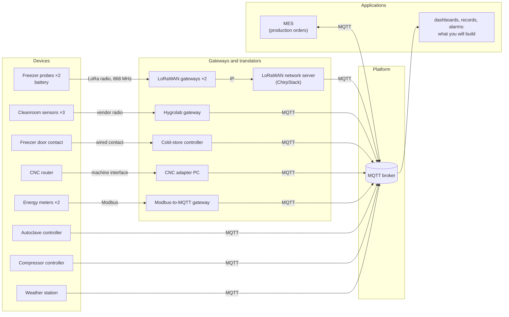
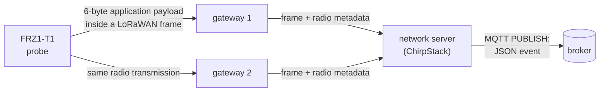

# Lab 1 — How do our data travel today, and can we trust them?

This lab is designed for a session of a little over three hours. The **15 numbered questions** form the core work; ◆ questions are optional extensions for further analysis. The deliverable is `work/report-lab1.txt`, generated with `check report`.

**Lectures:** L1 (the six blocks), L3 parts 1, 4, 5 and 6. Practical help:
[Working on your VM](../docs/setup.md).

## The situation

> *"In three weeks an aerospace customer audits us, and I must be able to prove every cure cycle and
> every hour of the freezer. Our electricity bill went up by a third this year, and I want to know
> where it goes. And I want one system, not nine."*
> — Maialen Etxeberria, plant manager

Adour Composites makes carbon-fibre parts. Its prepreg (carbon fibre pre-impregnated with resin) waits
in a freezer at −18 °C; technicians lay it up in a cleanroom; an autoclave cures the parts at 180 °C
and 7 bar; a CNC router trims them; a compressor and the electricity network serve the whole site.
The equipment already sends data, but through different devices, protocols, gateways and formats.

Before building anything, answer one question: **how do the plant's data travel today, and what can
we actually prove from what arrives?**

Record the answers to Q1–Q15 in `work/answers.txt`. The optional ◆ extensions can be tackled independently once the core work is complete.

---

## Preparation

Follow [Working on your VM](../docs/setup.md) to connect, start the lab and open a terminal in the
workstation. Then type:

```bash
check 1
```

You should see something close to:

```text
Exercise 1 — The lab is running
  ✔ the relay answers at http://relay:8080
  ✔ the plant is talking: autoclave-ac1, chirpstack, cmp1, cnc1-adapter, ...
  ✔ MQTT answers at relay:1884
```

If the environment is not reported as ready, `hint 1` provides the corresponding diagnostic. Open the **viewer** in your laptop's browser at <http://localhost:8080> and keep it available throughout the lab.

The viewer is an instrument built for this course: it lets you inspect the MQTT packets that cross the
lab. To make this possible, every client in the lab connects through `relay:1884` rather than directly
to the broker.

---

## Part 1 — One MQTT message, from publisher to subscriber

Before examining the full plant, we first isolate a single MQTT exchange so that the roles of publisher, broker and subscriber are unambiguous.

**MQTT** is a publish/subscribe protocol. A client can **publish** a message on a **topic**; another
client can **subscribe** to a topic filter. A **broker** receives publications and forwards each one
to the matching subscribers. Publishers do not need to know who receives their data.

**MQTT is the protocol; Eclipse Mosquitto is software that implements it.** In this lab, the broker
runs Mosquitto, and you also use two small command-line clients provided by Mosquitto:

- `mosquitto_sub`: subscribe and print received messages;
- `mosquitto_pub`: publish one message.

Two wildcards are useful in subscription filters:

- `+` replaces **one** topic level: `hygrolab/+/temperature`;
- `#` replaces **the rest** of a topic and must be last: `hygrolab/#`.

The viewer will expose packet types such as `CONNECT`, `SUBSCRIBE`, `PUBLISH` and `DISCONNECT`. At this stage, their names are sufficient to reconstruct the exchange; MQTT delivery guarantees and session semantics are studied in Lab 2.

### Exercise 2 — Publish and subscribe by hand

Open a first workstation terminal and subscribe to all topics below `hygrolab`:

```bash
mosquitto_sub -h relay -p 1884 -t 'hygrolab/#' -v
```

Here `relay:1884` is the MQTT endpoint exposed by the lab, `-t` specifies the subscription filter, and `-v` prints both the topic and the payload.

Cleanroom measurements should appear every few seconds. From a second terminal, publish a message of your own:

```bash
mosquitto_pub -h relay -p 1884 -t lab/hello -m 'hello from team X'
```

Use the **Packets** tab to locate the corresponding `SUBSCRIBE` and `PUBLISH`. The filter box is useful because the plant generates continuous background traffic. In the viewer, `↑` denotes a packet travelling toward the broker and `↓` a packet travelling away from it. Once the exchange is visible, run:

```bash
check 2
```

### Questions

> **Q1 — Reconstruct your MQTT exchange.**
> For the subscription and publication you just made, identify the **client**, **broker**, **topic or
> filter**, and the sequence of packet types you observed. Which participant decides who receives a
> publication?

> **Q2 — Read a topic filter.**
> For each filter below, state which of these topics it matches and justify the two cases that are
> easiest to confuse.
>
> Filters: `hygrolab/#`, `hygrolab/+/temperature`, `+/CR-01/temperature`
> Topics: `hygrolab/CR-01/temperature`, `hygrolab/CR-02/humidity`, `hygrolab/CR-01/status`,
> `compressors/CMP1`.

<details>
<summary><strong>◆ Going deeper — D1: what the broker says about itself</strong></summary>

Subscribe for about 20 seconds to `$SYS/#`. Find the Mosquitto version, the number of connected
clients and a message counter. Then subscribe to `#`: why did `$SYS/...` not appear there? Verify the
rule in the MQTT specification or Mosquitto documentation and cite the section you used.

</details>

---

## Part 2 — From physical devices to MQTT

The plant is not simply a collection of MQTT sensors. Several field devices use another protocol locally and rely on a gateway or translator before their data reach MQTT. The next step is to identify which component actually publishes each measurement.

This is the current architecture:



A **gateway** or **translator** is part of the data path. It may change the communication protocol,
the message representation, or the identifier visible to the broker. That is useful — but it also
creates another place where data can be delayed, altered or lost.

### Map the real publishers

Observe the complete MQTT namespace for about one minute:

```bash
mosquitto_sub -h relay -p 1884 -t '#' -v
```

Use the **Topics** and **Clients** tabs to relate the observed messages to the architecture above.

### Questions

> **Q3 — Who really publishes?**
> Complete the table in `answers.txt` for five devices: freezer probe `FRZ1-T1`, cleanroom sensor
> `CR-01`, main energy meter `EM-MAIN`, autoclave `AC-1`, CNC router `CNC-1`. Give the first link from
> the physical device, the MQTT client id that eventually publishes its data, and one topic carrying
> its data.

> **Q4 — What changes when a translator is in the path?**
> Choose **two** of the devices that do not publish MQTT directly. For each, explain (1) one credible
> reason for the translator to exist and (2) one additional failure or ambiguity it introduces for an
> application consuming the data.

<details>
<summary><strong>◆ Going deeper — D2: the lab is not the plant</strong></summary>

On the VM, not inside the workstation:

```bash
cd ~/iot-labs/lab1
docker compose logs broker | tail -20
```

Which network address does the broker see for the clients, and why? What information about the true
client path is hidden by the relay? Propose one way to observe MQTT traffic in a real deployment
without inserting such a relay in the application data path.

</details>

---

## Part 3 — Follow one freezer reading end to end

The freezer provides a useful end-to-end case because the audit requires evidence about its temperature history. We will follow one reading from probe `FRZ1-T1` to MQTT and distinguish the physical measurement from the metadata and representations added along the path.

In a spare terminal, start the uplink monitor and leave it running during this part:

```bash
python watch_uplinks.py
```

The script records one line per freezer uplink; the resulting history will be used in Q7.



The probe wakes once a minute, measures, sends and sleeps. Its **application payload is 6 bytes**.
Once LoRaWAN headers are added, the transmitted LoRaWAN frame is larger; the complete physical radio
transmission is larger again. The 6-byte quantity therefore refers specifically to the probe's
application payload.

Every gateway in range can receive the same transmission. The network server deduplicates these
copies and publishes one JSON event. The original 6 bytes are base64-encoded in the field `data`.
Each uplink also carries a frame counter, `fCnt`, incremented for successive transmissions.

For the audit, a temperature value is useful only together with enough evidence to relate it to a
source, a time and a continuous sequence of observations. The data path also matters: some
information originates in the probe, while other fields are added or transformed later. The
following questions separate these contributions rather than treating the MQTT event as a single
indivisible record.

The probe's 6-byte application payload, from its datasheet:

| Byte | 0 | 1–2 | 3 | 4 | 5 |
|---|---|---|---|---|---|
| Content | frame type `0x11` | temperature, hundredths of °C, **signed**, big-endian | humidity % | battery % | status |

A MQTT 3.1.1 `PUBLISH` packet contains, in simplified form:

| Part | Bytes | Content |
|---|---:|---|
| fixed header | 1 | packet type and flags |
| remaining length | 1–4 | size of what follows |
| topic length | 2 | length of the topic |
| topic | n | UTF-8 topic |
| packet identifier | 0 or 2 | present when required by the selected delivery mode |
| payload | rest | application message |

### Exercise 3 — Take a message apart

Fill `work/measurements.json`:

| Key | What to measure |
|---|---|
| `cleanroom_topic_bytes` | length of `hygrolab/CR-01/temperature` |
| `cleanroom_packet_bytes` | whole MQTT `PUBLISH` packet for one CR-01 temperature (viewer, packet B) |
| `chirpstack_payload_bytes` | payload size of one ChirpStack MQTT event, approximately |
| `probe_payload_bytes` | bytes obtained after base64-decoding the event's `data` field |
| `probe_temperature_c` | one recent temperature of `FRZ1-T1`, decoded by you |

Complete the two `TODO` in `work/decode.py`: base64 to bytes, then the `struct` format matching the
probe layout. Test it with:

```bash
python decode.py --test
```

Then decode a real `FRZ1-T1` event and run:

```bash
check 3
```

### Questions

> **Q5 — How expensive is the representation?**
> Reconstruct the size of the cleanroom `PUBLISH`: fixed header + topic length + topic + packet
> identifier (if present) + payload = total. What fraction of the whole MQTT packet is the textual
> measured value itself? Compare this representation with the freezer probe's 6-byte application
> payload. Does the larger representation on the IP side necessarily indicate a poor design? Explain
> why different parts of the system may reasonably use different representations.

> **Q6 — Where do meaning and metadata come from?**
> Compare the probe's 6 bytes with the ChirpStack JSON event. Name **three** useful fields that were
> not in the probe payload, state which component can add each one, and explain one consumer that
> could use it. Then identify which component must know that bytes 1–2 encode a signed temperature
> in hundredths of a degree. What would happen if the probe firmware changed this encoding while the
> decoder remained unchanged?

> **Q7 — Detect a missing transmission.**
> In `watch_uplinks.py`, find a gap in one probe's `fCnt`. Which counter(s) are missing and around what
> time? What does the counter let you conclude? What does it **not** tell you about where the loss
> occurred? Can the missing temperature itself be reconstructed from the remaining events?

> **Q8 — What time does the audit actually know?**
> The probe has no clock; the event contains the network server's reception time. Distinguish
> **measurement time**, **radio transmission time**, **reception time**, and **MQTT arrival time**.
> Which one do we really have for this probe, and what uncertainty does that create when claiming
> that the freezer was below −15 °C throughout an hour?

<details>
<summary><strong>◆ Going deeper — D3: from one plant to a larger fleet</strong></summary>

With your own clients stopped, use the viewer to estimate messages and bytes per minute produced by
the simulated plant. Extrapolate to one day and to 5,000 devices with the same traffic mix. Which
source dominates the message count? Which dominates the bytes? State the assumptions that make your
extrapolation fragile.

</details>

<details>
<summary><strong>◆ Going deeper — D4: automate the audit gap check</strong></summary>

Write a short script of your choice that subscribes to the two freezer probes and reports every jump
in `fCnt`, with the time interval during which evidence is incomplete. It must not try to invent the
missing temperature. Explain what additional evidence would be required to distinguish a radio loss
from a loss later in the path.

</details>

<details>
<summary><strong>◆ Going deeper — D5: how much timing uncertainty?</strong></summary>

Observe several freezer events and compare their relay arrival time with the event's reception time.
Measure the difference. Is it stable? Give one reason why this experiment still does **not** measure
the delay between physical measurement and radio transmission.

</details>

---

## Part 4 — What must an MQTT client get right?

The previous parts observed existing producers. We now add a temporary cleanroom sensor in order to examine what the broker actually uses to distinguish MQTT clients.

A MQTT client opens a connection and presents a **client identifier**. The identifier distinguishes
client sessions at the broker; **it is not, by itself, proof of the physical device's identity**.

With Paho in Python:

```python
c = mqtt.Client(mqtt.CallbackAPIVersion.VERSION2, client_id="sensor-alice")
c.connect("relay", 1884, keepalive=60)
c.loop_start()
c.publish("some/topic", "some payload", qos=1)
```

For the next experiment, one MQTT rule is sufficient: when a new connection presents a client identifier that is already in use, the broker disconnects the existing connection associated with that identifier.

### Exercise 4 — Your virtual sensor

Run `python publish_example.py` once and identify its packets in the viewer. Then complete the `TODO` marked *exercise 4* in `work/sensor.py` so that the new sensor:

- choose your name;
- publish `temperature_c`, `humidity_pct` and `measured_at` as JSON;
- make `measured_at` an ISO 8601 timestamp in UTC.

It should publish every 5 s on `lab/sensors/<name>/env`.

```bash
python sensor.py
```

Let it run for a minute, then run `check 4`.

### Questions

> **Q9 — Two connections, one client id.**
> Start a second copy of your sensor with the same client id and observe the **Clients** tab for about
> 30 seconds. What happens? Explain it using the MQTT rule above. Then separate two claims: what does
> seeing the id `sensor-<name>` let the broker distinguish, and what does that id alone **not prove**
> about the physical sender?

<details>
<summary><strong>◆ Going deeper — D6: diagnose duplicate identities from observations only</strong></summary>

Suppose you are not allowed to inspect the devices themselves. From the viewer alone, define two
observable indicators that would make you suspect two clients are fighting over the same id. For
each indicator, give one alternative explanation that would produce a similar symptom.

</details>

<details>
<summary><strong>◆ Going deeper — D7: one device, several identities</strong></summary>

The plant contains a physical sensor, the broker sees an MQTT client id, and applications consume
data under a topic such as `lab/sensors/alice/env`. Are these necessarily the same identity? For each
of the three levels, state what it identifies and where the association with the other levels is
defined. Then give one failure mode in which two of these identities remain consistent while the
third becomes wrong.

</details>

---

## Part 5 — Make heterogeneous data usable together

Because the existing topics and payloads were chosen independently by different suppliers, applications currently need source-specific knowledge. This part makes those inconsistencies explicit, then introduces a small common namespace and normalizes two representative sources. Lab 6 will address common data models in greater depth.

A topic hierarchy is an interface. Its level order determines what a subscriber can select with one
filter. For example, with:

```text
plant/<area>/<cell>/<device>/...
```

`plant/curing/#` can select the curing area. A different ordering makes different queries easy.
There is no single tree that makes every possible cross-cutting query cheap.

Manufacturing standards such as **ISA-95** provide useful vocabulary for levels such as site, area,
work centre and work unit. Here, ISA-95 terminology is used only to describe the plant hierarchy;
data modelling and broader namespace design are addressed in Lab 6.

A **bridge** can subscribe to a vendor topic, convert a message into a common representation, and
republish it. That helps consumers, but it also becomes another component whose transformations must
be understood.

> **Q10 — What is inconsistent today?**
> From the viewer's **Topics** tab and payloads, find at least **four distinct interoperability
> problems** among the freezer, cleanroom, energy meter and compressor. For each: show where you saw
> it and state what it forces an application developer to know or special-case.

### Exercise 5 — One address per device

`work/inventory.json` lists the 13 devices and five application needs:

| Need | The application wants |
|---|---|
| N1 | everything in the curing area |
| N2 | every energy meter, whatever the area |
| N3 | everything in the cold store |
| N4 | every production machine, for the OEE dashboard |
| N5 | everything in the autoclave-1 cell, for its quality record |

Fill `work/tree.json` with one topic per device and `work/subscriptions.json` with filters that deliver
exactly the required devices — two filters at most per need, one when your hierarchy makes it
possible. Then:

```bash
check 5
```

> **Q11 — What did your hierarchy optimize?**
> Explain the order of your topic levels. Which of N1–N5 became easy because of that order? Then try
> to select **every temperature sensor on the site**. How many filters are required, and what does
> this reveal about the limits of a single hierarchy?

### Exercise 6 — Normalize two sources

Complete the `TODO` in `work/bridge.py` so that it republishes:

| Device | Existing message | Message produced by your bridge |
|---|---|---|
| `CMP-1` | `compressors/CMP1`: pressure in **psi**, Unix timestamp (seconds since 1970) | `pressure_bar`, `measured_at` |
| `FRZ1-T1`, `FRZ1-T2` | ChirpStack event, 6 bytes hidden in `data` | `temperature_c`, `measured_at` |

Use at least two decimals for °C and bar (`1 psi = 0.0689476 bar`). `measured_at` must be ISO 8601
with a time zone. Use the compressor's own timestamp when available; for the probes, use the network
server reception time because the probe itself has no clock.

Run the bridge for about two minutes, then:

```bash
check 6
```

> **Q12 — What did the bridge know, and what did it invent?**
> For `CMP-1` and `FRZ1-T1`, classify each output field as (a) directly measured by the physical
> device, (b) supplied later by another component, or (c) computed by your bridge. Which information
> can the bridge normalize reliably, and which missing information can it **not** recover? If an
> auditor challenges a normalized value such as `pressure_bar = 6.89`, what original value and what
> transformation information would need to be retained to justify it? Finally, give one consequence
> if the bridge itself stops for ten minutes.

<details>
<summary><strong>◆ Going deeper — D8: can one tree make every query easy?</strong></summary>

Design a second ordering of the same topic levels that makes **all temperature sensors** selectable
with one filter. Recompute the filters for N1–N5 with that ordering and compare with your first tree.
Can one ordering make N1–N5 **and** the all-temperatures query each require one filter? Support your
answer with the filters you tried, not only an intuition.

</details>

---

## Part 6 — When data stop, what can we conclude?

A period without data is inherently ambiguous: a device may simply be quiet, its connection may have failed, or a translator may have stopped forwarding measurements. MQTT provides mechanisms for observing **client liveness**, but these mechanisms do not establish the health of every physical sensor behind that client.

A **retained message** is the broker's last retained value for a topic. A new subscriber receives it
immediately, even if the original publication happened earlier.

A **last will** is registered by a client when it connects. If that connection later disappears
without a clean MQTT `DISCONNECT`, the broker can publish the will on the client's behalf.

The **keepalive** is the maximum interval the client announces between control packets. If the broker
receives nothing for roughly 1.5 × the keepalive interval, it treats the connection as lost. A silent
client therefore sends `PINGREQ` messages to remain visibly alive.

A common status pattern is:

```python
c.will_set(STATUS, "offline", qos=1, retain=True)   # configured before connect()
c.connect(HOST, PORT, keepalive=KEEPALIVE_S)
c.publish(STATUS, "online", qos=1, retain=True)
```

This pattern reports the state of the **MQTT client connection**. When the client is a gateway, its status cannot by itself establish that every attached sensor is still producing valid measurements.

> **Q13 — What does a newcomer really learn from retained data?**
> Stop your subscriptions, then start a fresh `mosquitto_sub -h relay -p 1884 -t '#' -v` and inspect
> only the first second. Which messages arrive immediately because they were retained? Pick one
> retained value that could be stale. What additional information must an application check before
> treating such a value as current evidence?

### Exercise 7 — Online and last will

Complete the `TODO` marked *exercise 7* in `sensor.py`:

- publish `online` on `lab/sensors/<name>/status`, QoS 1, retained, after connecting;
- register `offline` on the same topic as a retained last will **before** connecting.

Keep `qos=1` as requested here; Lab 2 will explain and compare MQTT delivery modes.

Observe the status topic from another terminal:

```bash
mosquitto_sub -h relay -p 1884 -t 'lab/sensors/+/status' -v
```

Start the sensor, then stop it with **Ctrl+C**. Run `check 7`.

### Exercise 8 — A link that dies silently

Set `KEEPALIVE_S = 15`, restart the sensor and keep the status subscription open. In the viewer's **Clients** tab, use **Freeze** on that connection: the relay then stops forwarding traffic without closing the underlying connection. Record the freeze time and the time at which `offline` appears, then run:

```bash
check 8
```

> **Q14 — Distinguish a clean exit, a crash and a silent link.**
> Fill the table in `answers.txt` for a clean `DISCONNECT`, Ctrl+C, and a frozen link: whether a will
> is published and when. Then compare keepalive values of 15 s and 60 s: expected worst-case
> detection delay and `PINGREQ` wake-ups per hour for an otherwise idle client. Which value would you
> choose for the mains-powered cleanroom gateway if an alarm is expected within one minute? Why is
> this client-level mechanism insufficient to prove that a battery freezer probe behind a gateway is
> alive?

<details>
<summary><strong>◆ Going deeper — D9: construct a misleading status</strong></summary>

Using only mechanisms already used in this lab, construct or describe a sequence in which the
retained status is `online` although fresh measurements have stopped. Then construct the reverse:
measurements are arriving while the retained status is `offline`. For each case, explain what a
robust application should compare before raising an alarm.

</details>

---

## Final decision

> **Q15 — What do you tell Maialen?**
> In **10 lines at most**, answer: **can the plant today prove that the freezer stayed compliant for
> every hour?** State the strongest evidence you observed, the remaining gaps, and the **three changes
> you would prioritize first to improve traceability and compliance evidence**. Every claim must refer
> to an observation or measurement from this lab.
> End with one sentence explaining what this lab still does **not** establish about reliable delivery
> of the autoclave's cure records — that is where Lab 2 begins.

## Submission and architecture record

Run:

```bash
check report
```

Submit `~/iot-labs/lab1/work/report-lab1.txt`. The file contains your answers, the relevant work files and the first successful validation time recorded for each exercise.

Before Lab 2, update sections 1–4 of `~/iot-labs/record/site-architecture.md`: uses of the data, architecture, topic organisation and liveness. For each architectural decision, record the constraint, retained option, rejected option and rationale.

*Next: Lab 2 — can we lose a cure record if the network fails?*
