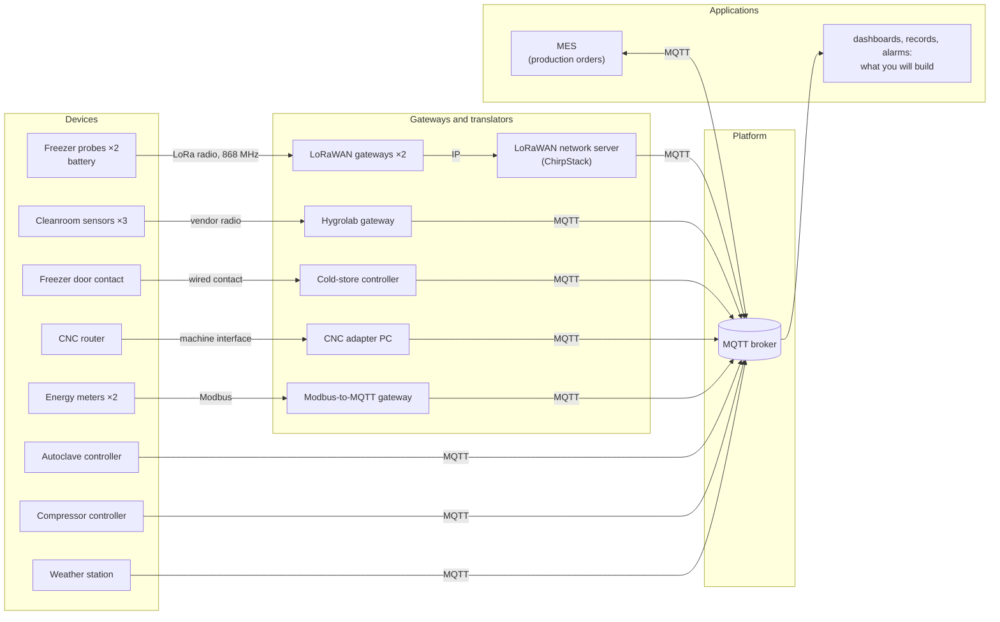
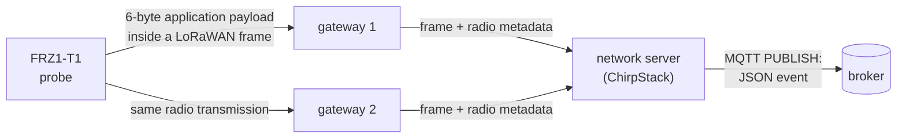

# Lab 1 — How do our data travel today, and can we trust them?

**Designed for 3+ hours of autonomous work.** The **15 numbered questions are the core lab**. The ◆ extensions are optional:
they go further with the same ideas, but they do not introduce material you will need from later labs.
You hand in `work/report-lab1.txt`, written by `check report`.

**Lectures:** L1 (the six blocks), L3 parts 1, 4, 5 and 6. Practical help:
[Working on your VM](../docs/setup.md).

## The situation

> *"In three weeks an aerospace customer audits us, and I must be able to prove every cure cycle and
> every hour of the freezer. Our electricity bill went up by a third this year, and I want to know
> where it goes. And I want one system, not nine."*
> — Maialen Etxeberria, plant manager

Adour Composites makes carbon-fibre parts. Its prepreg (carbon fibre pre-impregnated with resin) waits
in a freezer at −18 °C; technicians lay it up in a cleanroom; an autoclave cures the parts at 180 °C
and 7 bar; a CNC router trims them; a compressor and the electricity network serve the whole site.
The equipment already sends data, but through different devices, protocols, gateways and formats.

Before building anything, answer one question: **how do the plant's data travel today, and what can
we actually prove from what arrives?**

## How to read this lab

There are only three kinds of blocks:

- **Understand** — the minimum you need before the next manipulation.
- **Do** — something to run, observe or complete. `check N` verifies the implementation exercises.
- **Q1 … Q15** — what you must answer in `work/answers.txt`. Keep answers short and evidence-based.

The ◆ **Going deeper** boxes are optional. Skip them immediately if the core lab is not finished.
They are deliberately less guided, not prerequisites for the next lab.

> **Important:** you are not expected to search the web to discover basic tools used in the lab.
> When a tool or protocol is needed, this page tells you what it is. Documentation becomes useful
> when you want to verify a detail, not to guess the meaning of the exercise.

---

## Step 0 — Get the lab ready

Follow [Working on your VM](../docs/setup.md) to connect, start the lab and open a terminal in the
workstation. Then type:

```bash
check 1
```

You should see something close to:

```text
Exercise 1 — The lab is running
  ✔ the relay answers at http://relay:8080
  ✔ the plant is talking: autoclave-ac1, chirpstack, cmp1, cnc1-adapter, ...
  ✔ MQTT answers at relay:1884
```

If a line is red, run `hint 1`. Then open the **viewer** in your laptop's browser at
<http://localhost:8080> and keep it open for the whole lab.

The viewer is an instrument built for this course: it lets you inspect the MQTT packets that cross the
lab. To make this possible, every client in the lab connects through `relay:1884` rather than directly
to the broker.

---

## Part 1 — One MQTT message, from publisher to subscriber

Start with the smallest possible system before looking at the whole factory.

### Understand

**MQTT** is a publish/subscribe protocol. A client can **publish** a message on a **topic**; another
client can **subscribe** to a topic filter. A **broker** receives publications and forwards each one
to the matching subscribers. Publishers do not need to know who receives their data.

**MQTT is the protocol; Eclipse Mosquitto is software that implements it.** In this lab, the broker
runs Mosquitto, and you also use two small command-line clients provided by Mosquitto:

- `mosquitto_sub`: subscribe and print received messages;
- `mosquitto_pub`: publish one message.

Two wildcards are useful in subscription filters:

- `+` replaces **one** topic level: `hygrolab/+/temperature`;
- `#` replaces **the rest** of a topic and must be last: `hygrolab/#`.

You will see packet names such as `CONNECT`, `SUBSCRIBE`, `PUBLISH` and `DISCONNECT` in the viewer.
For now, read them literally. The detailed delivery guarantees of MQTT belong to Lab 2.

### Do — Exercise 2: publish and subscribe by hand

In a first workstation terminal:

```bash
mosquitto_sub -h relay -p 1884 -t 'hygrolab/#' -v
```

What the options mean:

```text
-h relay       connect through the lab relay
-p 1884        MQTT port used by the lab
-t '...'       topic filter to subscribe to
-v             print topic and payload
```

You should receive cleanroom values every few seconds. In a second terminal, publish one message:

```bash
mosquitto_pub -h relay -p 1884 -t lab/hello -m 'hello from team X'
```

Find your `SUBSCRIBE` and your `PUBLISH` in the viewer's **Packets** tab. The plant is noisy: use the
filter box at the top. `↑` means a packet going toward the broker; `↓` means one coming back from it.
Then run:

```bash
check 2
```

### Questions

> **Q1 — Reconstruct your MQTT exchange.**
> For the subscription and publication you just made, identify the **client**, **broker**, **topic or
> filter**, and the sequence of packet types you observed. Which participant decides who receives a
> publication?

> **Q2 — Read a topic filter.**
> For each filter below, state which of these topics it matches and justify the two cases that are
> easiest to confuse.
>
> Filters: `hygrolab/#`, `hygrolab/+/temperature`, `+/CR-01/temperature`
> Topics: `hygrolab/CR-01/temperature`, `hygrolab/CR-02/humidity`, `hygrolab/CR-01/status`,
> `compressors/CMP1`.

**Keep:** MQTT decouples producers and consumers through the broker; topics are addresses, filters are
subscription patterns.

<details>
<summary><strong>◆ Going deeper — D1: what the broker says about itself</strong></summary>

Subscribe for about 20 seconds to `$SYS/#`. Find the Mosquitto version, the number of connected
clients and a message counter. Then subscribe to `#`: why did `$SYS/...` not appear there? Verify the
rule in the MQTT specification or Mosquitto documentation and cite the section you used.

</details>

---

## Part 2 — From physical devices to MQTT

The plant is not a collection of MQTT sensors. Several field devices cannot, or should not, speak
MQTT themselves. Follow who actually publishes on their behalf.

### Understand

This is the current architecture:



A **gateway** or **translator** is part of the data path. It may change the communication protocol,
the message representation, or the identifier visible to the broker. That is useful — but it also
creates another place where data can be delayed, altered or lost.

### Do — map the real publishers

Subscribe to everything for about one minute:

```bash
mosquitto_sub -h relay -p 1884 -t '#' -v
```

Use the viewer's **Topics** and **Clients** tabs to connect messages to the architecture above.

### Questions

> **Q3 — Who really publishes?**
> Complete the table in `answers.txt` for five devices: freezer probe `FRZ1-T1`, cleanroom sensor
> `CR-01`, main energy meter `EM-MAIN`, autoclave `AC-1`, CNC router `CNC-1`. Give the first link from
> the physical device, the MQTT client id that eventually publishes its data, and one topic carrying
> its data.

> **Q4 — What changes when a translator is in the path?**
> Choose **two** of the devices that do not publish MQTT directly. For each, explain (1) one credible
> reason for the translator to exist and (2) one additional failure or ambiguity it introduces for an
> application consuming the data.

**Keep:** the MQTT client visible at the broker is not necessarily the physical device that produced
the measurement.

<details>
<summary><strong>◆ Going deeper — D2: the lab is not the plant</strong></summary>

On the VM, not inside the workstation:

```bash
cd ~/iot-labs/lab1
docker compose logs broker | tail -20
```

Which network address does the broker see for the clients, and why? What information about the true
client path is hidden by the relay? Propose one way to observe MQTT traffic in a real deployment
without inserting such a relay in the application data path.

</details>

---

## Part 3 — Follow one freezer reading end to end

The audit requires evidence about the freezer. Follow one temperature from the probe near the door
(`FRZ1-T1`) to MQTT and separate **the measurement itself** from everything added around it.

Start this now in a spare terminal and leave it running while you work:

```bash
python watch_uplinks.py
```

It prints one line for each freezer uplink. You will use the history for Q7.

### Understand



The probe wakes once a minute, measures, sends and sleeps. Its **application payload is 6 bytes**.
Once LoRaWAN headers are added, the transmitted LoRaWAN frame is larger; the complete physical radio
transmission is larger again. Do not call all three simply "the 6-byte packet".

Every gateway in range can receive the same transmission. The network server deduplicates these
copies and publishes one JSON event. The original 6 bytes are base64-encoded in the field `data`.
Each uplink also carries a frame counter, `fCnt`, incremented for successive transmissions.

The probe's 6-byte application payload, from its datasheet:

| Byte | 0 | 1–2 | 3 | 4 | 5 |
|---|---|---|---|---|---|
| Content | frame type `0x11` | temperature, hundredths of °C, **signed**, big-endian | humidity % | battery % | status |

A MQTT 3.1.1 `PUBLISH` packet contains, in simplified form:

| Part | Bytes | Content |
|---|---:|---|
| fixed header | 1 | packet type and flags |
| remaining length | 1–4 | size of what follows |
| topic length | 2 | length of the topic |
| topic | n | UTF-8 topic |
| packet identifier | 0 or 2 | present when required by the selected delivery mode |
| payload | rest | application message |

### Do — Exercise 3: take a message apart

Fill `work/measurements.json`:

| Key | What to measure |
|---|---|
| `cleanroom_topic_bytes` | length of `hygrolab/CR-01/temperature` |
| `cleanroom_packet_bytes` | whole MQTT `PUBLISH` packet for one CR-01 temperature (viewer, packet B) |
| `chirpstack_payload_bytes` | payload size of one ChirpStack MQTT event, approximately |
| `probe_payload_bytes` | bytes obtained after base64-decoding the event's `data` field |
| `probe_temperature_c` | one recent temperature of `FRZ1-T1`, decoded by you |

Complete the two `TODO` in `work/decode.py`: base64 to bytes, then the `struct` format matching the
probe layout. Test it with:

```bash
python decode.py --test
```

Then decode a real `FRZ1-T1` event and run:

```bash
check 3
```

### Questions

> **Q5 — How expensive is the representation?**
> Reconstruct the size of the cleanroom `PUBLISH`: fixed header + topic length + topic + packet
> identifier (if present) + payload = total. What fraction of the whole MQTT packet is the textual
> measured value itself?

> **Q6 — Where does the extra information come from?**
> Compare the probe's 6 bytes with the ChirpStack JSON event. Name **three** useful fields that were
> not in the probe payload, state which component can add each one, and explain one consumer that
> could use it.

> **Q7 — Detect a missing transmission.**
> In `watch_uplinks.py`, find a gap in one probe's `fCnt`. Which counter(s) are missing and around what
> time? What does the counter let you conclude? What does it **not** tell you about where the loss
> occurred? Can the missing temperature itself be reconstructed from the remaining events?

> **Q8 — What time does the audit actually know?**
> The probe has no clock; the event contains the network server's reception time. Distinguish
> **measurement time**, **radio transmission time**, **reception time**, and **MQTT arrival time**.
> Which one do we really have for this probe, and what uncertainty does that create when claiming
> that the freezer was below −15 °C throughout an hour?

**Keep:** a value acquires metadata and new representations as it crosses the system. Missing evidence
is not equivalent to evidence that everything was normal.

<details>
<summary><strong>◆ Going deeper — D3: from one plant to a larger fleet</strong></summary>

With your own clients stopped, use the viewer to estimate messages and bytes per minute produced by
the simulated plant. Extrapolate to one day and to 5,000 devices with the same traffic mix. Which
source dominates the message count? Which dominates the bytes? State the assumptions that make your
extrapolation fragile.

</details>

<details>
<summary><strong>◆ Going deeper — D4: automate the audit gap check</strong></summary>

Write a short script of your choice that subscribes to the two freezer probes and reports every jump
in `fCnt`, with the time interval during which evidence is incomplete. It must not try to invent the
missing temperature. Explain what additional evidence would be required to distinguish a radio loss
from a loss later in the path.

</details>

<details>
<summary><strong>◆ Going deeper — D5: how much timing uncertainty?</strong></summary>

Observe several freezer events and compare their relay arrival time with the event's reception time.
Measure the difference. Is it stable? Give one reason why this experiment still does **not** measure
the delay between physical measurement and radio transmission.

</details>

---

## Part 4 — What must an MQTT client get right?

Now become a producer. A fourth cleanroom bay is waiting for its sensor, so you create a stand-in and
observe what the broker actually uses to distinguish clients.

### Understand

A MQTT client opens a connection and presents a **client identifier**. The identifier distinguishes
client sessions at the broker; **it is not, by itself, proof of the physical device's identity**.

With Paho in Python:

```python
c = mqtt.Client(mqtt.CallbackAPIVersion.VERSION2, client_id="sensor-alice")
c.connect("relay", 1884, keepalive=60)
c.loop_start()
c.publish("some/topic", "some payload", qos=1)
```

One MQTT rule matters for the next experiment: if a new connection uses a client id already in use,
the broker disconnects the previous connection using that id.

### Do — Exercise 4: your virtual sensor

Run `python publish_example.py` once and find its packets in the viewer. Then complete the `TODO`
marked *exercise 4* in `work/sensor.py`:

- choose your name;
- publish `temperature_c`, `humidity_pct` and `measured_at` as JSON;
- make `measured_at` an ISO 8601 timestamp in UTC.

The sensor publishes every 5 s on `lab/sensors/<name>/env`.

```bash
python sensor.py
```

Let it run for a minute, then run `check 4`.

### Questions

> **Q9 — Two connections, one client id.**
> Start a second copy of your sensor with the same client id and observe the **Clients** tab for about
> 30 seconds. What happens? Explain it using the MQTT rule above. Then separate two claims: what does
> seeing the id `sensor-<name>` let the broker distinguish, and what does that id alone **not prove**
> about the physical sender?

**Keep:** a client id is necessary for session handling; it should not be confused with authentication.

<details>
<summary><strong>◆ Going deeper — D6: diagnose duplicate identities from observations only</strong></summary>

Suppose you are not allowed to inspect the devices themselves. From the viewer alone, define two
observable indicators that would make you suspect two clients are fighting over the same id. For
each indicator, give one alternative explanation that would produce a similar symptom.

</details>

---

## Part 5 — Make heterogeneous data usable together

The plant manager wants one system, but the existing topics and payloads were chosen independently by
suppliers. First expose the problem; then build a **small plant namespace** and normalize only two
sources. A later lab will go much further into common data models.

### Understand

A topic hierarchy is an interface. Its level order determines what a subscriber can select with one
filter. For example, with:

```text
plant/<area>/<cell>/<device>/...
```

`plant/curing/#` can select the curing area. A different ordering makes different queries easy.
There is no single tree that makes every possible cross-cutting query cheap.

Manufacturing standards such as **ISA-95** provide useful vocabulary for levels such as site, area,
work centre and work unit. In this lab, use that only as a way to name the plant structure; you are
**not** being asked to design a complete ISA-95 information model or an industrial UNS.

A **bridge** can subscribe to a vendor topic, convert a message into a common representation, and
republish it. That helps consumers, but it also becomes another component whose transformations must
be understood.

### Questions before coding

> **Q10 — What is inconsistent today?**
> From the viewer's **Topics** tab and payloads, find at least **four distinct interoperability
> problems** among the freezer, cleanroom, energy meter and compressor. For each: show where you saw
> it and state what it forces an application developer to know or special-case.

### Do — Exercise 5: one address per device

`work/inventory.json` lists the 13 devices and five application needs:

| Need | The application wants |
|---|---|
| N1 | everything in the curing area |
| N2 | every energy meter, whatever the area |
| N3 | everything in the cold store |
| N4 | every production machine, for the OEE dashboard |
| N5 | everything in the autoclave-1 cell, for its quality record |

Fill `work/tree.json` with one topic per device and `work/subscriptions.json` with filters that deliver
exactly the required devices — two filters at most per need, one when your hierarchy makes it
possible. Then:

```bash
check 5
```

> **Q11 — What did your hierarchy optimize?**
> Explain the order of your topic levels. Which of N1–N5 became easy because of that order? Then try
> to select **every temperature sensor on the site**. How many filters are required, and what does
> this reveal about the limits of a single hierarchy?

### Do — Exercise 6: normalize two sources

Complete the `TODO` in `work/bridge.py` so that it republishes:

| Device | Existing message | Message produced by your bridge |
|---|---|---|
| `CMP-1` | `compressors/CMP1`: pressure in **psi**, Unix timestamp (seconds since 1970) | `pressure_bar`, `measured_at` |
| `FRZ1-T1`, `FRZ1-T2` | ChirpStack event, 6 bytes hidden in `data` | `temperature_c`, `measured_at` |

Use at least two decimals for °C and bar (`1 psi = 0.0689476 bar`). `measured_at` must be ISO 8601
with a time zone. Use the compressor's own timestamp when available; for the probes, use the network
server reception time because the probe itself has no clock.

Run the bridge for about two minutes, then:

```bash
check 6
```

> **Q12 — What did the bridge know, and what did it invent?**
> For `CMP-1` and `FRZ1-T1`, classify each output field as (a) directly measured by the physical
> device, (b) supplied later by another component, or (c) computed by your bridge. Which information
> can the bridge normalize reliably, and which missing information can it **not** recover? Give one
> consequence if the bridge itself stops for ten minutes.

**Keep:** normalization can make heterogeneous sources easier to consume, but it does not create
missing evidence or provenance by magic.

<details>
<summary><strong>◆ Going deeper — D7: can one tree make every query easy?</strong></summary>

Design a second ordering of the same topic levels that makes **all temperature sensors** selectable
with one filter. Recompute the filters for N1–N5 with that ordering and compare with your first tree.
Can one ordering make N1–N5 **and** the all-temperatures query each require one filter? Support your
answer with the filters you tried, not only an intuition.

</details>

---

## Part 6 — When data stop, what can we conclude?

Silence is ambiguous: a device may be healthy but quiet, disconnected, or hidden behind a failed
translator. MQTT provides mechanisms that help applications observe **client liveness**. They do not
prove that every underlying sensor is healthy.

### Understand

A **retained message** is the broker's last retained value for a topic. A new subscriber receives it
immediately, even if the original publication happened earlier.

A **last will** is registered by a client when it connects. If that connection later disappears
without a clean MQTT `DISCONNECT`, the broker can publish the will on the client's behalf.

The **keepalive** is the maximum interval the client announces between control packets. If the broker
receives nothing for roughly 1.5 × the keepalive interval, it treats the connection as lost. A silent
client therefore sends `PINGREQ` messages to remain visibly alive.

A common status pattern is:

```python
c.will_set(STATUS, "offline", qos=1, retain=True)   # configured before connect()
c.connect(HOST, PORT, keepalive=KEEPALIVE_S)
c.publish(STATUS, "online", qos=1, retain=True)
```

This says something about the **MQTT client connection**. If that client is a gateway, it does not by
itself prove that every sensor behind the gateway is still producing valid measurements.

### Questions before coding

> **Q13 — What does a newcomer really learn from retained data?**
> Stop your subscriptions, then start a fresh `mosquitto_sub -h relay -p 1884 -t '#' -v` and inspect
> only the first second. Which messages arrive immediately because they were retained? Pick one
> retained value that could be stale. What additional information must an application check before
> treating such a value as current evidence?

### Do — Exercise 7: online and last will

Complete the `TODO` marked *exercise 7* in `sensor.py`:

- publish `online` on `lab/sensors/<name>/status`, QoS 1, retained, after connecting;
- register `offline` on the same topic as a retained last will **before** connecting.

Keep `qos=1` as requested here; Lab 2 will explain and compare MQTT delivery modes.

Watch the status in another terminal:

```bash
mosquitto_sub -h relay -p 1884 -t 'lab/sensors/+/status' -v
```

Start the sensor, then stop it with **Ctrl+C**. Run `check 7`.

### Do — Exercise 8: a link that dies silently

Set `KEEPALIVE_S = 15`, start the sensor again, and keep the status subscription open. In the
viewer's **Clients** tab, press **Freeze** on its connection. The relay stops forwarding traffic
without closing the connection. Record when you freeze it and when `offline` appears. Then run:

```bash
check 8
```

> **Q14 — Distinguish a clean exit, a crash and a silent link.**
> Fill the table in `answers.txt` for a clean `DISCONNECT`, Ctrl+C, and a frozen link: whether a will
> is published and when. Then compare keepalive values of 15 s and 60 s: expected worst-case
> detection delay and `PINGREQ` wake-ups per hour for an otherwise idle client. Which value would you
> choose for the mains-powered cleanroom gateway if an alarm is expected within one minute? Why is
> this client-level mechanism insufficient to prove that a battery freezer probe behind a gateway is
> alive?

**Keep:** retained state helps late subscribers; a last will reports an unclean client disappearance;
keepalive bounds how long a silent MQTT connection can look alive. None of these replaces end-to-end
evidence about the physical measurement.

<details>
<summary><strong>◆ Going deeper — D8: construct a misleading status</strong></summary>

Using only mechanisms already used in this lab, construct or describe a sequence in which the
retained status is `online` although fresh measurements have stopped. Then construct the reverse:
measurements are arriving while the retained status is `offline`. For each case, explain what a
robust application should compare before raising an alarm.

</details>

---

## Final decision

> **Q15 — What do you tell Maialen?**
> In **10 lines at most**, answer: **can the plant today prove that the freezer stayed compliant for
> every hour?** State the strongest evidence you observed, the remaining gaps, and the **three changes
> you would prioritize first to improve traceability and compliance evidence**. Every claim must refer
> to an observation or measurement from this lab.
> End with one sentence explaining what this lab still does **not** establish about reliable delivery
> of the autoclave's cure records — that is where Lab 2 begins.

## Hand in and update your record

Run:

```bash
check report
```

Download `~/iot-labs/lab1/work/report-lab1.txt` and hand it in. It contains your answers, work files
and the first time each exercise passed.

Before Lab 2, update `~/iot-labs/record/site-architecture.md`, sections 1 to 4: uses of the data,
architecture, topic organisation, and liveness. For each architectural decision, record the
constraint, retained option, rejected option and reason.

*Next: Lab 2 — can we lose a cure record if the network fails?*
