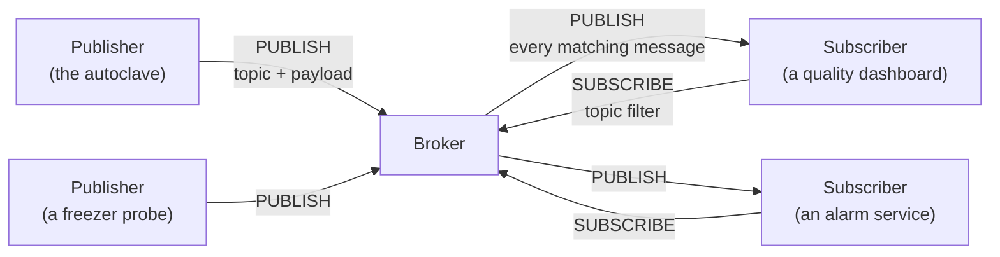

# Lab 1 — Map the plant: IoT architecture and first MQTT messages

**Duration:** 3 hours, on your own. **You hand in:** `work/report-lab1.txt`, written by `check report`.
**Where this lab sits:** the whole chain, from device to use, seen through its messages
(see the [course map](../README.md#the-course-map)). **Protocol:** MQTT.
**From the lectures:** L1 (the six blocks, the five lines), L3 part 1 (reference models) and part 5
(publish/subscribe, MQTT).

> **Before the session (15 min).** Connect to your VM, start the lab and run `check 1`
> ([section B](#b-getting-started-10-min)), then read [section A](#a-the-plant-and-what-it-expects-from-you).
> If `check 1` does not pass, tell your teacher before the session: three hours go fast.

You join Adour Composites as IoT engineers. In this first lab you map how the plant's data travel
today, watch every MQTT packet it exchanges, become a device yourself, design the plant's **unified
namespace**, and use two MQTT features every real deployment relies on: retained messages and the
last will.

**By the end of this lab you can:**

- name the layers of an IoT system and place real components in them;
- publish and subscribe with MQTT, from the command line and from Python;
- account for every byte of an MQTT message;
- design a topic namespace that serves the applications that will subscribe to it;
- tell, at any moment, whether a device is alive — and know how long it takes to find out.

## Contents

- [A. The plant, and what it expects from you](#a-the-plant-and-what-it-expects-from-you)
- [B. Getting started](#b-getting-started-10-min)
- [C. Part 1 — Architecture](#c-part-1--architecture-20-min)
- [D. Part 2 — Watch the plant talk](#d-part-2--watch-the-plant-talk-45-min)
- [E. Part 3 — Become a device](#e-part-3--become-a-device-25-min)
- [F. Part 4 — A unified namespace for the plant](#f-part-4--a-unified-namespace-for-the-plant-35-min)
- [G. Part 5 — Retained messages and last will](#g-part-5--retained-messages-and-last-will-30-min)
- [H. Your site architecture record](#h-your-site-architecture-record-15-min)
- [I. Hand in](#i-hand-in)
- [J. Going further](#j-going-further)
- [K. When something goes wrong](#k-when-something-goes-wrong)
- [L. Python, JSON and the terminal in ten lines](#l-python-json-and-the-terminal-in-ten-lines)

| Part | Time | Exercises | Questions | ◆ Deeper |
|---|---|---|---|---|
| Getting started | 10 min | (1, done before) | — | — |
| 1 — Architecture | 20 min | — | 1, 2 | D1 |
| 2 — Watch the plant talk | 45 min | 2, 3 | 3, 4 | D2, D3 |
| 3 — Become a device | 25 min | 4 | 5 | — |
| 4 — A unified namespace | 35 min | 5 | 6, 7 | D4, exercise 8 |
| 5 — Retained messages and last will | 30 min | 6, 7 | 8, 9, 10 | — |
| Record, hand in | 15 min | — | — | — |

The **core** of the lab is questions 1 to 10, exercises 1 to 7, and sections 3 and 4 of the record.
Everything marked **◆ Deeper** is optional: do it once the core is done, in any order.

> **Pace yourself.**
> - At the break (1 h 30), you should have finished Part 2.
> - If at 2 h you have not started Part 4, do exercises 5, 6 and 7 first — they build on each other —
>   then come back to the questions you left.
> - Leave every ◆ item for the end.
> - 15 minutes before the end, whatever happens: write sections 3 and 4 of the record, then
>   `check report`. A report handed in on time beats a perfect one never handed in.

**How to read the questions.** Each question says what it asks of you, and which notion of the
lectures it uses (L1, L2, L3 and the part):

| Tag | You are asked to |
|---|---|
| `Use` | make something work, and say what happened |
| `See` | observe or measure, and explain what you saw |
| `Decide` | choose, and justify the choice against its alternatives |
| `Research` | look it up, and cite your sources |

Answer in **`work/answers.txt`**, as you go: it already holds a place for every question.

---

## A. The plant, and what it expects from you

### Adour Composites, Tarnos

Adour Composites makes carbon-fibre parts — brackets, fairings, access panels — for aircraft and
racing yachts. Around eighty people work there in two shifts, 06:00–14:00 and 14:00–22:00, on
weekdays. A part goes through five areas:

| Area | What happens there | What is measured | Why it matters |
|---|---|---|---|
| **Cold store** | rolls of *prepreg* (carbon fibre pre-impregnated with resin) are kept in a freezer at −18 °C | the freezer's temperature (two wireless probes), its door | a roll costs thousands of euros, and every hour it spends warm counts against its shelf life |
| **Cleanroom** | technicians lay the prepreg plies up on moulds | temperature and humidity (three sensors) | the aerospace specification sets limits; outside them, parts are scrapped |
| **Curing** | the moulds cure in an **autoclave**: a pressure vessel that heats them to 180 °C at 7 bar for two hours | air and part temperatures, pressure, vacuum, energy | each cure cycle is a quality record the customer audits |
| **Machining** | a CNC router trims the cured parts | its state, spindle load, parts made | how much of the time the machine actually produces |
| **Utilities** | compressed air and electricity for the whole site | the compressor, the main meter and the autoclave's sub-meter | energy is the plant's second-largest cost |

Over the years, each supplier installed its devices in its own way, and they all publish to the
plant's MQTT broker. Nobody designed the whole. The plant manager, Maialen Etxeberria, sums up what
she expects from you:

> *"In three weeks an aerospace customer audits us, and I must be able to prove every cure cycle and
> every hour of the freezer. Our electricity bill went up by a third this year, and I want to know
> where it goes. And I want one system, not nine."*

**The data are simulated, but they follow the plant's rhythm:** shifts and breaks, cure cycles of
almost five hours, door openings, a quiet night. What you see depends on the day and the time — note
both whenever you record an observation.

### MQTT in a nutshell

MQTT (*Message Queuing Telemetry Transport*) is a lightweight messaging protocol built on TCP/IP. It
was designed in 1999 to monitor oil pipelines over satellite links, where every byte was expensive; it
is now an OASIS and ISO standard, and the most common way for connected devices to send their data,
from buildings to factories and vehicles.

MQTT follows a **publish/subscribe** model. Clients never talk to each other directly: they all
connect to a server, the **broker**.



| Word | Meaning |
|---|---|
| **client** | any program that connects to the broker. A client can publish, subscribe, or both |
| **broker** | the server every client connects to. It receives each message and forwards it to every client that subscribed to it |
| **topic** | the address of a message, a string such as `adour/tarnos/curing/autoclave-1/air-temperature`. Topics are not declared in advance: publishing on one creates it |
| **publish** | send a message (a *payload*: any bytes, often text or JSON) on a topic |
| **subscribe** | ask the broker for every message whose topic matches a *filter* |

Publishers do not know who listens, and subscribers do not know who publishes: a new dashboard can be
added without touching a single device. This decoupling is why MQTT scales from one machine to a
group of plants.

Every exchange is made of **packets**: `CONNECT` and `CONNACK` to open a session, `PUBLISH` to send a
message, `SUBSCRIBE` and `SUBACK` to subscribe, `PINGREQ` and `PINGRESP` to show the connection is
alive, `DISCONNECT` to leave. In this lab you will see each of them go by.

### The lab environment

`compose.yaml` starts four containers on your VM:

| Service | What it is |
|---|---|
| `broker` | Eclipse Mosquitto, one of the most widely used MQTT brokers |
| `plant` | the plant's devices, simulated: they publish as the real ones would |
| `relay` | a lab tool that sits between every client and the broker, and shows every packet in a web page, the **viewer** |
| `workstation` | where you work: Python, the MQTT command-line tools, `check` and `hint` |

**Rule of the lab:** every client connects to **`relay`, port `1884`** — never to the broker
directly, or the viewer and the checker cannot see you. In the workstation, the variables `MQTT_HOST`
and `MQTT_PORT` already say so.

New to the terminal, JSON or Python? Keep [section L](#l-python-json-and-the-terminal-in-ten-lines)
open: it holds everything this lab needs.

---

## B. Getting started (10 min)

*Do this before the session, and again at its start if your VM was restarted.*

### Connect to your VM

Your teacher gives you the address of your VM and your login. The most comfortable way is **VS Code
with the Remote – SSH extension**: *Connect to Host*, then open the folder `~/iot-labs`. You get an
editor and terminals on the VM. Without VS Code, from a terminal on your laptop:

```bash
ssh -L 8080:localhost:8080 <login>@<your-vm>
```

The `-L 8080:localhost:8080` part carries the viewer's web page to your laptop. VS Code does the same
by itself (*Ports* tab).

### Start the lab

On the VM:

```bash
cd ~/iot-labs/lab1
docker compose up -d
docker compose ps --services --status running
```

**You should see** the four running services, in any order:

```
broker
plant
relay
workstation
```

The first start builds the lab's image and takes a few minutes. If a service is missing,
`docker compose logs <service>` says why.

### Open the workstation and the viewer

You work **inside the workstation**. Your files live in `~/iot-labs/lab1/work` on the VM, which the
workstation sees as `/work`: edit them with VS Code, run them in the workstation.

```bash
docker compose exec workstation bash
```

Your prompt becomes `root@workstation:/work#`. Open a second terminal the same way: you will often need
one to publish and one to listen.

Then open **http://localhost:8080** in your laptop's browser. The **viewer** has three tabs:

- **Packets** — every packet, live: time, direction (↑ client to broker, ↓ broker to client), client,
  type, QoS, flags, topic, payload and sizes. Click a payload to see it whole.
- **Topics** — per topic, over the last 5 minutes: how many messages, how often, average sizes, who
  publishes.
- **Clients** — every connection: its settings, its traffic, and how it ended.

### Exercise 1 — The lab is running

In the workstation:

```bash
check 1
```

**You should see:**

```
Exercise 1 — The lab is running
  ✔ the relay answers at http://relay:8080
  ✔ the plant is talking: autoclave-ac1, chirpstack, cmp1, cnc1-adapter, coldstore-ctrl, hygrolab-gw, mes, modbus2mqtt, weather-roof
  ✔ MQTT answers at relay:1884

1/1 passed
```

Stuck? `hint 1`.

---

## C. Part 1 — Architecture (20 min)

### Background: layers

An IoT system is a chain: something is measured, carried over a network, collected, stored, processed,
and finally used. Reference architectures cut this chain into **layers**, each with its own
technologies and its own constraints. Knowing the layers tells you where a problem lives, and who is
responsible for it. L1 cut it into **six blocks** — sense, compute, power, connect, backhaul, use — and
the [course map](../README.md#the-course-map) places every lab of this course on such a chain.

> **Question 1 — One device through the course's lenses** · `Research` · *six blocks (L1, part 2),
> reference models (L3, part 1)*
>
> Choose **one** device of the plant: a freezer probe, the autoclave, or the main energy meter. Fill
> its six blocks as far as the tables of section A let you, and say what you had to assume. Then look
> up one layered reference model of IoT systems (ITU-T Y.2060, IEEE 2413, or a cloud provider's): name
> its layers, and say where it cuts the chain differently from the six blocks. Cite your source.

Now explore the lab from the **VM** (not the workstation). Read `compose.yaml`, then:

```bash
docker compose ps
docker network inspect lab1_default | grep -E '"Name"|IPv4Address'
docker compose logs broker | tail -20
```

In the broker's log, look at the address each client connects from, and compare it with the addresses
in the network.

> **Question 2 — The architecture of this lab** · `See` · *tiers and placement (L3, part 7)*
>
> Draw the architecture of the lab: every container, the ports, the protocols, and the direction in
> which data flow (boxes and arrows in text are fine). Place each container in one of the six blocks
> or layers of question 1. One component would not exist on a real site: which one, why is it here,
> and what would play its role in the plant? Why does the broker's log show the same address for
> every client?

> **◆ Deeper D1 — Why not HTTPS for the cleanroom?** · `Decide` · *the cost of a short exchange
> (L3, part 4), interaction patterns (L3, part 5)*
>
> The cleanroom's gateway could POST each reading to a web server over HTTPS instead of publishing it
> over MQTT. Using what L3 showed about sending a few bytes over two stacks, estimate for one reading
> the bytes and the round trips of each option — with a new connection each time, then with a
> connection kept open. Which interaction pattern does each option impose on the applications that
> want the data? Which protocol would L3 propose if the sensor slept between readings, and what would
> it change?

**What to remember.** An IoT system is a chain of layers, each with its own constraints. MQTT sits
between the devices and the applications, and decouples them. Where a component sits tells you what it
can see and what it cannot.

---

## D. Part 2 — Watch the plant talk (45 min)

### Background: listening with filters

A subscription names a **topic filter**. It can be a topic, or contain **wildcards** that match several
topics at once. Topics are made of levels separated by `/`:

| Filter | Matches | Does not match |
|---|---|---|
| `hygrolab/CR-01/temperature` | exactly that topic | anything else |
| `hygrolab/+/temperature` | the temperature of every cleanroom sensor — `+` is exactly one level | `hygrolab/CR-01/humidity` |
| `hygrolab/#` | every topic under `hygrolab/`, at any depth — `#` is the rest, and comes last | `cnc/router1/state` |
| `#` | every topic | (almost — see ◆ D3) |

The command-line tools `mosquitto_sub` and `mosquitto_pub` come with Mosquitto. Their options: `-h`
host, `-p` port, `-t` topic, `-m` message, `-v` print the topic before each message, `-q` QoS, `-r`
retain, `-C` stop after that many messages. `mosquitto_sub --help` lists them all.

### Exercise 2 — A message by hand, a subscription by hand

In a first workstation terminal, subscribe to everything the cleanroom says. Quote any topic that
contains `#` or `+`, or your shell may interpret it:

```bash
mosquitto_sub -h relay -p 1884 -t 'hygrolab/#' -v
```

**You should see** six values every ten seconds (your numbers will differ):

```
hygrolab/CR-01/temperature 20.65
hygrolab/CR-01/humidity 45.9
hygrolab/CR-02/temperature 20.96
hygrolab/CR-02/humidity 47.5
hygrolab/CR-03/temperature 20.59
hygrolab/CR-03/humidity 46.6
```

Keep it running. In a second terminal, publish your first message:

```bash
mosquitto_pub -h relay -p 1884 -t lab/hello -m 'hello from team X'
```

Find both in the viewer: your `SUBSCRIBE` and its `SUBACK`; your `CONNECT`, `PUBLISH` and `DISCONNECT`.
Then `check 2`. Stuck? `hint 2`.

> **Question 3 — Five flows of the plant** · `See` · *topics, payloads, formats*
>
> Subscribe to `#` for two minutes and use the viewer's *Topics* tab to find five flows: the
> cleanroom temperature of CR-01, the freezer probe near the door, the freezer door, the autoclave,
> and the power of the main energy meter. For each, fill the block ready in `answers.txt`: the client
> that publishes it, its topic, the payload format (bare value, JSON…), the unit and time format when
> there is one, how often it is published, the payload and packet sizes, the QoS, whether it is
> retained — and *who in the plant needs it, and for what* (think of the plant manager's three
> expectations). The freezer probes publish once a minute, and the door only when it moves: be
> patient, or look at the *Packets* tab's history.

### Exercise 3 — Measure the plant

Open `work/measurements.json` and replace each `null` with a number. Wait until the lab has run for
5 minutes, so that the *Topics* tab covers 5 full minutes.

| Key | What to measure |
|---|---|
| `cleanroom_payload_bytes` | the payload of one message on `hygrolab/CR-01/temperature` |
| `cleanroom_packet_bytes` | the whole `PUBLISH` packet carrying it |
| `chirpstack_payload_bytes` | the payload of one ChirpStack uplink event (any, roughly) |
| `sensor_data_bytes` | the bytes the freezer probe actually sent: its `data` field, base64-decoded |
| `plant_bytes_per_minute` | the bytes of the `PUBLISH` packets the plant sends per minute, all topics except yours |

For the base64 field, Python does it in one line:

```bash
python -c "import base64; print(len(base64.b64decode('...')))"
```

Then `check 3`: each key turns ✔ or says what is wrong. Stuck? `hint 3`.

> **Question 4 — Where do the bytes go?** · `See` · *count the bytes (L3, parts 5 and 6)*
>
> For the cleanroom temperature message, account for every byte of the packet: fixed header, topic
> length, topic, payload (the MQTT 3.1.1 specification, section 3.3, describes the `PUBLISH` packet).
> What share of the packet is the value itself? For the freezer probe's ChirpStack event, what share
> of the payload is the probe's own data, and what is the rest? Propose two ways to send fewer bytes
> for the same information.

> **◆ Deeper D2 — From one plant to the group** · `Decide` · *orders of magnitude (L1, part 2)*
>
> From your measurement, how many bytes and how many messages per day does the plant publish? The
> group plans to equip its four plants with 5,000 devices of the same mix: estimate the traffic per
> second and per day, and the messages per year. A cloud platform bills 1 € per million messages: what
> would the group pay each year? Which flow dominates, and why does that matter for a battery-powered
> device, or for a site connected by a cellular link?

> **◆ Deeper D3 — What the broker says about itself** · `Research` · *operating a broker*
>
> Subscribe to `$SYS/#` for 20 seconds. Which version of Mosquitto runs here, how many clients are
> connected, how many messages has it received? Then subscribe to `#`: why do the `$SYS` topics not
> appear? Find the rule in the MQTT specification and quote its section.

**What to remember.** A topic filter selects by whole levels: `+` for one, `#` for all the rest. A
message is its topic *and* its payload, and on small values the topic often weighs more than the data.
Every format choice, multiplied by thousands of devices, becomes a network and energy budget.

---

## E. Part 3 — Become a device (25 min)

### Background: a client in Python

The cleanroom is getting a fourth layup bay, and its sensor has not arrived. You will write a stand-in
that publishes like a real one. Eclipse **Paho** is the reference MQTT client library, available in
many languages. In Python, a client is created with an identifier, connects, and runs its network loop
in the background while your code publishes:

```python
import paho.mqtt.client as mqtt

c = mqtt.Client(mqtt.CallbackAPIVersion.VERSION2, client_id="sensor-alice")
c.connect("relay", 1884, keepalive=60)   # host, port, keepalive in seconds
c.loop_start()                           # the network runs in a background thread
c.publish("some/topic", "some payload", qos=1)
```

The **client identifier** tells the broker who you are. The **keepalive** is the longest time the
client promises to stay silent: when it has nothing to say, it sends a `PINGREQ` so that the broker
knows it is still there.

### Exercise 4 — Your virtual sensor

First run the example in `work/`, and find its packets in the viewer:

```bash
python publish_example.py
```

**You should see** `published, message id 1`, and in the viewer: `CONNECT`, `CONNACK`, `PUBLISH` with
QoS 1, `PUBACK`, `DISCONNECT`.

Then copy it to `sensor.py` and turn it into a sensor that:

- connects with a client id starting with `sensor-` followed by a name of your choice, for example
  `sensor-alice`;
- publishes every 2 to 10 seconds on `lab/sensors/<name>/env`;
- sends a JSON payload with `temperature_c` and `humidity_pct` (numbers) and `measured_at` (an
  ISO 8601 date in UTC), for example
  `{"temperature_c": 20.4, "humidity_pct": 46, "measured_at": "2026-09-30T13:28:21+00:00"}`;
- keeps running until you stop it.

Run it with `python sensor.py`, leave it running for a minute, then `check 4`.

**You should see:**

```
Exercise 4 — Your virtual sensor
  ✔ sensor-alice publishes on lab/sensors/alice/env
  ✔ payload: JSON with temperature_c, humidity_pct and measured_at
  ✔ one message every 5.0 s

1/1 passed
```

Stuck? `hint 4`.

> **Question 5 — Two clients, one identifier** · `See` · `Research` · *MQTT sessions (L3, part 5)*
>
> Start a second copy of your sensor in another terminal, with the same client id, and watch the
> *Clients* tab for 30 seconds. Describe what happens and explain it with the MQTT specification (look
> for what the server must do when a client connects with a client id already in use). What would it
> mean in the plant, and how do manufacturers avoid it? Finally, which client id did `mosquitto_pub`
> use in exercise 2, and where does it come from (`mosquitto_pub --help`, option `-i`)?

**What to remember.** A client is an identifier, a connection and a keepalive. The identifier must be
unique: the broker trusts it to know who is who.

---

## F. Part 4 — A unified namespace for the plant (35 min)

### Background: the namespace is an interface

A topic is an address, and all the topics together form a **tree**: each `/` goes one level down.
Consider this tree:

```
plant/cleanroom/bay-1/temperature
plant/cleanroom/bay-2/temperature
plant/cleanroom/bay-2/humidity
plant/curing/autoclave-1/temperature
plant/curing/autoclave-1/door/state
```

`plant/cleanroom/+/temperature` delivers the temperature of every cleanroom bay, but not the
autoclave's. `plant/curing/#` delivers everything in the curing area, however deep. The order of the
levels decides which questions can be answered with one subscription — and every application that
subscribes depends on that order. Changing it later means changing every subscriber: the namespace is
the first interface of an IoT system, and it deserves the care of an API.

Industry has converged on an idea called the **unified namespace** (UNS): one broker, one tree, in
which every device, machine and application of a site publishes its current state, organised like the
plant itself. The plant's structure is usually taken from **ISA-95**, the standard that describes a
manufacturing enterprise as a hierarchy: *enterprise, site, area, work centre, work unit*. Anyone who
knows the plant can then find any data without a map.

> **Question 6 — What is wrong with the plant's topics?** · `See` · *identity, unit and time travel
> with the value (L3, part 6)*
>
> Using your five flows of question 3 — and a look at the compressor's and the CNC router's in the
> *Topics* tab — list at least five problems in the topics and payloads the plant publishes today, and
> for each one the concrete trouble it causes to an application that subscribes (look closely at the
> freezer door's topic, and at the energy meter's). Why can nobody subscribe to "everything in the
> curing area" today?

### Exercise 5 — A unified namespace for the plant

`work/inventory.json` lists the plant's 13 devices — with their area, their cell (the work unit they
belong to) and their class — and five needs of the applications that will subscribe:

| Need | The application wants |
|---|---|
| N1 | everything in the curing area |
| N2 | every energy meter, whatever the area |
| N3 | everything in the cold store |
| N4 | every production machine, for the OEE dashboard |
| N5 | everything in the autoclave-1 cell, for its quality record |

Write two files in `work/`:

- `tree.json`: one topic per device, `{"<device id>": "<topic>", ...}`, for all 13 devices;
- `subscriptions.json`: for each need, the topic filters that deliver exactly the devices it wants,
  `{"N1": ["<filter>"], ...}` — **two filters at most per need**, one if your namespace is good.

The checker applies your filters to your topics exactly as a broker would, and tells you what each
need misses or catches too much. Topics must not contain wildcards, spaces, empty levels, a leading
or trailing `/`, or start with `$`. Then `check 5`.

**You should see**, once it is right:

```
Exercise 5 — A unified namespace for the plant
  ✔ 13 devices, one valid topic each
  ✔ N1 (everything in the curing area): ...
  ✔ N2 (every energy meter, whatever the area): ...
  ...
```

and before that, messages such as `N2 (every energy meter, whatever the area): misses EM-MAIN` or
`N1: invalid filter adour/#/curing ('#' must be a whole level, and the last one)`. Stuck? `hint 5`.

> **Question 7 — Your namespace, justified** · `Decide` · *unified namespace, ISA-95*
>
> Explain the order of your levels, and where ISA-95 helped. Why should a measured value never be part
> of a topic? The CNC router is moved to a new trimming cell next year: what happens to your
> namespace, and what would you do about it? One need of the plant could not be served by your
> namespace with one filter: invent it.

> **◆ Deeper D4 — Sparkplug B** · `Research` · *what OPC UA and others add (L3, part 5)*
>
> Industry uses a standard on top of MQTT, Sparkplug B (Eclipse Foundation). Describe its topic
> structure and its message types. What does it impose that your namespace does not, and which problems
> of question 6 does it solve? How does it fit with the idea of a unified namespace? Cite the
> specification.

### ◆ Exercise 8 — Build the bridge

Your namespace is a design on paper: the devices still publish their own way, and most of them
cannot be changed. On real sites, a **bridge** closes the gap — a small program next to the broker
(or a flow in a tool such as Node-RED) that subscribes to each vendor's topics, cleans every message,
and republishes it in the unified namespace. Write `work/bridge.py`, a client with the id
`bridge-<name>`, that does it for three devices:

| Device | The plant publishes | Your bridge publishes, on the device's topic from `tree.json` |
|---|---|---|
| CR-01 | `hygrolab/CR-01/temperature`: a bare number, in °C | `{"temperature_c": 20.65, "measured_at": "..."}` |
| CMP-1 | `compressors/CMP1`: JSON, pressure in **psi**, time in seconds since 1970 | `{"pressure_bar": 7.12, "measured_at": "..."}` |
| FRZ1-T1 and FRZ1-T2 | ChirpStack uplink events: the probe's 6 bytes, in base64 | `{"temperature_c": -17.62, "measured_at": "..."}` |

The rules of the clean namespace:

- values in the site's units, °C and bar (1 psi = 0.0689476 bar), with at least two decimals;
- `measured_at` in ISO 8601 **with its time zone**, and the device's own time whenever the message
  carries one;
- you may add any field that helps (`humidity_pct`, `state`, `battery_pct`…).

The freezer probe's 6 bytes, as its datasheet describes them: byte 0 is the frame type (`0x11`),
bytes 1–2 the temperature in hundredths of a degree Celsius (signed, big-endian), byte 3 the
humidity in %, byte 4 the battery in %, byte 5 a status. Which probe is which? The event says it, in
words.

Run it (`python bridge.py`), leave it a couple of minutes so that both probes speak, then `check 8`.
The checker compares the last value your bridge published for each device with what the plant
published just before: it notices a pressure left in psi, a forgotten division, a lost sign, or a
time without its zone.

**You should see:**

```
Exercise 8 — Build the bridge  (◆ deeper)
  ✔ CR-01 -> adour/.../CR-01: temperature_c 20.65 (the plant: 20.65 °C), by bridge-alice
  ✔ CMP-1 -> adour/.../CMP-1: pressure_bar 7.12 (the plant: 7.12 bar), by bridge-alice
  ✔ FRZ1-T1 -> adour/.../FRZ1-T1: temperature_c -17.62 (the plant: -17.62 °C), by bridge-alice

deeper: 1/1
```

Stuck? `hint 8`. In `answers.txt`, say in a few lines what your bridge does, and what it would take
to bring the eleven other devices in. Labs 3, 6 and 7 come back to this program: it is where
protocols change identity.

**What to remember.** The namespace is the plant's first interface: design it from the needs of those
who subscribe, most general level first. ISA-95 gives a structure everyone in industry already knows.
Devices rarely speak the namespace themselves: something must translate, and that translation is part
of the architecture.

---

## G. Part 5 — Retained messages and last will (30 min)

### Background: state and liveness

Every application in the plant asks two questions: *what is the state right now*, even if I just
arrived, and *is this device still alive?* The customer's auditor will ask a third: *how do you know?*
MQTT answers the first two with two features.

- A **retained message** is a message published with the *retain* flag. The broker keeps the last one
  of each topic and hands it to every new subscriber of that topic, right away, without waiting for
  the next publication.
- The **last will** (*Last Will and Testament*) is a message a client registers with the broker when
  it connects: a topic, a payload, a QoS and a retain flag, carried in the `CONNECT` packet. If the
  client disappears without saying goodbye, the broker publishes it on its behalf.

Together they give the classic status pattern: a device publishes `online` (retained) when it
connects, and registers `offline` (retained) as its last will.

> **Question 8 — What a newcomer receives** · `See` · *publish/subscribe (L3, part 5)*
>
> Stop your subscriptions, then start a new one on `#` and look only at what arrives in the first
> second. Which messages are these, and why do they arrive at once while the cleanroom values do not?
> Give one case in the plant where retaining a message would be a mistake, and find how a retained
> message is deleted.

### Exercise 6 — A retained status and a last will

Improve `sensor.py` so that the plant always knows whether your sensor is alive:

- right after connecting, it publishes `online` on `lab/sensors/<name>/status`, **retained**;
- it registers a **last will**: `offline` on the same topic, retained too. The will is part of the
  `CONNECT` packet: set it before connecting.

In a second terminal, keep an eye on the status:

```bash
mosquitto_sub -h relay -p 1884 -t 'lab/sensors/+/status' -v
```

Start your sensor, then stop it with **Ctrl+C**. Look at the *Clients* tab: how did the connection
end? Then `check 6`.

**You should see:**

```
Exercise 6 — A retained status and a last will
  ✔ retained on lab/sensors/alice/status: offline
  ✔ sensor-alice has a last will: lab/sensors/alice/status <- offline, retained
  ✔ sensor-alice died abruptly at 13:29:03

1/1 passed
```

Stuck? `hint 6`. One of the plant's own devices uses this pattern, and does not always stay alive:
find it in the *Clients* tab.

### Exercise 7 — A link that dies in silence

Ctrl+C is a gentle death: the operating system still closes the connection, and the broker notices at
once. A device whose radio link fades out, or whose power is cut, closes nothing. The relay can imitate
that: **Freeze** stops forwarding anything on a connection, in either direction, without closing it.

Start your sensor with a **keepalive of 15 seconds** (`connect(..., keepalive=15)`), keep the status
subscription running, and note the time. In the viewer's *Clients* tab, press **Freeze** on your
sensor's connection. Wait until the status changes, and note the time again. Then `check 7`.

**You should see**, after a while, `offline` on the status topic, and:

```
Exercise 7 — A link that dies in silence
  ✔ sensor-alice (keepalive 15 s): frozen: broker gave up after 20 s

1/1 passed
```

Your sensor then reconnects by itself through a new connection: look at its status afterwards. Stuck?
`hint 7`.

> **Question 9 — How long before the broker notices?** · `See` · `Research` · *session cost (L3, part 5)*
>
> Give the delay you measured between the freeze and the `offline` status, and explain it from the MQTT
> specification (section 3.1.2.10). Compare three endings: a `DISCONNECT`, Ctrl+C, and a frozen link —
> when is the will published, if at all? L3 counted, over one hour, how often an MQTT session with a
> 60-second keepalive wakes a device's radio: redo the count for your 15-second keepalive, and say what
> a very short keepalive costs a battery-powered device.

> **Question 10 — Birth, death and goodbye of a gateway** · `Decide` · *who answers when a device
> dies (L1, part 3)*
>
> After exercise 7, your sensor publishes again, yet its status says `offline`: explain why, and fix
> `sensor.py`. Then design the status messages of the cleanroom's gateway: the message it publishes when
> it starts (and when exactly?), its last will, and what it does when it is shut down on purpose. Give
> topic, payload, QoS and retain flag for each.

**What to remember.** Retained messages give the current state to whoever arrives; the last will
reports a death the device could not announce itself. How fast a death is noticed depends on the
keepalive, and costs energy.

---

## H. Your site architecture record (15 min)

The folder `~/iot-labs/record` holds `site-architecture.md`, your team's **site architecture record**.
It follows you through the course: each lab asks you to write or revise a section, and to log the
decisions you took. In Lab 10, you defend it. The workstation sees it as `/record`.

**During this lab**, write sections 3 and 4 — you have just done the work:

3. **Unified namespace** — its structure, two or three examples, and its rules.
4. **Device status and liveness** — the pattern of question 10, and the keepalive you would choose.

**Before Lab 2**, at home, write sections 1 and 2:

1. **Context and needs** — three uses of the plant's data (the freezer's compliance, the cure record,
   the energy bill), each described with the five lines of L1: family of use, deciding constraint,
   does it tolerate a lost message, whose network, who is still there in ten years.
2. **Architecture overview** — the plant's data path as it should be, layer by layer (a Mermaid diagram
   or an image). Your drawing of question 2 was the lab; this one is the plant.

Log each decision in the table at the end, the way L3 asks every choice to be written: the
constraint, the option retained, the option rejected, and the reason.

## I. Hand in

Once your answers are in `work/answers.txt` and your record is up to date, in the workstation:

```bash
check report
```

**You should see:** `written: /work/report-lab1.txt — hand this file in.` It is a plain text file with
which exercises the checker confirms and when, the hints you opened, your answers, your files
(`measurements.json`, `tree.json`, `subscriptions.json`, `sensor.py`, `bridge.py`) and your record.
Download `~/iot-labs/lab1/work/report-lab1.txt` from the VM (in VS Code: right-click, *Download*;
otherwise `scp <login>@<your-vm>:iot-labs/lab1/work/report-lab1.txt .` from your laptop) and upload it
where your teacher asks. Run `check report` again whenever you change something: the file is
rewritten each time. Sections 1 and 2 of the record are handed in with Lab 2's report.

## J. Going further

Finished early? After the ◆ items, pick one.

- **Where does the energy go?** Watch the main meter (`modbus2mqtt/meter_main/reg/3059`) and the
  autoclave's (`modbus2mqtt/meter_ac1/reg/3059`), the compressor's state and the autoclave's phase. What
  share of the plant's power does the autoclave take right now? What does the compressor do when nobody
  uses compressed air? Keep your notes: Lab 7 and Lab 8 come back to it.
- **See the bytes yourself.** On the VM, as root, install `tcpdump` if it is missing
  (`apt install tcpdump`), capture the broker's traffic with `tcpdump -i any -A port 1883`, and find
  the cleanroom packet you took apart in question 4. What does this tell you about security?
- **QoS preview.** Publish the same message with `-q 0`, `-q 1` and `-q 2` and count, in the viewer,
  the packets each one needs. Lab 2 is about why.

## K. When something goes wrong

| You see | It usually means | Try |
|---|---|---|
| `check: command not found` | you are on the VM, not in the workstation | `docker compose exec workstation bash` |
| `no configuration file provided` | you are not in the lab's folder | `cd ~/iot-labs/lab1` |
| a service missing from `docker compose ps` | it stopped or failed to start | `docker compose logs <service>`, then `docker compose up -d` |
| the viewer does not open | the SSH tunnel is missing | reconnect with `ssh -L 8080:localhost:8080 ...`, or use VS Code's *Ports* tab |
| `Connection refused` on port 1884 | the relay is down | `docker compose up -d relay` |
| your client works but the viewer does not show it | you connected to the broker directly | host `relay`, port `1884` |
| `mosquitto_sub` prints nothing | a wrong topic, or a `#` the shell swallowed | quote the topic: `-t 'hygrolab/#'` |
| exercise 3: "less than 5 minutes" | the lab was just (re)started | wait, then measure again |
| exercise 4 finds no message | wrong client id or topic | `sensor-<name>` and `lab/sensors/<name>/env` |
| exercise 5: `is not valid JSON` | a missing comma or quote | the message gives the line and column |
| exercise 6: no abrupt death | you stopped the sensor with `disconnect()` | stop it with Ctrl+C |
| exercise 7: the broker has not given up yet | the broker waits longer than the keepalive | wait: that is question 9 |
| exercise 8: `no JSON message of yours ... on <topic>` | the bridge publishes elsewhere, or not yet | publish on the topics of your `tree.json`, and wait a minute for the probes |
| your bridge receives nothing | it subscribed before being connected | subscribe in `on_connect` |
| the autoclave says `IDLE`, the CNC says `OFF` | it is night or the weekend at the plant | normal: note the time; the cleanroom, the freezer and the utilities never sleep |
| everything is broken | — | `docker compose down`, then `docker compose up -d`: your files in `work/` are kept |

## L. Python, JSON and the terminal in ten lines

```text
Terminal  cd ~/iot-labs/lab1 · ls · cat file      move, list, print a file;  ↑ recalls a command
          Ctrl+C stops the running program;  nano file edits (Ctrl+O save, Ctrl+X quit) — or VS Code
JSON      {"temperature_c": 20.4, "tags": ["a", "b"]}   double quotes only, no comma after the last item
          python -m json.tool tree.json                  checks a JSON file, says where it is broken
Python    import json;  d = json.loads(text);  text = json.dumps(d)       text <-> dictionary
          d["pressure_psi"] · float("20.65") · round(x, 2) · f"lab/sensors/{name}/env"
          from datetime import datetime, timezone
          datetime.now(timezone.utc).isoformat(timespec="seconds")      now, ISO 8601, in UTC
          datetime.fromtimestamp(1790000000, timezone.utc).isoformat()  seconds since 1970 -> ISO
          import base64, struct;  raw = base64.b64decode(s);  struct.unpack(">BhBBB", raw)  bytes -> numbers
```

In `struct`, `>` means big-endian, `B` one unsigned byte, `h` two bytes read as a signed number.

---

*Next: [Lab 2 — Never lose a cure record](../README.md#the-labs). QoS 0, 1 and 2 on a link that fails,
persistent sessions, and what "delivered" really means.*
