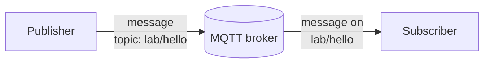
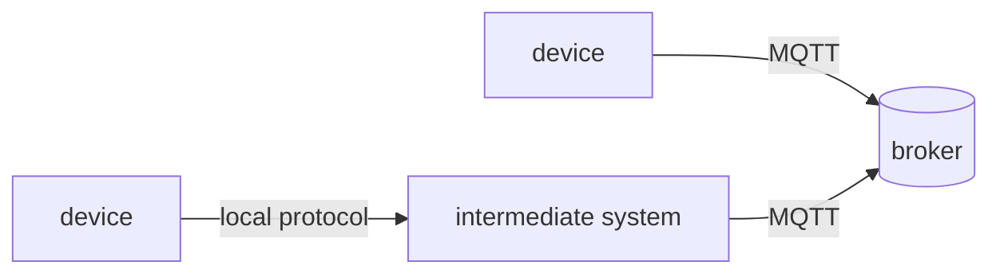
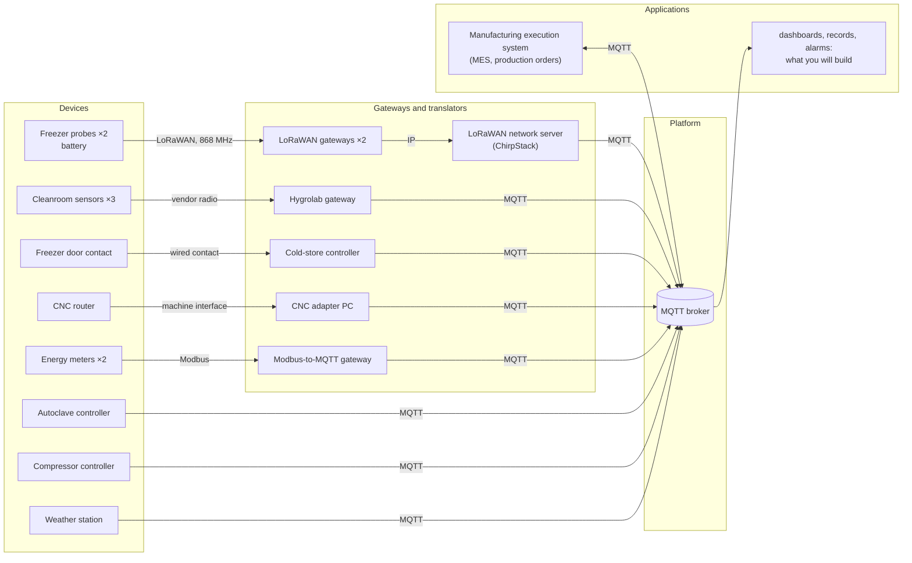
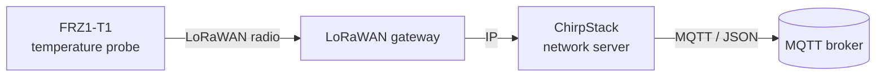
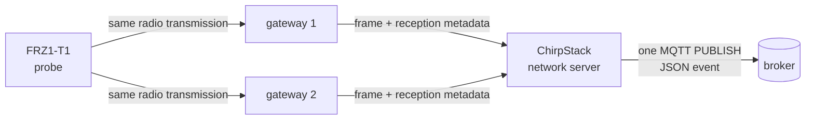

# Lab 1 — How do our data travel today, and can we trust them?


## The situation

> *"In three weeks an aerospace customer audits us, and I must be able to prove every cure cycle and
> every hour of the freezer. Our electricity bill went up by a third this year, and I want to know
> where it goes. And I want one system, not nine."*
> — Maialen Etxeberria, plant manager

Adour Composites makes carbon-fibre parts. Its prepreg (carbon fibre pre-impregnated with resin) waits
in a freezer at −18 °C; technicians lay it up in a cleanroom; an autoclave cures the parts at 180 °C
and 7 bar; a CNC router trims them; a compressor and the electricity network serve the whole site.
The equipment already sends data, but through different devices, protocols, gateways and formats.

The objective of this first lab is to reconstruct how those data travel today and to determine what
can — and cannot — be established from the data that finally reach applications.

---

## Preparation

Follow [Working on your VM](../docs/setup.md) to connect to the VM and start the lab. Open the
**viewer** in your laptop's browser at <http://localhost:8080> and keep it available throughout the
lab. Within a few seconds, MQTT traffic from the simulated plant should appear.

All commands in this lab are run **inside the `workstation` container** unless stated otherwise. The
container already includes Python and the Mosquitto command-line clients, so nothing needs to be
installed on your own machine. From `~/iot-labs/lab1` on the VM, open a shell in that container with:

```bash
docker compose exec workstation bash
```

The shell opens in `/work`, which is the lab's working directory. Open additional shells with the same
command whenever two programs must run at the same time.

The viewer is an observation instrument built for the course. It displays the MQTT traffic that
passes through the lab relay. To make this observation possible, the simulated MQTT clients connect
through `relay:1884` rather than directly to the broker.

---

## Part 1 — One MQTT message, from publisher to subscriber

Before looking at the plant, start with the smallest MQTT system that is useful: one program produces a
message, one broker receives it, and one program consumes it.



The **publisher** sends a message to a named **topic**. The **subscriber** asks the broker for messages
on that topic. The **broker** sits between them: it receives publications and forwards them to the
subscribers that asked for the corresponding topics. The publisher therefore does not need to know
which application will consume its data.

**MQTT** is the protocol. **Eclipse Mosquitto** is one implementation of it. The broker used in this
lab runs Mosquitto, and Mosquitto also provides the two command-line programs used below:
`mosquitto_pub` to publish a message and `mosquitto_sub` to receive one.

### Publish one message and receive it

In the first `workstation` shell, subscribe to one exact topic:

```bash
mosquitto_sub -h relay -p 1884 -t 'lab/hello' -v
```

Here `relay:1884` is the MQTT endpoint exposed by the lab, `-t` gives the topic of interest, and `-v`
prints both the topic and the payload. The terminal should initially remain quiet.

Open a second `workstation` shell with the same `docker compose exec workstation bash` command, then publish one message on that same topic:

```bash
mosquitto_pub -h relay -p 1884 -t 'lab/hello' -m 'hello from team X'
```

The subscriber should now display the message. At this point, the important chain is simply:

```text
publisher  ->  broker  ->  subscriber
             lab/hello
```

Now look at the same exchange in the viewer's **Packets** tab. The two terminal commands only show the
application-level result; the viewer exposes the MQTT exchange underneath it. You should find a
connection from each client, a subscription from the receiving client and the publication you just
generated. In MQTT, these appear as packets such as `CONNECT`, `SUBSCRIBE` and `PUBLISH`. A cleanly
closed client may also send `DISCONNECT`.

The lab inserts a relay so that this traffic can be observed. `↑` denotes a packet travelling toward
the broker and `↓` a packet travelling away from it.

### Q1 — Reconstruct the exchange you just generated

Follow your two terminals in the **Packets** tab. Starting with the subscriber connection and ending
with the message received by that subscriber, reconstruct the sequence you can actually observe.
Which client installed the subscription? Which topic did it request? Which client later published the
message? Where, in this chain, is the decision made to forward the publication to the subscriber?

Relate what you observe to the three roles in the figure above: **publisher**, **broker** and
**subscriber**.

### From one topic to several

Subscribing to one exact topic works for `lab/hello`, but a real application often needs a whole set of
related measurements. MQTT topics are hierarchical names made of levels separated by `/`. For example,
the cleanroom sensors use names of this form:

```text
hygrolab
├── CR-01
│   ├── temperature
│   └── humidity
└── CR-02
    ├── temperature
    └── humidity
```

A **topic filter** can describe more than one topic. A **wildcard** is a placeholder used in a
subscription filter instead of spelling out an exact level or suffix. MQTT provides two wildcard
symbols:

```text
hygrolab/CR-01/temperature    one exact topic
hygrolab/+/temperature        '+' lets one level vary
hygrolab/#                    '#' includes everything below hygrolab
```

`+` always replaces exactly one level. `#` replaces all remaining levels and can only appear at the
end of a filter. These wildcards belong to **subscription filters**; publishers still publish to a
concrete topic such as `hygrolab/CR-01/temperature`.

### Q2 — Read MQTT topic filters as the broker does

Consider the following three filters:

```text
hygrolab/#
hygrolab/+/temperature
+/CR-01/temperature
```

First predict which of the following topics each filter would match:

```text
hygrolab/CR-01/temperature
hygrolab/CR-02/humidity
hygrolab/CR-01/status
compressors/CMP1
```

Then test the filters with `mosquitto_sub` for a short period and compare what actually arrives with
your prediction. Some listed topics may not currently be produced; in that case, decide from the
matching rule rather than from the absence of a live message. For at least two non-obvious cases,
explain the match level by level.

<details>
<summary><strong>◆ Going deeper — D1: what the broker says about itself</strong></summary>

Mosquitto publishes operational information under the special `$SYS/` hierarchy. Subscribe to
`$SYS/#` for about 20 seconds and explore what is available rather than stopping at the first value.
Find at least the broker version, the number of connected clients and one counter related to messages
or bytes. Which of these values would actually help an operator diagnose a busy or unhealthy broker?
Which important property of the physical plant do they tell you nothing about?

Now open a normal subscription to `#`. The `$SYS/...` messages do not appear, although `#` looks as if
it should match everything. Find the MQTT rule responsible for this behaviour in the specification or
Mosquitto documentation and explain why system topics are treated differently.

</details>

---

## Part 2 — From physical devices to MQTT

The exchange above had only three actors. In the plant, there are two basic ways for a measurement to
reach MQTT. Some devices can act as MQTT clients themselves. Others speak a different protocol and
need an intermediate component that translates or forwards their data before MQTT appears.



In the first case, the physical device and the MQTT client may be the same component. In the second,
the physical device is not an MQTT client: a gateway, adapter, network server or other intermediate
component eventually publishes on its behalf. The broker therefore sees that intermediate component,
not the original sensor, as its MQTT peer. That distinction matters later when we ask where a value
came from or what exactly has failed.

The plant is simply a larger combination of these two patterns. Use the following diagram first as a
map: identify which sources publish MQTT directly and which ones reach MQTT through an intermediate
component.

This is the current architecture:



The labels on the first links—LoRa radio, Modbus, vendor radio, machine interface—mainly tell you that
those devices do **not** start by speaking MQTT. Their internal protocol details are not needed to trace
the path here; the important question is where MQTT first appears.

A **gateway** or **translator** belongs to the data path. Depending on the source, it may change the
communication protocol, the representation of a value, the timestamp, or the identifier eventually
visible to applications.

Observe the complete MQTT namespace for about one minute:

```bash
mosquitto_sub -h relay -p 1884 -t '#' -v
```

At the same time, use the viewer's **Topics** and **Clients** tabs. You should be able to relate a
physical device in the diagram to a client id and to one or more MQTT topics.

### Q3 — Trace five devices up to the broker

For each of the following devices — `FRZ1-T1`, `CR-01`, `EM-MAIN`, `AC-1` and `CNC-1` — reconstruct
the path from the physical device to MQTT.

For each device, provide:

1. the first communication link or interface leaving the physical device;
2. any gateway or translator on the path;
3. the MQTT client id visible in the viewer;
4. one MQTT topic carrying data from that device.

The architecture diagram tells you the expected path; the viewer provides the client ids and actual
topics. Use both sources and make any mismatch explicit.

### Q4 — Compare a direct publisher with translated data

Compare `AC-1`, which publishes MQTT directly, with **two** translated sources: `FRZ1-T1` and
`EM-MAIN`.

For each translated source, identify why an intermediate component is necessary given the first link
shown in the architecture. Then identify one additional failure or ambiguity that this intermediate
component can introduce. Base the answer on the concrete path you reconstructed in Q3; for example,
consider what an application would observe if the physical device were still working but its
translator stopped publishing.

<details>
<summary><strong>◆ Going deeper — D2: the lab is not the plant</strong></summary>

The relay is useful for teaching because it makes MQTT visible, but it also changes what the broker
sees. On the VM, outside the workstation, inspect the last broker log entries:

```bash
cd ~/iot-labs/lab1
docker compose logs broker | tail -20
```

Compare the network addresses in those logs with the client ids shown by the viewer. Which address is
actually visible to the broker, and why do several logically different clients appear to come through
the same intermediary? Draw the path of one client including the relay and identify which pieces of
network-level information are lost or replaced along that path.

A real industrial deployment would normally not insert this teaching relay. Suggest a different place
or mechanism from which you could observe broker traffic or broker activity without changing every
client's application path, and explain what information that observation point would and would not
provide.

</details>

---

## Part 3 — Follow one freezer reading end to end

The freezer path is the first one in which the physical sensor is several steps away from MQTT. Focus
on a single device, `FRZ1-T1`, and build the chain before looking at the details of its messages.

`FRZ1-T1` is a battery-powered temperature **probe**, i.e. the physical sensor placed inside the
freezer. It does **not** run MQTT. Instead, one measurement travels through the following chain:



The names in this chain refer to different roles:

- **LoRaWAN** is the low-power wide-area networking technology used on the radio link from the probe.
  It is designed for small messages from constrained devices over relatively long distances.
- a **LoRaWAN gateway** receives radio transmissions and forwards the received frames over an IP
  network. It is the bridge between the radio side and the network side;
- **ChirpStack** is the LoRaWAN network-server software used in this lab. It processes received
  LoRaWAN uplinks and exposes the resulting events to applications, here through MQTT.

An **uplink** is simply a transmission travelling from the end device toward the network. At this
stage, the important distinction is between the application data produced by the probe and the larger
LoRaWAN frame that carries those data over the radio.

In a spare terminal, start the uplink monitor and leave it running during this part:

```bash
python watch_uplinks.py
```

For each received uplink, it prints the network-server reception time, the probe name, a LoRaWAN
frame counter (`fCnt`) and the number of gateways that received the radio transmission. Watch a few
successive lines before going further.

One radio transmission can be heard by more than one gateway. Those gateways forward copies of the
same transmission to ChirpStack; the network server recognises the duplicates and exposes a single
application event. The more detailed path is therefore:



The probe wakes once a minute, measures, transmits and sleeps. The application payload it creates is
only **6 bytes**. LoRaWAN adds its own protocol information around those bytes, so the transmitted
LoRaWAN frame is larger; the complete physical radio transmission is larger again. In what follows,
`6 bytes` always refers to the **application payload produced by the probe**, not to the full radio
frame.

The counter `fCnt` belongs to LoRaWAN. It increases across successive uplinks from a device, which
means that a jump in the counter can reveal that the sequence observed by the network server is
incomplete. It does not, by itself, tell you where a missing transmission disappeared.

ChirpStack publishes the received uplink as a JSON event. The original 6 binary bytes cannot be placed
directly in ordinary JSON text, so they appear in the `data` field using **base64**, an encoding that
represents arbitrary bytes as text. The event also contains information that did not come from those
six application bytes, such as network-server reception time and gateway reception metadata.

The probe's 6-byte application payload is defined as follows:

| Byte | 0 | 1–2 | 3 | 4 | 5 |
|---|---|---|---|---|---|
| Content | frame type `0x11` | temperature, hundredths of °C, **signed**, big-endian | humidity % | battery % | status |

Later in this part you will also compare this compact binary payload with a normal MQTT publication.
For reference, a MQTT 3.1.1 `PUBLISH` packet contains, in simplified form:

| Part | Bytes | Content |
|---|---:|---|
| fixed header | 1 | packet type and flags |
| remaining length | 1–4 | size of what follows |
| topic length | 2 | length of the topic |
| topic | n | UTF-8 topic |
| packet identifier | 0 or 2 | present when required by the selected delivery mode |
| payload | rest | application message |

### Decode one freezer payload

In the viewer, filter on:

```text
application/adour-coldchain/device/
```

Open one recent uplink from `FRZ1-T1` and locate its JSON `data` field. Complete the two `TODO` in
`work/decode.py`: first convert the base64 text into bytes, then unpack the 6-byte structure described
above.

Test the decoder with:

```bash
python decode.py --test
```

Then pass the `data` value from a real `FRZ1-T1` event to the script and verify that the decoded values are plausible.

### Q5 — Compare a compact sensor payload with an MQTT representation

Take one real `hygrolab/CR-01/temperature` `PUBLISH` packet from the viewer and account for its bytes:
the complete MQTT packet, the topic and its length, and the textual payload. Use the simplified packet
structure above to explain the difference between the useful temperature characters and everything
needed to transport and identify them. If the viewer shows a packet identifier, include it; otherwise
explain why it is absent.

Now compare this with the freezer probe, where the whole application payload is only six bytes and
several physical quantities are packed together. Compute the fraction of your cleanroom MQTT packet
occupied by the temperature text itself, but do not stop at the ratio. The two representations live
on very different links and serve different purposes. Explain why spending more bytes on a readable,
self-describing representation after reaching the IP network can be a reasonable architectural choice
even if the battery-powered radio link is kept compact.

### Q6 — Determine where meaning and metadata are introduced

Use the **same real `FRZ1-T1` event** you decoded above. Put the decoded six fields next to the
corresponding ChirpStack JSON event and compare them.

Identify at least three useful pieces of information present in the JSON but absent from the six
bytes produced by the probe. For each one, state which component in the path can know or add it and
give one reason an application might use it.

Finally, identify where the knowledge *"bytes 1–2 are a signed big-endian temperature in hundredths
of a degree"* must reside. Explain what value applications would obtain if the probe firmware changed
that binary format while the decoder continued to use the old one.

### Q7 — Use `fCnt` to identify incomplete evidence

Leave `watch_uplinks.py` running until you observe a jump in `fCnt` for one of the freezer probes.
Record the two counters on either side of the gap and the associated reception times.

From this observation, state precisely:

- which transmission counter(s) are missing;
- what you can conclude about the sequence received by the network server;
- what you cannot determine about **where** in the path the loss occurred;
- whether the missing temperature value itself can be reconstructed from the remaining events.

Avoid replacing the last two points by guesses: distinguish evidence from plausible explanations.

### Q8 — Identify which timestamp the freezer evidence actually contains

Open one freezer event in the viewer and compare its JSON `time` field with the arrival time shown by
the relay. The probe itself has no clock.

Distinguish the following four instants in the end-to-end path: physical measurement, radio
transmission, network-server reception and MQTT arrival. For each one, state whether it is directly
known, approximated or absent in this system.

Conclude by explaining what uncertainty remains if an auditor asks whether the freezer was below
−15 °C **throughout** a particular hour.

<details>
<summary><strong>◆ Going deeper — D3: from one plant to a larger fleet</strong></summary>

The traffic in this lab is small enough that almost any broker can handle it. Scaling, however, is not
only a matter of multiplying the number of devices: message frequency and message size can make very
different sources dominate the load.

Stop your own temporary clients so that they do not bias the observation. Over a one-minute window,
use the viewer to estimate both the number of publications and the number of bytes generated by the
plant. Separate at least the freezer, cleanroom and one higher-rate source rather than using only one
global total. Extrapolate your measurements to one day, then to a hypothetical deployment of 5,000
devices with the same traffic mix.

Compare the source that dominates **message count** with the one that dominates **bytes**. Are they
the same? Finally, identify at least three assumptions in your extrapolation that would probably fail
in a real fleet—for example synchronized reporting, event bursts, protocol overhead outside MQTT or
changes in sampling rates.

</details>

<details>
<summary><strong>◆ Going deeper — D4: automate the audit gap check</strong></summary>

In Q7 you detect a missing frame manually. Turn that reasoning into a small monitoring tool. Write a
script, in the language of your choice, that follows both freezer probes and reports every discontinuity
in `fCnt`. A useful alert should identify the probe, the previous and current counters, and the time
interval over which the evidence became incomplete.

Test the script on live traffic long enough to observe at least one normal sequence and, if possible,
one gap. Do not interpolate or manufacture a replacement temperature: the point is to identify an
evidence gap, not to hide it. Then explain what extra observations you would need if the objective
changed from *detecting that something is missing* to *locating where it was lost* (radio reception,
network server, MQTT publication, or later consumption).

</details>

<details>
<summary><strong>◆ Going deeper — D5: how much timing uncertainty?</strong></summary>

The freezer event contains a network-server reception time, while the viewer gives you a later arrival
time at the relay. Collect several pairs and compute the difference for each event. Look at the range
and variability rather than reporting only one number. Does this part of the path behave like an
almost constant delay, or do you observe meaningful jitter?

Then interpret the experiment carefully. Which segment of the end-to-end path have you actually
measured? Why does this still tell you nothing precise about the delay between the physical measurement
and the probe's radio transmission? If the audit required a guaranteed measurement time within one
second, what additional capability would have to exist closer to the sensor?

</details>

---

## Part 4 — What must an MQTT client get right?

So far, every producer was part of the simulated plant. Creating one ourselves gives more control over
its connection lifecycle and makes an MQTT detail visible that is easy to overlook when everything is
working normally: the broker needs a stable way to distinguish one client session from another.

A MQTT client opens a connection and presents a **client identifier**. The identifier distinguishes
client sessions at the broker; **it is not, by itself, proof of the physical device's identity**.

The lab already includes **Paho**, a Python MQTT client library. A minimal publisher using it looks like this:

```python
c = mqtt.Client(mqtt.CallbackAPIVersion.VERSION2, client_id="sensor-alice")
c.connect("relay", 1884)
c.loop_start()
c.publish("some/topic", "some payload")
```

For the next experiment, one MQTT rule is sufficient: when a new connection presents a client
identifier that is already in use, the broker disconnects the existing connection associated with
that identifier.

### Add a virtual sensor

Run `python publish_example.py` once and identify its `CONNECT`, `PUBLISH` and `DISCONNECT` packets in
the viewer. Then complete the relevant `TODO` in `work/sensor.py` so that the simulated
sensor:

- uses your name in its client id and topic;
- publishes `temperature_c`, `humidity_pct` and `measured_at` as JSON;
- represents `measured_at` as an ISO 8601 timestamp in UTC;
- publishes every 5 s on `lab/sensors/<name>/env`.

Run it with:

```bash
python sensor.py
```

Let several messages appear and inspect one of them in the viewer.

### Q9 — Observe what happens when two connections reuse one client id

Keep your first `sensor.py` running. From a second `workstation` shell, start a second copy without
changing `NAME`. Watch the **Clients** tab and both terminals for roughly 30 seconds.

Describe the sequence you observe when the two processes repeatedly try to use the same client id,
and relate it to the MQTT rule given above. Then distinguish two statements:

1. what `sensor-<name>` allows the broker to distinguish;
2. what seeing that client id does **not** establish about the identity of the physical sender.

<details>
<summary><strong>◆ Going deeper — D6: diagnose duplicate identities from observations only</strong></summary>

Imagine that the two processes from Q9 are real devices installed in different rooms and that you do
not have shell access to either of them. Repeat the duplicate-client experiment and watch only the
viewer. Build a short diagnostic argument from the evidence available there: connection/disconnection
patterns, repeated `CONNECT` packets, timing, client-id history, or interruptions in publications.

Identify at least two observable symptoms that would make a duplicate client id a plausible diagnosis.
For each symptom, give another failure that could produce something similar—for example a genuinely
unstable network or a client that crashes and reconnects. What additional observation would let you
discriminate between those explanations?

</details>

<details>
<summary><strong>◆ Going deeper — D7: one device, several identities</strong></summary>

A single measurement can carry several notions of identity. The technician sees a physical sensor
with a label; the broker sees a client id such as `sensor-alice`; applications may infer a device from
a topic such as `lab/sensors/alice/env` or from a field in the payload. These names often agree, but
MQTT does not make them equivalent.

For each level—physical asset, MQTT client/session, application-level device name—state what is being
identified and where the mapping to the other levels actually comes from. Then construct one realistic
misconfiguration in which two levels still agree while the third points to the wrong asset. From the
MQTT data alone, would that error necessarily be detectable?

</details>

---

## Part 5 — Make heterogeneous data usable together

Looking at the Topics tab should now reveal another problem: the plant has not merely chosen several
protocols, it has also accumulated several conventions. One vendor puts the device id in the topic,
another hides it in JSON; one source reports psi, another degrees Celsius; timestamps may refer to the
device, a gateway or a server. None of these choices is necessarily wrong in isolation, but an
application that combines the sources must understand all of them.

MQTT topics are part of that interface. Their hierarchy determines which groups of data are easy to
select with one subscription. With `plant/<area>/<cell>/<device>/...`, for example,
`plant/curing/#` naturally selects the curing area, while a query that cuts across areas may be less
convenient. There is therefore a design trade-off: the tree should reflect the queries that matter,
not simply reproduce the organisation chart.

### Q10 — Make the current interoperability problems explicit

Inspect one recent message from each of these four sources in the viewer:

- freezer: `application/adour-coldchain/device/.../event/up`;
- cleanroom: `hygrolab/CR-01/temperature` and `hygrolab/CR-01/humidity`;
- main energy meter: `modbus2mqtt/meter_main/...`;
- compressor: `compressors/CMP1`.

For each source, note the topic structure and the payload representation. Across the four sources,
identify at least **four concrete incompatibilities** that an application combining the data would
have to handle. Look specifically at naming, units, timestamps, how several quantities are grouped,
and whether identifiers are explicit or implicit. For every incompatibility, cite the two concrete
messages or conventions you compared.

### Design a topic hierarchy for the plant

`work/inventory.json` describes 13 devices, their location and their class. Read it before choosing a
hierarchy. Five applications already exist or are planned:

| Need | The application wants |
|---|---|
| N1 | everything in the curing area |
| N2 | every energy meter, whatever the area |
| N3 | everything in the cold store |
| N4 | every production machine, for the production-performance dashboard |
| N5 | everything in the autoclave-1 cell, for its quality record |

Propose a consistent MQTT topic hierarchy for the plant. You do not need to enumerate every possible
measurement field; the important choice here is the order and meaning of the levels used to locate a
device and its data. Check the design on a few deliberately different cases, including `FRZ1-T1`,
`AC-1`, `EM-AC1`, `CMP-1` and `WS-ROOF`.

### Q11 — Which queries does your hierarchy make easy?

Use your proposed hierarchy to write subscription filters for N1–N5. Try to retrieve exactly the
required devices and avoid a list of one filter per device; if a need genuinely requires two filters,
that is already useful information about the structure you chose.

Then consider a new request that was not in the original requirements: an engineer wants **every
temperature sensor on the site**, regardless of area. Write the filter or filters needed for that
request and compare them with N1–N5. Explain which kinds of query your hierarchy naturally favours,
which become awkward, and whether you would change the hierarchy after seeing this new requirement.

### Normalize two sources

A common topic hierarchy solves only the **addressing** problem. The payloads can still disagree on
units, field names and timestamps. One way to hide those vendor-specific differences from downstream
applications is to place a **bridge** in the data path. Here, the bridge subscribes to an existing
message, interprets it, converts what is needed and republishes a new message in the common form.

That translation is useful, but it is not neutral: once the bridge converts psi to bar, chooses a
timestamp or renames a field, those choices become part of the meaning and lineage of the resulting
data.

Complete the `TODO` in `work/bridge.py`. Choose output topics for the compressor and the two freezer
probes that are consistent with the hierarchy you just proposed, then make the bridge subscribe to
the vendor topics, convert the messages and republish them:

| Device | Existing message | Message produced by your bridge |
|---|---|---|
| `CMP-1` | `compressors/CMP1`: pressure in **psi**, Unix timestamp (seconds since 1970) | `pressure_bar`, `measured_at` |
| `FRZ1-T1`, `FRZ1-T2` | ChirpStack event, 6-byte payload hidden in `data` | `temperature_c`, `measured_at` |

Use at least two decimals for °C and bar (`1 psi = 0.0689476 bar`). `measured_at` must be ISO 8601
with a time zone. Use the compressor's own timestamp when available; for the probes, use the network
server reception time because the probes have no clock.

Run the bridge and observe both the original and republished traffic in the viewer:

```bash
python bridge.py
```

### Q12 — Compare an original message with the value produced by your bridge

Choose one compressor message and one `FRZ1-T1` message for which you can also find the corresponding
output from your bridge. Keep the pairs together so that you are comparing the same observation as
closely as possible.

For each output field produced by the bridge, determine whether it is:

- directly measured by the physical device;
- supplied later by another component in the path;
- computed by your bridge.

Use the actual input and output values to justify the classification. Then answer three concrete
questions: what information can the bridge normalize reliably, what missing information can it not
recover, and what would subscribers observe if the bridge stopped publishing for ten minutes?

Finally, suppose an auditor challenges a value such as `pressure_bar = 6.89`. State which original
value and which conversion information would have to be retained to reproduce and justify that
normalized value.

<details>
<summary><strong>◆ Going deeper — D8: can one tree make every query easy?</strong></summary>

Treat the hierarchy from Q11 as one design among several, not as a final answer. Build a second
hierarchy whose first objective is to make **all temperature sensors on the site** selectable with a
single MQTT filter. Write concrete topics for the same representative devices and recompute the
filters for N1–N5.

Compare the two designs in a small table: number of filters required for each need, amount of
duplication or special cases, and how easy the topic is for a human to interpret. Can you find an
ordering that makes N1–N5 and the all-temperature query all expressible with one filter, without
encoding the same information twice? If not, explain the structural reason rather than simply saying
that MQTT wildcards are limited.

As a final thought, distinguish what belongs in a **topic used for routing** from what would be better
kept as **metadata in the payload**. That distinction becomes important once the number of possible
queries grows.

</details>

---

## Part 6 — When data stop, what can we conclude?

Up to this point, receiving a message has been easy to interpret: some component was alive long enough
to publish it. Silence is harder. A quiet topic might mean that nothing changed, that a sensor stopped
measuring, that a gateway failed, or simply that an MQTT connection disappeared. MQTT provides mechanisms for these different situations, but they answer different questions.

A **retained message** addresses one of them: what should a subscriber learn when it arrives after the
last publication? When a publication is marked as retained, the broker stores the latest retained value
for that topic. A subscriber that arrives later can therefore receive
that value immediately, without waiting for the original producer to publish again.

This is useful for state such as a current mode or configuration, but it creates an obvious question:
the value is the **last value remembered by the broker**, not necessarily a fresh measurement.

### Q13 — Determine what a new subscriber learns immediately

Stop any broad `#` subscription you currently have. Start a fresh one:

```bash
mosquitto_sub -h relay -p 1884 -t '#' -v
```

Let the subscriber run only briefly, then stop it so that the first burst is easy to inspect. In the
viewer, distinguish messages marked as retained from periodic publications that happened to arrive at
the same time.

Choose a few retained messages and interpret what a new application would learn from them without
waiting for the original producer. Then pick one retained measurement or state that could be stale:
what timestamp, age or independent signal would you need before treating that stored value as current
evidence rather than simply the last value the broker remembers?

### Add an online status and a last will

A retained value tells a late subscriber what the broker remembers, but it does not tell us why a
client disappeared. MQTT provides a separate mechanism for unexpected disconnections: the **Last Will
and Testament** (usually shortened to **last will**).

When a client connects, it can give the broker a message to publish on its behalf if the connection
later disappears without a clean `DISCONNECT`. A common pattern is therefore to register a retained
`offline` will before connecting, then publish a retained `online` status once the connection is
established:

```python
c.will_set(STATUS, "offline", retain=True)
c.connect(HOST, PORT, keepalive=KEEPALIVE_S)
c.publish(STATUS, "online", retain=True)
```

Complete the two status-related `TODO` in `sensor.py`:

- before connecting, register `offline` as a retained last will on `lab/sensors/<name>/status`;
- after connecting, publish `online` on the same topic and retain that status.

Observe the status from another terminal:

```bash
mosquitto_sub -h relay -p 1884 -t 'lab/sensors/+/status' -v
```

Start the sensor, verify that `online` is visible, then stop the Python process with **Ctrl+C** and observe the status change.

### Observe a connection that dies silently

The last will still depends on the broker noticing that the connection is gone. If a TCP connection
vanishes without closing cleanly, that may not be immediate. MQTT therefore associates each
connection with a **keepalive** interval. An otherwise idle client periodically proves that the
connection is still responsive, using `PINGREQ`/`PINGRESP`; if the broker hears nothing for long
enough, it treats the connection as lost and can publish the client's last will.

The next experiment makes that delay visible rather than simply terminating the process.

Set `KEEPALIVE_S = 15`, restart the sensor and keep the status subscription open. In the viewer's
**Clients** tab, use **Freeze** on that connection. The relay then stops forwarding traffic without
closing the underlying connection.

Record the moment at which you freeze the connection and the moment at which `offline` appears.

### Q14 — Compare abrupt failure with keepalive-based detection

Use the two observations above. Explain why Ctrl+C can trigger the last will quickly,
whereas the frozen connection remains apparently present until the broker's keepalive timeout.

For keepalive values of **15 s** and **60 s**, calculate:

- the approximate worst-case time before the broker considers an otherwise silent connection lost;
- the number of keepalive cycles per hour for an idle client.

For the mains-powered cleanroom gateway, choose between these two values if the application is
expected to detect a communication failure within one minute, and justify the choice. Finally,
explain why even a perfectly chosen MQTT keepalive for the gateway does not prove that a battery
freezer probe behind that gateway is still alive.

<details>
<summary><strong>◆ Going deeper — D9: when `online` and fresh data disagree</strong></summary>

A status topic is attractive because it seems to reduce device health to one word. Test how dangerous
that simplification can be. Using the sensor you already control, create—or, if you prefer, describe
precisely enough to reproduce—two inconsistent situations:

1. the retained status says `online`, but no fresh environmental measurements arrive;
2. measurements are arriving, while the retained status seen by a new subscriber is `offline`.

For each case, explain the sequence of MQTT events that produces the inconsistency and identify which
piece of information is stale or misleading. Then design a more robust liveness test using only data
already available in this lab: for example status, age of the last measurement, connection state or
expected publication period. Under what conditions could even that combined test still be wrong?

</details>

---

## Final decision

### Q15 — What can you actually tell the plant manager?

Return to the audit question from the beginning of the session: **can the current system prove that
the freezer stayed compliant for every hour?** Give the plant manager an answer that is as strong as
the evidence allows, but no stronger. Use the decoded measurements, timestamps, `fCnt` continuity and
the data path you reconstructed to support the claim.

Then identify the main gaps that still weaken that evidence and three changes you would prioritise if
traceability and auditability became production requirements. Keep the changes tied to problems you
actually observed rather than proposing a generic redesign.

There is one related question we have not resolved yet: if a critical record such as an autoclave cure
message is published while the network is failing, what guarantee do we have that it reaches its
destination exactly as intended? That is the question taken up in Lab 2.

*Next: Lab 2 — can we lose a cure record if the network fails?*
