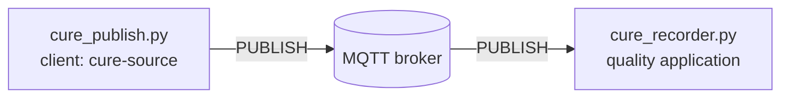

# Lab 2 — Can we lose a cure record if the network fails?

## The situation

> *"Yesterday's cure completed correctly, but the quality application has a gap exactly when the
> network was unstable. I need more than 'MQTT is reliable': did the broker receive the record, did
> the application receive it, and what can we recover after a disconnection?"*
> — Nora Elissalde, quality manager

Lab 1 followed data through a working MQTT chain. This lab keeps the same plant and tools, but now
clients will disconnect and some exchanges will be interrupted. The objective is to determine **what
was delivered, what was kept, and by which component**.

Only the numbered questions **Q1–Q15** are expected in your report. The commands and observations in
between are there to build the evidence you need; you do not need to report every intermediate step.

## Preparation

From `lab2/` on the **host**, start the stack and enter the workstation container:

```bash
docker compose up -d --build
docker compose exec workstation bash
```

Your shell is now in `/work` **inside `workstation`**. Unless a step explicitly says **on the host**, run
all `python`, `mosquitto_pub` and `mosquitto_sub` commands from this shell. Names such as `relay` and
`ac1-edge` are Docker service names and are not normally resolvable from the host itself. Open additional
workstation shells with the same `docker compose exec workstation bash` command when two programs must
run at the same time.

Keep the **viewer** open at <http://localhost:8080>. In its **Packets** tab, enable **show protocol details**.

In Lab 1 you published test messages directly with `mosquitto_pub`. Here we want to follow the **same
application record** through several MQTT experiments, so two small Python programs play the same MQTT
roles in a more reproducible way. **The network architecture has not changed:** they are ordinary MQTT
clients, and their packets appear in the same viewer as before.

- `cure_publish.py` is the publisher. Each time you run it, it creates **one** synthetic record for a
  completed autoclave cycle, publishes it, and exits;
- `cure_recorder.py` is the subscriber. It represents the quality application that receives those
  records and stays connected until you stop it with `Ctrl+C`.

For Parts 1 and 2, keep **two workstation shells** open. We will use the first for the long-running
recorder and the second for short commands such as publishing a record. A `cure_publish.py` command
publishes one record and then exits by itself; the recorder remains running. Keep the browser viewer
open separately at `localhost:8080`.

For example, running `python cure_publish.py CR-101 --qos 0` later in Q1 will publish one MQTT message
on `quality/autoclave/AC-1/cure-records` whose payload contains something like:

```json
{"record_id":"CR-101","batch":"BATCH-101","recipe":"CFRP-180C","result":"PASS", ...}
```

This record is **not generated continuously by the plant**. It appears when you run the publisher. At
that moment you will see the corresponding MQTT traffic in the same viewer at
<http://localhost:8080>; filtering the packet list with `CR-101` or `cure-records` lets you follow that
record from the publisher to the broker and then to the quality application. The `record_id` is only an
application-level identifier that helps us recognise the same record across these exchanges.


## Part 1 — What does an MQTT acknowledgement actually acknowledge?

You already know the `publisher → broker → subscriber` chain. Here the same chain carries a cure
record:



MQTT defines three **Quality of Service (QoS)** levels: 0, 1 and 2. Do not learn their guarantees in
advance; start from the traces and see what changes.

### Follow one record with QoS 0

In **workstation shell A**, start the quality application and leave it running:

```bash
python cure_recorder.py --client-id audit-q0 --qos 0
```

It should report that it connected and subscribed. In **workstation shell B**, publish one record:

```bash
python cure_publish.py CR-101 --qos 0
```

This second command publishes `CR-101` and exits. In shell A, check that the recorder prints a
`RECEIVED record_id=CR-101` line. Then open the viewer and filter the packet list with `CR-101`.
You should be able to locate the `PUBLISH` from `cure-source` to the broker and the second `PUBLISH`
from the broker to `audit-q0`. These views — publisher output, recorder output, and the two `PUBLISH` packets in the trace — provide
different evidence about how far the record travelled.

### Q1 — How far can you prove that CR-101 travelled?

For `CR-101`, identify what the packet trace proves and what the recorder output proves. Which
observation is the strongest evidence that the record reached the application itself?

### Add one level of reliability

Return to **shell A** and stop `audit-q0` with `Ctrl+C`. In the same shell, start a new recorder at
QoS 1 and leave it running:

```bash
python cure_recorder.py --client-id audit-q1 --qos 1
```

In **shell B**, publish the next record:

```bash
python cure_publish.py CR-102 --qos 1
```

The publisher again exits by itself; keep `audit-q1` running. In the viewer, first locate the two
`PUBLISH` packets carrying `CR-102`. Around each one, look for the MQTT control packet that completes
that delivery. The viewer also displays a numeric packet identifier: use it to match a `PUBLISH` with
its acknowledgement **on the same connection**. Do not try to match packet identifiers across the
broker.

### Q2 — Is QoS 1 one end-to-end exchange?

The broker sits between two MQTT connections. Reconstruct the `PUBLISH → acknowledgement` exchange on each side, then explain what shows that these are two separate deliveries rather than one end-to-end acknowledgement.

### Remove the subscriber

In **shell A**, stop `audit-q1` with `Ctrl+C`. Because this is a clean MQTT session, its subscription
is removed when it disconnects. Leave the recorder stopped.

In **shell B**, publish while no quality application is connected:

```bash
python cure_publish.py CR-103 --qos 1
```

In the viewer, locate the `PUBLISH` of `CR-103` from `cure-source` and check whether the broker returns
a `PUBACK` to the publisher. Now go back to **shell A** and start the same recorder again:

```bash
python cure_recorder.py --client-id audit-q1 --qos 1
```

Do **not** publish a new record. Watch the recorder terminal for a few seconds and check whether
`CR-103` appears. Q3 asks you to relate these two observations.

### Q3 — How far does the publisher's PUBACK reach?

Here the publisher still receives `PUBACK` while the application is offline. After the restart, does the application receive `CR-103`? Use the two observations to explain what the publisher-side acknowledgement guarantees — and what it cannot guarantee.

### Inspect QoS 2

Stop the recorder in **shell A** with `Ctrl+C`, then start a QoS-2 recorder and leave it running:

```bash
python cure_recorder.py --client-id audit-q2 --qos 2
```

From **shell B**, publish one QoS-2 record:

```bash
python cure_publish.py CR-104 --qos 2
```

In the viewer, locate the two `PUBLISH` packets carrying `CR-104`. Inspect the packets immediately
around the first delivery (`cure-source ↔ broker`) and write down the order and direction of
`PUBLISH`, `PUBREC`, `PUBREL` and `PUBCOMP`. Repeat for the second delivery (`broker ↔ audit-q2`). Use
the packet identifier only to follow packets belonging to one connection.

### Q4 — What does QoS 2 add?

Use the trace to write the QoS-2 packet sequence on each side of the broker. Which component completes the first exchange and starts the second one?

### Let the two sides use different QoS levels

Here each publisher command still sends one record and exits. We will change the maximum QoS requested
by the subscriber while keeping the publication at QoS 2.

**Run 1.** In shell A:

```bash
python cure_recorder.py --client-id audit-max0 --qos 0
```

In shell B:

```bash
python cure_publish.py CR-105 --qos 2
```

In the viewer, note the QoS requested in `SUBSCRIBE` and the QoS of the broker-to-`audit-max0`
`PUBLISH`. Stop the recorder with `Ctrl+C`.

Repeat the same observation with:

```bash
# shell A
python cure_recorder.py --client-id audit-max1 --qos 1
# shell B
python cure_publish.py CR-106 --qos 2
```

then:

```bash
# shell A
python cure_recorder.py --client-id audit-max2 --qos 2
# shell B
python cure_publish.py CR-107 --qos 2
```

Stop each recorder before starting the next one. Finally, keep a QoS-2 recorder but lower the
publication QoS:

```bash
# shell A
python cure_recorder.py --client-id audit-pub1 --qos 2
# shell B
python cure_publish.py CR-108 --qos 1
```

Again note the subscription QoS and the outgoing `PUBLISH` QoS. The four runs give the evidence for Q5.

### Q5 — How does the broker choose the outgoing QoS?

The four runs vary both the publication QoS and the subscription QoS. From what you observed, infer the rule used by the broker for the outgoing `PUBLISH`, and illustrate it with one of your traces.

### Attach names to what you observed

At this point, the standard MQTT names can be attached to what you observed:

```text
QoS 0 — at most once
QoS 1 — at least once
QoS 2 — exactly once
```

Keep their scope precise: each name describes **one MQTT delivery between one sender and one receiver**.
Q3 already showed why this is not the same as an end-to-end application guarantee.

<details>
<summary><strong>◆ Going deeper — D1: what did stronger delivery cost?</strong></summary>

Use the clean Q1, Q2 and Q4 traces. On one already-connected MQTT link, count the MQTT packets and sum
the viewer's `packet B` values from the first `PUBLISH` until that delivery completes.

Compare QoS 0, 1 and 2, and explain what extra protocol work appears as the QoS increases. Do not
interpret small JSON-size differences as protocol overhead.
</details>

<details>
<summary><strong>◆ Going deeper — D2: packet identifier or business-record identifier?</strong></summary>

Compare the MQTT packet identifiers with the JSON `record_id` for one QoS-1 or QoS-2 record.

Explain which identifier names one in-flight MQTT exchange and which identifier still refers to the
same business record after reconnect or retransmission.
</details>

## Part 2 — What state survives when the application disconnects?

Q3 used a clean client: when it returned, nothing was waiting. MQTT can also keep **client-specific
session state** across connections. With `--persistent`, the recorder requests that behaviour.

### Leave a persistent subscriber offline

In **shell A**, start a fresh persistent recorder and leave it running:

```bash
python cure_recorder.py --client-id audit-persistent --qos 1 --persistent
```

On this first connection, the recorder prints `session_present=False` and sends a `SUBSCRIBE`. In
**shell B**, publish one normal record and check that shell A receives it:

```bash
python cure_publish.py CR-201 --qos 1
```

Now stop the recorder in shell A with `Ctrl+C`. While it is offline, use shell B to publish three
records:

```bash
python cure_publish.py CR-202 --qos 1
python cure_publish.py CR-203 --qos 1
python cure_publish.py CR-204 --qos 1
```

Return to **shell A** and run **exactly the same persistent-recorder command** again. Do not publish
anything new. Watch the first lines printed by the recorder: note `session_present`, whether it sends
a new `SUBSCRIBE`, and which `CR-20x` records arrive immediately. In the viewer, verify that
`cure-source` does not publish those records a second time during the reconnection.

### Q6 — What did the broker keep while the application was away?

On reconnection, some records arrive even though the source does not publish them again. Which observations show that the broker resumed an existing session, and what information must it have kept while the application was disconnected?

### Change only the client identity

Stop `audit-persistent` in **shell A** with `Ctrl+C`; do not reconnect it yet. In **shell B**, publish
two more records while that client is offline:

```bash
python cure_publish.py CR-205 --qos 1
python cure_publish.py CR-206 --qos 1
```

Back in **shell A**, connect a *different* persistent client:

```bash
python cure_recorder.py --client-id audit-other --qos 1 --persistent
```

Look at its first connection lines and wait briefly: note `session_present` and whether `CR-205` or
`CR-206` arrive. Stop `audit-other` with `Ctrl+C`. Then, still in shell A, reconnect the original
`audit-persistent` client with the exact command used in Q6. Again note `session_present` and which
records arrive immediately.

### Q7 — How does the broker find the right stored session?

Only the client identity changes between these reconnects. Compare `audit-other` with `audit-persistent`: which one recovers the previous session, and what does this tell you about how the broker finds that session and what it contains?

### Compare session state with a retained value

Stop whichever recorder is still running in **shell A** before continuing.

Lab 1 already used retained messages. This time we will place one retained value on a neighbouring
AC-1 topic, then compare it with records stored for a particular persistent session. From **shell B**,
create the retained value:

```bash
mosquitto_pub -h relay -p 1884 -i result-source -q 1 -r \
  -t 'quality/autoclave/AC-1/last-result' \
  -m '{"record_id":"LAST-STATE","result":"PASS"}'
```

A direct `mosquitto_pub` is enough here because we only need one retained MQTT publication.

Now, in **shell A**, start a fresh persistent recorder over the whole AC-1 subtree and leave it
running:

```bash
python cure_recorder.py --client-id audit-state --qos 1 --persistent \
  --topic 'quality/autoclave/AC-1/#'
```

Because this is a new subscription, check that the recorder immediately receives `LAST-STATE` and
notice its `retain=True` flag. Then stop `audit-state` with `Ctrl+C`. While it is absent, publish from
**shell B**:

```bash
python cure_publish.py CR-230 --qos 1
```

In **shell A**, connect a new *clean* client to the same wildcard:

```bash
python cure_recorder.py --client-id audit-new --qos 1 \
  --topic 'quality/autoclave/AC-1/#'
```

Wait long enough to see what it receives, then stop it with `Ctrl+C`. Note separately whether you saw
`LAST-STATE` and `CR-230`. Finally, in shell A, reconnect the original persistent `audit-state` client
with its previous command. Do not publish anything new; again note which of those two values arrive.

### Q8 — Retained state or session state?

At this point the broker is holding two different kinds of state. Compare what `audit-new` and the resumed `audit-state` receive: which information follows the **topic**, and which follows one particular **client session**?

### Start clean with the same Client ID

Stop `audit-state` in **shell A** with `Ctrl+C`. In **shell B**, publish one more record while that
persistent session is offline:

```bash
python cure_publish.py CR-231 --qos 1
```

Now deliberately reconnect **cleanly**: in shell A, use the same Client ID but omit `--persistent`:

```bash
python cure_recorder.py --client-id audit-state --qos 1 \
  --topic 'quality/autoclave/AC-1/#'
```

On connection, note `session_present`, whether the recorder receives `CR-231`, and whether it receives
retained `LAST-STATE`. Stop this clean client with `Ctrl+C`, then run the original persistent
`audit-state` command once more and observe its initial connection state. These observations are the
basis of Q9.

### Q9 — What did the clean reconnect erase?

After the clean reconnect, what happened to the previous session state? Use your answer to Q8 to explain why the retained `LAST-STATE` is still available even though that session has disappeared.

### Restart the broker itself

So far only clients have disappeared. We now restart the broker itself. In **shell A**, create a fresh
persistent session and leave it running:

```bash
python cure_recorder.py --client-id audit-restart --qos 1 --persistent
```

From **shell B**, publish `CR-240` and check that shell A receives it. Then stop the recorder with
`Ctrl+C` and, while it is offline, publish two queued records:

```bash
python cure_publish.py CR-241 --qos 1
python cure_publish.py CR-242 --qos 1
```

Leave the recorder offline. Open a **separate host terminal** in the `lab2/` directory — not a
workstation shell — and restart only the broker:

```bash
docker compose restart broker
```

When the broker is running again, return to **workstation shell A** and reconnect `audit-restart` with
its exact previous command. Note `session_present`, whether a new `SUBSCRIBE` is sent, and whether
`CR-241` / `CR-242` are recovered. Finally, on the host, open `broker/mosquitto.conf` and identify the
configuration line that accounts for what you observed.

### Q10 — Is a persistent MQTT session durable across a broker restart?

The session survived several client disconnects; now the broker itself has restarted. What survives each kind of interruption, and which Mosquitto configuration setting explains the difference?

<details>
<summary><strong>◆ Going deeper — D3: make broker state survive its restart</strong></summary>

This extension changes broker configuration, so make the edits **on the host** in `lab2/`. In
`broker/mosquitto.conf`, enable persistence and use `/mosquitto/data/` as the persistence directory.
In `compose.yaml`, enable the existing `broker-data` volume mount for `/mosquitto/data`.

Recreate the stack from the host so that the Compose change is applied:

```bash
docker compose down
docker compose up -d --build
```

Open workstation shells again, repeat Q10 with a fresh Client ID and fresh cure records, and check
whether the session now survives `docker compose restart broker`. Why is “stored by one broker” still
weaker than a complete durability strategy?
</details>

<details>
<summary><strong>◆ Going deeper — D4: how much can a disconnected session accumulate?</strong></summary>

In shell B, remove any previous log:

```bash
rm -f queue.jsonl
```

In shell A, create the persistent subscription and wait until the recorder reports that it subscribed:

```bash
python cure_recorder.py --client-id queue-test --qos 1 --persistent \
  --topic 'lab2/queue-test' --log queue.jsonl
```

Stop it with `Ctrl+C`. While it is offline, use shell B to publish a numbered burst over one MQTT
connection:

```bash
python burst_publish.py 1100
```

`burst_publish.py` avoids starting 1,100 separate publisher processes. Reconnect the same subscriber
in shell A, let it drain the stored queue, then stop it and inspect `queue.jsonl` together with
Mosquitto's queue-related configuration.

How many records were recovered, what broker limit explains the result, and why is that an
implementation limit rather than an MQTT delivery guarantee?
</details>

### Make one acknowledgement disappear

The next failure is different: the application will receive a record, but the broker will not learn
that the delivery completed.

In **shell A**, remove any old log, then start a fresh persistent recorder and leave it running:

```bash
rm -f audit.jsonl
python cure_recorder.py --client-id audit-dup --qos 1 --persistent --log audit.jsonl
```

Each received business record is now appended to `/work/audit.jsonl`. In **shell B**, arm one
controlled fault:

```bash
python fault.py drop-next --client audit-dup --direction up --type PUBACK
```

`fault.py` configures the teaching relay; it is **not** another MQTT client. It asks the relay to drop
exactly the next matching packet.

Still in **shell B**, publish one record:

```bash
python cure_publish.py CR-250 --qos 1
```

Now watch **both shell A and the viewer**. First, shell A should print that it received `CR-250`. Then
find the `PUBACK` sent by `audit-dup` in the viewer and wait until that row is marked `DROPPED`. As soon
as you see both events, stop the recorder in shell A with `Ctrl+C`.

Restart the recorder in shell A with **exactly the same persistent command** and do not publish another
record. Watch for `CR-250` again. In the viewer, compare the first and repeated broker-to-recorder
`PUBLISH`: check their `record_id`, MQTT packet identifier and `DUP` flag. Finally, in shell B inspect
what the application actually stored:

```bash
python check_audit.py audit.jsonl
```

`check_audit.py` only reads the local JSONL log and summarizes how many deliveries were recorded.

### Q11 — Can one QoS-1 business record reach the application twice?

`CR-250` appears twice in the application log. Is the second copy a new business record or a retransmission of the previous MQTT delivery? Use the trace and `audit.jsonl` to justify your answer.

<details>
<summary><strong>◆ Going deeper — D5: make the application idempotent</strong></summary>

Open `cure_recorder_idempotent.py` in `/work` and complete `already_recorded()`. The function should use
the JSONL log to decide whether a `record_id` has already been stored. Do not change the MQTT logic:
the recorder should still receive retransmissions, but it should avoid appending the same business
record twice.

Repeat Q11 with a fresh Client ID and a fresh log, replacing `cure_recorder.py` with your idempotent
recorder. Verify both sides of the result: the viewer should still show the MQTT retransmission, while
the JSONL log should contain only one stored business record. What application state would have to be
durable if this protection must survive an application crash?
</details>

## Part 3 — What changes when the application asks for the current state?

The stack also contains `ac1-edge`, which exposes the **same current AC-1 state** in two ways:

```text
MQTT:  lab2/autoclave/AC-1/live
CoAP:  coap://ac1-edge/state
```

The MQTT path publishes periodically. `coap_get.py` sends one CoAP GET request, prints the exchange
and exits. You are not expected to know CoAP beforehand.

### Observe the periodic MQTT state

For Part 3, the two-shell convention is no longer essential because each observation is short. In a
workstation shell, start an MQTT subscriber and leave it running for a few updates:

```bash
mosquitto_sub -h relay -p 1884 -i live-observer -q 1 \
  -t 'lab2/autoclave/AC-1/live' -v
```

You should see JSON messages whose `seq` value changes over time. Note two or three sequence numbers,
then stop the subscriber with `Ctrl+C`. Keep watching the viewer with a filter such as `ac1-live`: the
MQTT publications continue even though your subscriber is no longer running.

From the workstation, request the current state twice through CoAP, leaving a few seconds between the
two commands so that the state changes:

```bash
python coap_get.py coap://ac1-edge/state
```

Each `coap_get.py` command sends one request, prints one response and exits. Compare the returned
`seq` values with the MQTT sequence numbers you saw earlier, and notice that no new CoAP exchange is
created between the two commands.

### Q12 — Who initiates communication on the two paths?

Watch what happens while the workstation is idle, then when you issue a CoAP request. What triggers a new MQTT live-state exchange, and what triggers a new CoAP state exchange?

### Look inside one CoAP exchange

Three fields will be useful for the next failure experiment: message type (`CON`, `NON`, `ACK`), the
16-bit Message ID (`mid`), and the client `token`.

Run the two requests one after the other from the workstation:

```bash
python coap_get.py --type con coap://ac1-edge/state
python coap_get.py --type non coap://ac1-edge/state
```

For each command, the client prints a `SEND` line followed by a `RECV` line. Compare the message type,
`mid` and token between those two lines. Q13 asks what role each identifier plays; you do not need to
inspect the Python implementation.

### Q13 — How are CoAP messages and responses matched?

The client output shows both a Message ID and a token. In the CON/ACK exchange, which field links the ACK to the confirmable **message**? Which field links the returned **response** to the GET request?

### Suppress the first CoAP response

The special `/state/drop-once` resource deliberately ignores the first request for a token and answers
only if that same request is transmitted again. First run a confirmable request:

```bash
python coap_get.py --type con --timeout 1 coap://ac1-edge/state/drop-once
```

Watch the client output until it receives a response. Count the `SEND attempt=...` lines and check whether
`mid` and token change between attempts. Then run the same experiment with a non-confirmable request:

```bash
python coap_get.py --type non --timeout 1 coap://ac1-edge/state/drop-once
```

In the NON case the command should print one `SEND`, then `TIMEOUT`, and exit with a non-zero status;
that failure is expected. Do not troubleshoot it. The short timeout is only a teaching aid; Q14 is
about the difference in retransmission behaviour.

### Q14 — What does CON add when a response is missing?

Both requests face the same controlled loss. What happens with the CON request that does not happen with NON, and what in the client output lets you recognise the extra message as a retransmission?

<details>
<summary><strong>◆ Going deeper — D6: inspect the server side of the same failure</strong></summary>

On the host:

```bash
docker compose logs --tail=40 ac1-edge
```

Match the client token and Message ID with the server log.

Did the first request fail to reach the server, or did the server receive it and suppress the response?
Why can a client timeout alone not distinguish those cases?
</details>

### Compare what remains visible after an absence

In **shell A**, start the persistent MQTT watcher and leave it running:

```bash
python live_watch.py --client-id live-history --persistent
```

`live_watch.py` prints one line for each MQTT live-state message. Note one or two `seq` values, then
stop it with `Ctrl+C`. Wait long enough for several new states to be produced (the live state advances
roughly every two seconds).

Restart `live_watch.py` in shell A with **exactly the same command**. Before doing anything else, note
which sequence numbers are delivered immediately as the stored session resumes. Then, from **shell B**,
request the current state once through CoAP:

```bash
python coap_get.py coap://ac1-edge/state
```

### Q15 — What can each path tell you after the same absence?

After the same period of absence, compare what you recover through MQTT with what one CoAP GET returns. What do the two paths tell you about **intermediate states** and the **current state**?

Then choose one result from Q3, Q10 or Q11 to show why “acknowledged”, “kept by the broker”, “received by the application” and “stored as one business record” are not equivalent claims.

<details>
<summary><strong>◆ Going deeper — D7: compare application-protocol bytes for one current-state exchange</strong></summary>

Use `coap_get.py` byte counts and the MQTT viewer's `packet B` field. Compare one already-connected
QoS-1 MQTT delivery (`PUBLISH` + `PUBACK`) with one confirmable CoAP GET and its response.

State exactly which bytes you include, then explain why this protocol-byte count alone is insufficient
to decide which path consumes less energy on a battery-powered device.
</details>

Across the lab, keep the boundaries exposed by the experiments: an MQTT acknowledgement, a queued
session delivery, a retained topic value and a business record stored by an application are different
evidence and live at different points in the system.

The security question is deliberately left open. The broker currently accepts anonymous clients, and
nothing here proves that `cure-source` is an authorised AC-1 component. A later lab will examine
authentication, access control and confidentiality without mixing them with the delivery semantics
studied here.

*Next: Lab 3 — can we read the machines directly?*
