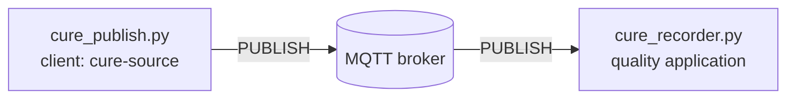

# Lab 2 — Can we lose a cure record if the network fails?

## The situation

> *"Yesterday's cure completed correctly, but the quality application has a gap exactly when the
> network was unstable. I need more than 'MQTT is reliable': did the broker receive the record, did
> the application receive it, and what can we recover after a disconnection?"*
> — Nora Elissalde, quality manager

Lab 1 followed data through a working MQTT chain. This lab keeps the same plant and tools, but now
clients will disconnect and some exchanges will be interrupted. The objective is to determine **what
was delivered, what was kept, and by which component**.

Only the numbered questions **Q1–Q15** are expected in your report. The commands and observations in
between are there to build the evidence you need; you do not need to report every intermediate step.

## Preparation

From `lab2/`, start the stack:

```bash
docker compose up -d --build
```

As in Lab 1, keep the **viewer** open at <http://localhost:8080> and run student commands inside the
`workstation` container:

```bash
docker compose exec workstation bash
```

In the viewer's **Packets** tab, enable **show protocol details**.

The first two parts use a synthetic **cure record**: one quality record produced when an autoclave
cycle completes. For example:

```json
{"record_id":"CR-101","batch":"BATCH-101","recipe":"CFRP-180C","result":"PASS", ...}
```

The `record_id` lets us recognise the same business record across several protocol exchanges. These
records use the topic `quality/autoclave/AC-1/cure-records`.

In Lab 1 you used `mosquitto_pub` and `mosquitto_sub` directly. Here, two small Python programs are
provided for reproducible experiments. They are ordinary MQTT clients:

- `cure_publish.py` publishes one chosen cure record and exits;
- `cure_recorder.py` represents the quality application and stays connected to receive records.

You do not need to modify them unless a *Going deeper* question asks you to.

## Part 1 — What does an MQTT acknowledgement actually acknowledge?

You already know the `publisher → broker → subscriber` chain. Here the same chain carries a cure
record:



MQTT defines three **Quality of Service (QoS)** levels: 0, 1 and 2. Do not learn their guarantees in
advance; start from the traces and see what changes.

### Follow one record with QoS 0

Open two workstation shells. In the first, start the quality application:

```bash
python cure_recorder.py --client-id audit-q0 --qos 0
```

In the second, publish one record:

```bash
python cure_publish.py CR-101 --qos 0
```

Use `CR-101` to locate the corresponding traffic in the viewer. Follow the `PUBLISH` from
`cure-source` to the broker and then the `PUBLISH` from the broker to `audit-q0`. Also check the
recorder terminal.

### Q1 — Where can you prove that CR-101 reached?

The same record is visible at several points in the path. Which observation shows that the broker received `CR-101`, and which one shows that the recorder application received it?

### Add one level of reliability

Stop the recorder before continuing.

Restart the recorder and publisher at QoS 1:

```bash
python cure_recorder.py --client-id audit-q1 --qos 1
```

```bash
python cure_publish.py CR-102 --qos 1
```

Compare this trace with Q1. You should now see an additional MQTT control packet on each connection.
The viewer also shows a numeric packet identifier; follow it only within the same MQTT connection.

### Q2 — Is QoS 1 one end-to-end exchange?

The broker sits between two MQTT connections. Reconstruct the `PUBLISH → acknowledgement` exchange on each side, then explain what shows that these are two separate deliveries rather than one end-to-end acknowledgement.

### Remove the subscriber

Stop `audit-q1`, so no quality application is subscribed, then publish:

```bash
python cure_publish.py CR-103 --qos 1
```

Check whether `cure-source` still receives a `PUBACK`. Then restart the same clean recorder:

```bash
python cure_recorder.py --client-id audit-q1 --qos 1
```

Do not publish anything new. Look for `CR-103`.

### Q3 — How far does the publisher's PUBACK reach?

Here the publisher still receives `PUBACK` while the application is offline. After the restart, does the application receive `CR-103`? Use the two observations to explain what the publisher-side acknowledgement guarantees — and what it cannot guarantee.

### Inspect QoS 2

Stop the previous recorder and run:

```bash
python cure_recorder.py --client-id audit-q2 --qos 2
```

```bash
python cure_publish.py CR-104 --qos 2
```

Inspect first `cure-source ↔ broker`, then `broker ↔ audit-q2`. Starting from `PUBLISH`, reconstruct the
order and direction of `PUBREC`, `PUBREL` and `PUBCOMP`. Follow the packet identifier inside each
connection.

### Q4 — What does QoS 2 add?

Use the trace to write the QoS-2 packet sequence on each side of the broker. Which component completes the first exchange and starts the second one?

### Let the two sides use different QoS levels

Keep the publisher at QoS 2. Run the following recorders one after another, stopping each before the
next:

```bash
python cure_recorder.py --client-id audit-max0 --qos 0
python cure_recorder.py --client-id audit-max1 --qos 1
python cure_recorder.py --client-id audit-max2 --qos 2
```

Publish one new record for each run, always with QoS 2:

```bash
python cure_publish.py CR-105 --qos 2
python cure_publish.py CR-106 --qos 2
python cure_publish.py CR-107 --qos 2
```

For each run, read the QoS requested by the subscriber and the QoS of the `PUBLISH` sent by the broker.
Then make one extra test with publisher QoS 1 and subscriber QoS 2.

### Q5 — How does the broker choose the outgoing QoS?

The four runs vary both the publication QoS and the subscription QoS. From what you observed, infer the rule used by the broker for the outgoing `PUBLISH`, and illustrate it with one of your traces.

### Attach names to what you observed

At this point, the standard MQTT names can be attached to what you observed:

```text
QoS 0 — at most once
QoS 1 — at least once
QoS 2 — exactly once
```

Keep their scope precise: each name describes **one MQTT delivery between one sender and one receiver**.
Q3 already showed why this is not the same as an end-to-end application guarantee.

<details>
<summary><strong>◆ Going deeper — D1: what did stronger delivery cost?</strong></summary>

Use the clean Q1, Q2 and Q4 traces. On one already-connected MQTT link, count the MQTT packets and sum
the viewer's `packet B` values from the first `PUBLISH` until that delivery completes.

Compare QoS 0, 1 and 2, and explain what extra protocol work appears as the QoS increases. Do not
interpret small JSON-size differences as protocol overhead.
</details>

<details>
<summary><strong>◆ Going deeper — D2: packet identifier or business-record identifier?</strong></summary>

Compare the MQTT packet identifiers with the JSON `record_id` for one QoS-1 or QoS-2 record.

Explain which identifier names one in-flight MQTT exchange and which identifier still refers to the
same business record after reconnect or retransmission.
</details>

## Part 2 — What state survives when the application disconnects?

Q3 used a clean client: when it returned, nothing was waiting. MQTT can also keep **client-specific
session state** across connections. In the provided recorder, `--persistent` requests that behaviour.

### Leave a persistent subscriber offline

Start a fresh persistent recorder:

```bash
python cure_recorder.py --client-id audit-persistent --qos 1 --persistent
```

On this first connection, look at `session_present` in `CONNACK` and note that the client subscribes.
Verify that a normal record arrives:

```bash
python cure_publish.py CR-201 --qos 1
```

Stop the recorder, then publish three records while it is absent:

```bash
python cure_publish.py CR-202 --qos 1
python cure_publish.py CR-203 --qos 1
python cure_publish.py CR-204 --qos 1
```

Reconnect with **exactly the same recorder command**. Do not publish anything new. Watch what arrives
immediately, whether a new `SUBSCRIBE` is sent, and whether the source republishes those records.

### Q6 — What did the broker keep while the application was away?

On reconnection, some records arrive even though the source does not publish them again. Which observations show that the broker resumed an existing session, and what information must it have kept while the application was disconnected?

### Change only the client identity

Stop `audit-persistent` again, but leave its stored session intact.

While `audit-persistent` is offline, publish:

```bash
python cure_publish.py CR-205 --qos 1
python cure_publish.py CR-206 --qos 1
```

Connect a different persistent client:

```bash
python cure_recorder.py --client-id audit-other --qos 1 --persistent
```

Observe whether it resumes a session and whether it receives `CR-205` / `CR-206`, then stop it. Now
reconnect `audit-persistent` with its original command.

### Q7 — How does the broker find the right stored session?

Only the client identity changes between these reconnects. Compare `audit-other` with `audit-persistent`: which one recovers the previous session, and what does this tell you about how the broker finds that session and what it contains?

### Compare session state with a retained value

Stop `audit-persistent` before continuing.

Lab 1 already used retained messages. Create one retained autoclave result:

```bash
mosquitto_pub -h relay -p 1884 -i result-source -q 1 -r \
  -t 'quality/autoclave/AC-1/last-result' \
  -m '{"record_id":"LAST-STATE","result":"PASS"}'
```

A direct `mosquitto_pub` is enough here because we only need one retained MQTT publication.

Now create a fresh persistent recorder over the AC-1 subtree:

```bash
python cure_recorder.py --client-id audit-state --qos 1 --persistent \
  --topic 'quality/autoclave/AC-1/#'
```

Verify that `LAST-STATE` arrives, then stop `audit-state`. While it is absent, publish:

```bash
python cure_publish.py CR-230 --qos 1
```

Connect a new clean client to the same wildcard, observe what it receives, and stop it:

```bash
python cure_recorder.py --client-id audit-new --qos 1 \
  --topic 'quality/autoclave/AC-1/#'
```

Finally reconnect the original persistent `audit-state` client without publishing anything new.

### Q8 — Retained state or session state?

At this point the broker is holding two different kinds of state. Compare what `audit-new` and the resumed `audit-state` receive: which information follows the **topic**, and which follows one particular **client session**?

### Start clean with the same Client ID

Stop `audit-state` and publish one more record while it is absent:

```bash
python cure_publish.py CR-231 --qos 1
```

Reconnect with the same Client ID but without `--persistent`:

```bash
python cure_recorder.py --client-id audit-state --qos 1 \
  --topic 'quality/autoclave/AC-1/#'
```

Observe `session_present`, whether `CR-231` arrives, and whether retained `LAST-STATE` still arrives.
After stopping this client, try the original persistent command again.

### Q9 — What did the clean reconnect erase?

After the clean reconnect, what happened to the previous session state? Use your answer to Q8 to explain why the retained `LAST-STATE` is still available even though that session has disappeared.

### Restart the broker itself

So far only clients have disappeared. Create a fresh persistent session:

```bash
python cure_recorder.py --client-id audit-restart --qos 1 --persistent
```

Publish `CR-240`, check that it arrives, then stop the recorder and publish while it is absent:

```bash
python cure_publish.py CR-241 --qos 1
python cure_publish.py CR-242 --qos 1
```

On the **host**, restart only the broker:

```bash
docker compose restart broker
```

Reconnect `audit-restart` and inspect `session_present`, any new `SUBSCRIBE`, and the missing records.
Then open `broker/mosquitto.conf` and locate the setting that explains the result.

### Q10 — Is a persistent MQTT session durable across a broker restart?

The session survived several client disconnects; now the broker itself has restarted. What survives each kind of interruption, and which Mosquitto configuration setting explains the difference?

<details>
<summary><strong>◆ Going deeper — D3: make broker state survive its restart</strong></summary>

Enable Mosquitto persistence and add the required persistent volume. Repeat Q10 with a fresh Client ID
and fresh cure records.

Show whether the session now survives and explain why “stored by one broker” is still weaker than a
complete durability strategy.
</details>

<details>
<summary><strong>◆ Going deeper — D4: how much can a disconnected session accumulate?</strong></summary>

Create and stop a persistent subscriber for a dedicated test topic:

```bash
python cure_recorder.py --client-id queue-test --qos 1 --persistent \
  --topic 'lab2/queue-test' --log queue.jsonl
```

Publish a numbered burst over one MQTT connection:

```bash
rm -f queue.jsonl
python burst_publish.py 1100
```

`burst_publish.py` is used here simply to send many numbered records over one connection instead of
starting 1,100 publisher processes. Reconnect the subscriber, drain the queue, then inspect
`queue.jsonl` and Mosquitto's queue-related configuration.

How many records were recovered, what broker limit explains the result, and why is that an
implementation limit rather than an MQTT delivery guarantee?
</details>

### Make one acknowledgement disappear

The next failure is different: the application will receive a record, but the broker will not learn
that the delivery completed.

Start a fresh persistent recorder and log each application delivery:

```bash
rm -f audit.jsonl
python cure_recorder.py --client-id audit-dup --qos 1 --persistent --log audit.jsonl
```

In another shell, arm one controlled fault:

```bash
python fault.py drop-next --client audit-dup --direction up --type PUBACK
```

`fault.py` configures the teaching relay; it is **not** another MQTT client. It asks the relay to drop
exactly the next matching packet.

Publish:

```bash
python cure_publish.py CR-250 --qos 1
```

Wait until the recorder has printed `CR-250` and the viewer marks its `PUBACK` as `DROPPED`, then stop
the recorder immediately. Reconnect with exactly the same recorder command and do not publish another
record.

Compare the first and repeated broker-to-recorder `PUBLISH`: `record_id`, MQTT packet identifier and
`DUP` flag. Then inspect the application log:

```bash
python check_audit.py audit.jsonl
```

`check_audit.py` only reads the local JSONL log and summarizes how many deliveries were recorded.

### Q11 — Can one QoS-1 business record reach the application twice?

`CR-250` appears twice in the application log. Is the second copy a new business record or a retransmission of the previous MQTT delivery? Use the trace and `audit.jsonl` to justify your answer.

<details>
<summary><strong>◆ Going deeper — D5: make the application idempotent</strong></summary>

Copy `cure_recorder.py` and change only its storage logic so an already-recorded `record_id` is not
appended again. Repeat the dropped-`PUBACK` experiment.

Does MQTT still retransmit? What application state would have to be durable if duplicate protection
must survive an application crash?
</details>

## Part 3 — What changes when the application asks for the current state?

The stack also contains `ac1-edge`, which exposes the **same current AC-1 state** in two ways:

```text
MQTT:  lab2/autoclave/AC-1/live
CoAP:  coap://ac1-edge/state
```

The MQTT path publishes periodically. `coap_get.py` is a small provided CoAP client: one execution
sends one GET request, prints the exchange and exits. You are not expected to know CoAP beforehand.

### Observe the periodic MQTT state

Run:

```bash
mosquitto_sub -h relay -p 1884 -i live-observer -q 1 \
  -t 'lab2/autoclave/AC-1/live' -v
```

Note several `seq` values, then stop the subscriber. In the viewer, filter on `ac1-live` and let the
plant continue for several state changes.

Now request the current state twice through CoAP, with enough time between requests for the state to
change:

```bash
python coap_get.py coap://ac1-edge/state
```

Notice when network traffic appears and which `seq` is returned.

### Q12 — Who initiates communication on the two paths?

Watch what happens while the workstation is idle, then when you issue a CoAP request. What triggers a new MQTT live-state exchange, and what triggers a new CoAP state exchange?

### Look inside one CoAP exchange

Three fields will be useful for the next failure experiment: message type (`CON`, `NON`, `ACK`), the
16-bit Message ID (`mid`), and the client `token`.

Send one confirmable GET and one non-confirmable GET:

```bash
python coap_get.py --type con coap://ac1-edge/state
python coap_get.py --type non coap://ac1-edge/state
```

For each exchange, compare the request and response fields printed by the client.

### Q13 — How are CoAP messages and responses matched?

The client output shows both a Message ID and a token. In the CON/ACK exchange, which field links the ACK to the confirmable **message**? Which field links the returned **response** to the GET request?

### Suppress the first CoAP response

The resource `/state/drop-once` receives the first request for a token but deliberately sends no
response. If the same request is transmitted again, it answers normally.

Run a confirmable request:

```bash
python coap_get.py --type con --timeout 1 coap://ac1-edge/state/drop-once
```

Observe how many `SEND` attempts occur and whether the Message ID and token are reused. Then repeat with
a non-confirmable request:

```bash
python coap_get.py --type non --timeout 1 coap://ac1-edge/state/drop-once
```

A timeout and non-zero exit are expected in the NON case. The short timeout is only a teaching aid;
the mechanism being observed is CoAP's confirmable-message behaviour.

### Q14 — What does CON add when a response is missing?

Both requests face the same controlled loss. What happens with the CON request that does not happen with NON, and what in the client output lets you recognise the extra message as a retransmission?

<details>
<summary><strong>◆ Going deeper — D6: inspect the server side of the same failure</strong></summary>

On the host:

```bash
docker compose logs --tail=40 ac1-edge
```

Match the client token and Message ID with the server log.

Did the first request fail to reach the server, or did the server receive it and suppress the response?
Why can a client timeout alone not distinguish those cases?
</details>

### Compare what remains visible after an absence

Start a persistent MQTT watcher for the live-state topic:

```bash
python live_watch.py --client-id live-history --persistent
```

`live_watch.py` is a small MQTT subscriber specialized for this final experiment: it prints the
sequence number of each state it receives and can resume a persistent session.

Record one or two `seq` values, then stop it while several new states are produced. Reconnect with
**exactly the same command** and note the sequence numbers delivered immediately after resume.

Immediately request the state once through CoAP:

```bash
python coap_get.py coap://ac1-edge/state
```

### Q15 — What can each path tell you after the same absence?

After the same period of absence, compare what you recover through MQTT with what one CoAP GET returns. What do the two paths tell you about **intermediate states** and the **current state**?

Then choose one result from Q3, Q10 or Q11 to show why “acknowledged”, “kept by the broker”, “received by the application” and “stored as one business record” are not equivalent claims.

<details>
<summary><strong>◆ Going deeper — D7: compare application-protocol bytes for one current-state exchange</strong></summary>

Use `coap_get.py` byte counts and the MQTT viewer's `packet B` field. Compare one already-connected
QoS-1 MQTT delivery (`PUBLISH` + `PUBACK`) with one confirmable CoAP GET and its response.

State exactly which bytes you include, then explain why this protocol-byte count alone is insufficient
to decide which path consumes less energy on a battery-powered device.
</details>

Across the lab, keep the boundaries exposed by the experiments: an MQTT acknowledgement, a queued
session delivery, a retained topic value and a business record stored by an application are different
evidence and live at different points in the system.

The security question is deliberately left open. The broker currently accepts anonymous clients, and
nothing here proves that `cure-source` is an authorised AC-1 component. A later lab will examine
authentication, access control and confidentiality without mixing them with the delivery semantics
studied here.

*Next: Lab 3 — can we read the machines directly?*
